# Stage 1 Development Plan — Project Setup & Infrastructure

**Stage**: 1 of 6
**Headline deliverable**: A fully scaffolded repo where `docker compose up` brings up Postgres + Valkey + MinIO healthy, FastAPI boots and serves `/health`, Vite dev server boots and renders a placeholder page that successfully calls `/health`, all four coding agents (Claude Code, OpenCode, OpenAI Codex, Cursor) can read repo-level rules + skills + MCPs, and the backend has a working error envelope + structured logging foundation.

**Cross-references**: `tech-stack-analysis.md`, `dependency-map.md`

---

## Executive Summary

This stage establishes the foundation. Nothing here is user-facing — the entire purpose is to make every subsequent stage productive. There is no business logic, no UI, no data persistence beyond schema. By the end, a fresh clone of this repo on a Windows laptop with Docker Desktop installed can be brought to a working dev environment in under 10 minutes by following the README.

- **Total tasks**: 6
- **Total sub-tasks**: 27
- **Estimated effort**: 3–5 days for a single developer; 1.5–3 days with parallel agent execution
- **Top 3 risks**:
  1. **Agent rules drift** (R10 in global risk register) — `Claude.md`, `AGENTS.md`, `.cursorrules` must stay content-equivalent. Mitigation: shared YAML front-matter + lint script.
  2. **Windows + Docker volume mounts** can be slow or break MinIO/Postgres data persistence. Mitigation: use Docker named volumes (not bind mounts) for data dirs.
  3. **MCP server installation diverges across agents.** Mitigation: a single `mcp-config.json` template + per-agent install script.

---

## Entry Criteria

- Boilerplate repo URL accessible: `https://github.com/SIDDHESHCHAUDHARI2K24/fastapi_backend_boilerplate`
- Figma WYSIWYG kit URL accessible: `https://www.figma.com/community/file/1359075236113343829`
- Docker Desktop installed and running on the dev laptop
- Node.js LTS (≥ 20) installed for Vite + frontend MCP/agent tooling
- Python 3.11+ installed (for `uv`)

## Exit Criteria

1. Repo at desired layout, committed to a `main` branch with a `.gitignore` and a `README.md`.
2. `docker compose up -d` brings up Postgres, Valkey, MinIO; healthchecks all green within 30 seconds.
3. `cd backend && uv sync && uv run uvicorn app.app:create_app --factory --reload` boots; `GET http://localhost:8000/health` returns `{"status":"ok"}`.
4. `cd frontend && npm install && npm run dev` boots; `http://localhost:5173` renders a placeholder page that **proves CORS works** by calling `GET /health` and rendering the result.
5. `cd backend && uv run alembic revision --autogenerate -m "init"` succeeds and produces an empty (or near-empty) migration.
6. Agent rules files exist: `Claude.md` (Claude Code), `AGENTS.md` (OpenCode + Codex), `.cursorrules` (Cursor). All three are content-equivalent (same tech stack, layout, conventions, hooks).
7. Graphify MCP and Figma MCP are configured in **at least Claude Code AND OpenCode**, validated by issuing a sample query from each.
8. `obra/superpowers` skills are installed in each agent's repo-level skill directory; `using-superpowers`, `brainstorming`, `executing-plans`, `test-driven-development`, `requesting-code-review`, `verification-before-completion` skills are confirmed discoverable.
9. Backend has working `structlog` JSON output to stdout with `request_id` correlation across logs from a single request.
10. Backend has the standard error envelope contract demonstrated by an `/api/v1/_demo/error` endpoint that raises a custom exception and returns the documented envelope.
11. README documents the local-dev start sequence end-to-end.

---

## Phase Overview

This stage is small enough to be a single phase. The 6 tasks are grouped logically but are mostly parallelizable — see the intra-stage dependency graph below.

| Task | Focus | Deliverable | Effort |
|---|---|---|---|
| **P1.T1** | Repository scaffold | Folder layout, root files, `.gitignore`, README skeleton | M |
| **P1.T2** | Docker Compose for local infra | `docker-compose.yml` + per-service config in `valkey/`, `minio/` | L |
| **P1.T3** | Backend bootstrap | Boilerplate import, uv setup, `core/` foundation (errors, logging, settings, db, valkey, storage) | XL |
| **P1.T4** | Frontend bootstrap | Vite + React + TS scaffold, Tailwind, `<App />` placeholder calling `/health` | L |
| **P1.T5** | Agent rules files | `Claude.md`, `AGENTS.md`, `.cursorrules` | M |
| **P1.T6** | MCPs + Superpowers skills | Figma MCP, Graphify MCP, Superpowers skills installed in each agent | L |

---

## Intra-Stage Dependency Graph (Sub-Task Level)

```mermaid
graph TD
    subgraph "P1.T1 — Repo scaffold"
        T1_S1[P1.T1.S1<br/>Create directory layout]
        T1_S2[P1.T1.S2<br/>Add .gitignore + README skeleton]
        T1_S3[P1.T1.S3<br/>Init Git + first commit]
    end

    subgraph "P1.T2 — Docker Compose"
        T2_S1[P1.T2.S1<br/>Postgres service + healthcheck]
        T2_S2[P1.T2.S2<br/>Valkey service + healthcheck]
        T2_S3[P1.T2.S3<br/>MinIO service + healthcheck + bucket bootstrap]
        T2_S4[P1.T2.S4<br/>docker-compose.yml + .env.example]
    end

    subgraph "P1.T3 — Backend bootstrap"
        T3_S1[P1.T3.S1<br/>Import boilerplate to backend/]
        T3_S2[P1.T3.S2<br/>uv sync + verify boots]
        T3_S3[P1.T3.S3<br/>core/errors.py + global handler]
        T3_S4[P1.T3.S4<br/>core/logging.py + request_id middleware]
        T3_S5[P1.T3.S5<br/>core/settings.py with all env vars]
        T3_S6[P1.T3.S6<br/>core/db.py SQLAlchemy 2.0 async]
        T3_S7[P1.T3.S7<br/>core/valkey.py connection helper]
        T3_S8[P1.T3.S8<br/>core/storage.py S3 client factory]
        T3_S9[P1.T3.S9<br/>/health and /_demo/error endpoints]
        T3_S10[P1.T3.S10<br/>Alembic init + first empty migration]
    end

    subgraph "P1.T4 — Frontend bootstrap"
        T4_S1[P1.T4.S1<br/>Vite + React + TS scaffold]
        T4_S2[P1.T4.S2<br/>Tailwind + design tokens from Figma]
        T4_S3[P1.T4.S3<br/>Folder layout: features/, lib/, types/]
        T4_S4[P1.T4.S4<br/>Placeholder App calling /health]
        T4_S5[P1.T4.S5<br/>Vitest configured + smoke test]
    end

    subgraph "P1.T5 — Agent rules"
        T5_S1[P1.T5.S1<br/>Draft Claude.md content]
        T5_S2[P1.T5.S2<br/>Mirror to AGENTS.md]
        T5_S3[P1.T5.S3<br/>Mirror to .cursorrules]
        T5_S4[P1.T5.S4<br/>Lint script: rules-equivalence check]
    end

    subgraph "P1.T6 — MCPs + Superpowers"
        T6_S1[P1.T6.S1<br/>Install Graphify in Claude Code + OpenCode]
        T6_S2[P1.T6.S2<br/>Install Figma MCP in Claude Code + OpenCode]
        T6_S3[P1.T6.S3<br/>Install obra/superpowers skills in each agent]
        T6_S4[P1.T6.S4<br/>Validate Graphify query + Figma query from each agent]
    end

    T1_S1 --> T1_S2 --> T1_S3

    T1_S1 --> T2_S1
    T1_S1 --> T2_S2
    T1_S1 --> T2_S3
    T2_S1 --> T2_S4
    T2_S2 --> T2_S4
    T2_S3 --> T2_S4

    T1_S1 --> T3_S1
    T3_S1 --> T3_S2
    T3_S2 --> T3_S5
    T3_S5 --> T3_S3
    T3_S5 --> T3_S4
    T3_S5 --> T3_S6
    T3_S5 --> T3_S7
    T3_S5 --> T3_S8
    T3_S3 --> T3_S9
    T3_S4 --> T3_S9
    T3_S6 --> T3_S10

    T1_S1 --> T4_S1
    T4_S1 --> T4_S2
    T4_S1 --> T4_S3
    T4_S2 --> T4_S4
    T4_S3 --> T4_S4
    T3_S9 -.CORS target.-> T4_S4
    T4_S1 --> T4_S5

    T1_S1 --> T5_S1
    T5_S1 --> T5_S2
    T5_S1 --> T5_S3
    T5_S2 --> T5_S4
    T5_S3 --> T5_S4

    T1_S1 --> T6_S1
    T1_S1 --> T6_S2
    T1_S1 --> T6_S3
    T6_S1 --> T6_S4
    T6_S2 --> T6_S4
    T6_S3 --> T6_S4

    classDef done fill:#1f5f3a,stroke:#fff,color:#fff
    classDef parallel fill:#1e3a5f,stroke:#fff,color:#fff
    class T1_S1,T1_S2,T1_S3 done
```



**Parallelization callouts** for an orchestrating agent:
- **Wave 1** (after `P1.T1.S1`): `P1.T2.*`, `P1.T3.*`, `P1.T4.*`, `P1.T5.*`, `P1.T6.*` can all run in parallel — they only need the empty directory tree.
- **Within P1.T3**: after `P1.T3.S5` (settings) lands, S3/S4/S6/S7/S8 are all parallelizable.
- **Cross-task sync points**: `P1.T4.S4` (frontend calling `/health`) is the only cross-task verification — needs `P1.T3.S9` (backend `/health` exists) and `P1.T2.*` (services up). This is the integration moment for the stage.

---

## Phase 1: Foundation

### Task P1.T1: Repository scaffold

**Feature**: Project foundations
**Effort**: M / 4 hours
**Dependencies**: None
**Risk Level**: Low

The repo layout is the contract every other task obeys. Get this right and stable before anything else lands.

#### Sub-task P1.T1.S1: Create directory layout

**Description**: Create the agreed top-level directory structure with empty placeholder files (`.gitkeep`) so git tracks empty directories. No code yet — just the skeleton.

**Implementation Hints**:
- Top-level dirs to create: `backend/`, `frontend/`, `alembic/`, `valkey/`, `minio/`, `infra/`, `infra/docker/`, `infra/terraform/` (placeholder for Stage 6), `docs/`, `docs/dev-plans/`, `docs/design/`, `scripts/`.
- Top-level files: `.gitignore` (Python + Node + IDE + OS templates merged), `README.md` (skeleton), `docker-compose.yml` (will be filled in P1.T2), `.env.example` (placeholders), `Makefile` (Windows-friendly: use `make` only if user has it; provide `scripts/*.ps1` and `scripts/*.sh` equivalents).
- Inside `backend/`, do NOT create the boilerplate dirs yet — that happens in P1.T3.S1 by importing the boilerplate.
- Use `.gitkeep` only in dirs that will remain empty after this sub-task.

**Dependencies**: None
**Effort**: XS / 1 hour
**Risk Flags**: None.
**Acceptance Criteria**:
- All directories listed above exist.
- `.gitignore` covers `__pycache__/`, `*.pyc`, `.venv/`, `node_modules/`, `dist/`, `.env`, `.idea/`, `.vscode/settings.json` (but NOT `.vscode/launch.json` template), `.DS_Store`, `Thumbs.db`, `*.log`, `coverage/`.
- `tree -L 2` (or PowerShell equivalent) output matches the agreed layout.

#### Sub-task P1.T1.S2: Add .gitignore + README skeleton

**Description**: Populate `.gitignore` with comprehensive patterns and create a README skeleton with placeholder sections that later sub-tasks will fill in.

**Implementation Hints**:
- README sections (placeholders OK; content fills as stages complete):
  - Project name + 1-line description
  - Demo accounts (filled in S2)
  - Tech stack (link to `docs/tech-stack-analysis.md`)
  - Local dev setup
    1. Prerequisites
    2. Clone + env setup
    3. Start infra: `docker compose up -d`
    4. Start backend
    5. Start frontend
  - Running tests
  - Project structure
  - Dev plans (link to `docs/dev-plans/`)
  - Coding-agent setup (link to `docs/AGENT-SETUP.md` — created in P1.T6)
  - Supported file types and known limitations (filled in Stage 5)
  - Deployment (filled in Stage 6)
  - License
- Keep README short — link out to `docs/` for detail.

**Dependencies**: P1.T1.S1
**Effort**: XS / 1 hour
**Risk Flags**: None.
**Acceptance Criteria**:
- `README.md` opens cleanly in a markdown previewer.
- `.gitignore` contains at least the patterns listed above.

#### Sub-task P1.T1.S3: Init Git + first commit

**Description**: Initialize the git repo, make the first commit. This locks in the structure as a baseline before parallel work begins.

**Implementation Hints**:
- `git init`, ensure default branch is `main`.
- `git add -A && git commit -m "chore: initial repository scaffold"`.
- Add a `LICENSE` file if user has a preference; otherwise `MIT` or skip.
- Configure `.gitattributes` to enforce LF line endings on shell scripts and `.py`/`.ts` files (important on Windows): `*.sh text eol=lf`, `*.py text eol=lf`, `*.ts text eol=lf`, `*.tsx text eol=lf`.

**Dependencies**: P1.T1.S2
**Effort**: XS / 30 min
**Risk Flags**: Windows line-ending issues will bite later if `.gitattributes` is missing.
**Acceptance Criteria**:
- `git log` shows the initial commit.
- `git status` shows a clean tree.
- `.gitattributes` exists with LF rules.

---

### Task P1.T2: Docker Compose for local infrastructure

**Feature**: Project foundations
**Effort**: L / 1 day
**Dependencies**: P1.T1.S1
**Risk Level**: Medium (Windows + Docker Desktop volume quirks)

Three services: Postgres, Valkey, MinIO. Each has a healthcheck. Data persists across restarts via named Docker volumes.

#### Sub-task P1.T2.S1: Postgres service definition

**Description**: Add a Postgres 16 service to `docker-compose.yml` with persistent named volume, healthcheck, and dev credentials. Bind to host port 5432 (configurable via env var to avoid conflicts with any existing Postgres).

**Implementation Hints**:
- Image: `postgres:16-alpine` (smaller, fast pull on Windows).
- Volume: `postgres_data:/var/lib/postgresql/data` (named volume — Windows bind mounts to this path are problematic).
- Env: `POSTGRES_USER=app`, `POSTGRES_PASSWORD=app`, `POSTGRES_DB=docs_dev`. Override via `.env`.
- Healthcheck: `pg_isready -U app -d docs_dev`, interval 5s, retries 10.
- Port mapping: `${POSTGRES_HOST_PORT:-5432}:5432`.
- Add a SQL init script in `infra/docker/postgres/init.sql` that creates additional schemas if needed (currently empty — placeholder).

**Dependencies**: P1.T1.S1
**Effort**: S / 2 hours
**Risk Flags**: None.
**Acceptance Criteria**:
- `docker compose up postgres -d` starts the service.
- `docker compose exec postgres psql -U app -d docs_dev -c '\dt'` succeeds.
- Healthcheck reports `healthy` within 15 seconds.
- Restarting the service preserves data (`docker compose restart postgres` then connect — same data).

#### Sub-task P1.T2.S2: Valkey service definition

**Description**: Add Valkey to `docker-compose.yml` with persistent volume, healthcheck, no auth (dev only). Bind port 6379.

**Implementation Hints**:
- Image: `valkey/valkey:8-alpine`.
- Volume: `valkey_data:/data` for AOF persistence.
- Command: `valkey-server --appendonly yes` to enable persistence.
- Healthcheck: `valkey-cli ping` expects `PONG`, interval 5s.
- Port: `${VALKEY_HOST_PORT:-6379}:6379`.
- A separate `valkey/valkey.conf` file is optional at this stage — defer until we tune for pub/sub in S4.

**Dependencies**: P1.T1.S1
**Effort**: S / 2 hours
**Risk Flags**: None.
**Acceptance Criteria**:
- `docker compose up valkey -d` succeeds.
- `docker compose exec valkey valkey-cli ping` returns `PONG`.
- `docker compose exec valkey valkey-cli set k v && valkey-cli get k` returns `v`.

#### Sub-task P1.T2.S3: MinIO service definition + bucket bootstrap

**Description**: Add MinIO to `docker-compose.yml` with persistent volume, healthcheck, and an init container that creates the default bucket on first run. Expose console (9001) and S3 API (9000).

**Implementation Hints**:
- Image: `minio/minio:latest` (pin a digest in production; latest is fine for dev).
- Volume: `minio_data:/data`.
- Env: `MINIO_ROOT_USER=minioadmin`, `MINIO_ROOT_PASSWORD=minioadmin` (dev only — flag in README).
- Command: `server /data --console-address ":9001"`.
- Ports: `9000:9000` (S3 API), `9001:9001` (console).
- Healthcheck: `curl -f http://localhost:9000/minio/health/live`.
- Add a second compose service `minio-init` using `minio/mc` image that waits for MinIO healthy, runs `mc alias set local http://minio:9000 minioadmin minioadmin && mc mb -p local/docs && mc mb -p local/snapshots && mc mb -p local/attachments`. Use `restart: "no"` so it runs once and exits.

**Dependencies**: P1.T1.S1
**Effort**: M / 4 hours
**Risk Flags**: MinIO console URL `localhost:9001` is for human admin — don't commit credentials anywhere outside `.env.example`.
**Acceptance Criteria**:
- `docker compose up minio minio-init -d` succeeds.
- Browsing `http://localhost:9001` shows the MinIO console with three buckets: `docs`, `snapshots`, `attachments`.
- `docker compose down && docker compose up minio -d` preserves the buckets.

#### Sub-task P1.T2.S4: Compose file + .env.example + readme snippet

**Description**: Stitch the three services into a top-level `docker-compose.yml` with a shared network and a `depends_on` graph. Add `.env.example` documenting every env var that compose reads. Add a "Local infra" section to the README.

**Implementation Hints**:
- Top-level `docker-compose.yml` at repo root (NOT inside `backend/` — it orchestrates more than backend).
- One Docker network: `app_net` (default driver).
- All three services + `minio-init` join `app_net`.
- Use Compose **profiles** for optional services we may add later (e.g., a pgAdmin profile) — out of scope now, but structure for it.
- `.env.example` keys: `POSTGRES_HOST_PORT`, `POSTGRES_USER`, `POSTGRES_PASSWORD`, `POSTGRES_DB`, `VALKEY_HOST_PORT`, `MINIO_HOST_PORT`, `MINIO_CONSOLE_PORT`, `MINIO_ROOT_USER`, `MINIO_ROOT_PASSWORD`. Each with comment.
- README "Local infra" section: copy `.env.example` to `.env`, run `docker compose up -d`, run `docker compose ps` to verify health.

**Dependencies**: P1.T2.S1, P1.T2.S2, P1.T2.S3
**Effort**: M / 4 hours
**Risk Flags**: None.
**Acceptance Criteria**:
- `docker compose config` validates without warnings.
- Cold start (`docker compose down -v && docker compose up -d`) reaches all-healthy state in under 60 seconds.
- `.env.example` is comprehensive; copying to `.env` and starting works without editing.

---

### Task P1.T3: Backend bootstrap

**Feature**: Project foundations
**Effort**: XL / 2 days
**Dependencies**: P1.T1.S1
**Risk Level**: Medium (uv on Windows + first-time SQLAlchemy 2.0 + structlog patterns must be pleasant to use)

This is the largest task in the stage. It produces the `core/` foundation that every later stage builds on.

#### Sub-task P1.T3.S1: Import boilerplate into backend/

**Description**: Clone the boilerplate, copy its contents into `backend/`, prune unrelated parts (e.g., uvloop dir if it's not needed on Windows; `scripts/scaffold_new_project.py` is a developer tool — keep), commit as a clear commit so future history shows what came from boilerplate.

**Implementation Hints**:
- Clone outside the repo to a temp dir, then copy: `app/`, `alembic/` (move to repo root, not inside `backend/` — per file-structure decision), `pyproject.toml`, `uv.lock`, `.python-version`, `pytest.ini`, `Makefile` (review and adjust).
- The boilerplate has `alembic/` inside `backend/`. We're moving it to repo root. Update `alembic.ini` `script_location` if needed; update `app/features/core/db.py` references.
- Remove `uvloop/` directory — Windows doesn't support uvloop. Use the default loop.
- Remove the boilerplate's `--loop asyncio` flag from any docs since asyncio is the default.
- Update `backend/Makefile` (or PowerShell equivalent) to reflect new paths.
- Commit: `chore(backend): import FastAPI boilerplate from SIDDHESHCHAUDHARI2K24/fastapi_backend_boilerplate`.

**Dependencies**: P1.T1.S1
**Effort**: M / 4 hours
**Risk Flags**: Boilerplate path assumptions — `app.features.core.db` may reference paths we just moved. Read `env.py` in alembic and update.
**Acceptance Criteria**:
- `backend/app/` exists with `app.py`, `features/core/`, `features/auth/`.
- `alembic/` lives at repo root (NOT inside `backend/`).
- `backend/pyproject.toml` exists.
- `git diff` against boilerplate is small and explainable.

#### Sub-task P1.T3.S2: uv sync + verify boots

**Description**: Run `uv sync` in `backend/`. Run the boilerplate's auth tests to confirm nothing broke during import. Boot the FastAPI app to confirm it serves a default endpoint.

**Implementation Hints**:
- From `backend/`: `uv sync` — installs all deps from `uv.lock`.
- Run: `uv run pytest` — boilerplate test suite should pass even before we've added DB. If tests require a DB, point them at the Postgres from compose; document this in README.
- Boot: `uv run uvicorn app.app:create_app --factory --reload` (note: per boilerplate README; remove `--loop asyncio` since that's default).
- Hit `http://localhost:8000/docs` — should render Swagger.
- Add `uv` to README prereqs with install instruction (`pip install uv` or scoop/winget on Windows).

**Dependencies**: P1.T3.S1
**Effort**: S / 2 hours
**Risk Flags**: `uv` PATH issue on Windows is common. Document `where.exe uv` verification step in README.
**Acceptance Criteria**:
- `uv sync` succeeds with no warnings.
- `uv run pytest` shows green (or skips with clear reason if DB missing).
- `uv run uvicorn ...` boots; `/docs` renders.
- `Ctrl+C` stops cleanly without zombie processes.

#### Sub-task P1.T3.S3: core/errors.py — exception hierarchy + global handler

**Description**: Define the application's exception hierarchy and the global FastAPI exception handler. Establishes the **standard error envelope** that every endpoint returns on failure. This is THE backend-frontend error contract for the entire project.

**Implementation Hints**:
- File: `backend/app/features/core/errors.py`.
- Base exception: `class AppException(Exception)` with `code: str`, `message: str`, `details: dict | None`, `status_code: int`.
- Subclasses: `NotFoundException` (404), `PermissionDeniedException` (403), `ValidationException` (422), `ConflictException` (409), `RateLimitedException` (429), `AuthenticationException` (401), `InternalException` (500).
- Each subclass sets a default `code` (e.g., `NotFoundException.code = "NOT_FOUND"`); subclasses can be further specialized later (e.g., `DocumentNotFoundException(code="DOC_NOT_FOUND")`).
- Envelope shape (response body):
  ```json
  {
    "error": {
      "code": "DOC_NOT_FOUND",
      "message": "Document not found",
      "details": {"document_id": "..."},
      "request_id": "..."
    }
  }
  ```
- Global handler in `backend/app/app.py`:
  ```python
  app.add_exception_handler(AppException, _app_exception_handler)
  app.add_exception_handler(RequestValidationError, _validation_handler)
  app.add_exception_handler(Exception, _unhandled_handler)  # 500 fallback
  ```
- Pydantic `RequestValidationError` is mapped into the same envelope shape with `code="VALIDATION_ERROR"` and `details` populated from the Pydantic errors.
- The `request_id` field is filled from the request-state value set by the logging middleware (P1.T3.S4).
- Document the contract in `backend/app/features/core/README.md`.

**Dependencies**: P1.T3.S5 (settings, for log levels)
**Effort**: M / 4 hours
**Risk Flags**: Pydantic v2 `RequestValidationError` shape differs from v1; map carefully.
**Acceptance Criteria**:
- Raising `NotFoundException("doc x")` from a handler returns HTTP 404 with the documented envelope.
- A Pydantic-422 validation error returns the same envelope shape with `code="VALIDATION_ERROR"`.
- An unhandled `Exception` returns 500 with envelope containing `code="INTERNAL_ERROR"` and (in dev mode) the traceback in `details`; in prod mode `details` is empty.
- Unit tests in `app/features/core/tests/test_errors.py` cover all six exception types + the unhandled fallback.

#### Sub-task P1.T3.S4: core/logging.py — structlog config + request_id middleware

**Description**: Configure `structlog` to emit JSON to stdout with consistent fields. Add a FastAPI middleware that generates a `request_id` (UUID v7), binds it to the structlog context for the duration of the request, sets it on `request.state.request_id`, and adds it to the response header `X-Request-ID`.

**Implementation Hints**:
- File: `backend/app/features/core/logging.py`.
- `structlog` processors: `add_logger_name`, `add_log_level`, `TimeStamper(fmt="iso", utc=True)`, `EventRenamer("message")`, `JSONRenderer()`.
- Bind `request_id` via `structlog.contextvars.bind_contextvars` in middleware; clear with `clear_contextvars` in a `finally`.
- Use `uuid_extensions.uuid7()` if available (faster, sortable), else fall back to `uuid.uuid4()`.
- Middleware order: `RequestIDMiddleware` should be the OUTERMOST middleware so all subsequent log lines from any handler include the ID.
- Log level via env var: `LOG_LEVEL=DEBUG` in dev `.env`, `INFO` in prod.
- Sample log output documented in `core/README.md`:
  ```json
  {"timestamp": "2026-05-02T...", "level": "info", "message": "request_started", "method": "GET", "path": "/health", "request_id": "..."}
  ```

**Dependencies**: P1.T3.S5
**Effort**: M / 4 hours
**Risk Flags**: Async context propagation across FastAPI's worker threads can lose contextvars — pin `structlog>=24.0` which handles this correctly.
**Acceptance Criteria**:
- Hitting any endpoint emits `request_started` and `request_finished` JSON logs to stdout, both containing the same `request_id`.
- The response includes `X-Request-ID` header with the same ID.
- A unit test (`test_logging.py`) captures stdout and asserts the structure.
- Setting `LOG_LEVEL=ERROR` suppresses INFO logs.

#### Sub-task P1.T3.S5: core/settings.py — Pydantic settings with all env vars

**Description**: Define a single `Settings` class (Pydantic v2 `BaseSettings`) loading from `.env` and OS environment. Includes every env var the project will ever need across all 6 stages — even the ones not used yet. Future stages just consume; they don't add new settings classes.

**Implementation Hints**:
- File: `backend/app/features/core/settings.py`.
- Use `pydantic_settings.BaseSettings` with `model_config = SettingsConfigDict(env_file=".env", env_file_encoding="utf-8", extra="ignore")`.
- Fields, grouped:
  - **App**: `app_name`, `environment` (Literal["development","production","test"]), `log_level`, `debug` (bool), `version`.
  - **HTTP**: `cors_origins` (list[str]), `csrf_secret_key` (SecretStr).
  - **Postgres**: `database_url` (PostgresDsn).
  - **Valkey**: `valkey_url`, `session_ttl_seconds` (default 7 days).
  - **Object storage** (S3-compatible): `s3_endpoint_url`, `s3_access_key`, `s3_secret_key`, `s3_addressing_style` (Literal["path","virtual"], default "path" for MinIO), `s3_bucket_documents`, `s3_bucket_snapshots`, `s3_bucket_attachments`, `s3_region` (default "us-east-1").
  - **Auth**: `bcrypt_cost` (default 10 in dev, 12 in prod), `session_cookie_name`, `session_cookie_secure` (bool, False in dev, True in prod), `session_cookie_samesite` (Literal["lax","strict","none"]).
  - **Rate limiting**: `rate_limit_login_max`, `rate_limit_login_window_seconds`, etc. (placeholders for S2/S4/S5).
  - **WebSocket**: `ws_max_message_bytes` (default 1 MB).
  - **Uploads**: `upload_max_txt_md_bytes` (1 MB), `upload_max_docx_bytes` (10 MB), `upload_max_attachment_bytes` (25 MB).
- Expose as a cached singleton: `get_settings()` decorated with `@lru_cache`.
- Update `.env.example` at repo root + symlink/copy `backend/.env.example` to mirror these.

**Dependencies**: P1.T3.S2
**Effort**: M / 4 hours
**Risk Flags**: SecretStr fields must be unwrapped with `.get_secret_value()` when used; document in `core/README.md`.
**Acceptance Criteria**:
- `from app.features.core.settings import get_settings; s = get_settings()` returns valid settings when `.env` is present.
- Missing required field raises a clear validation error (test it).
- `pytest` test confirms `.env.example` parses cleanly via `Settings`.
- All env vars listed in this hint are present.

#### Sub-task P1.T3.S6: core/db.py — async SQLAlchemy 2.0 session

**Description**: Replace the boilerplate's raw asyncpg helpers with SQLAlchemy 2.0 async session management. This gives later stages clean ORM ergonomics for `documents`, `permissions`, `attachments`, `audit_log`. Keep existing auth raw-asyncpg code working OR refactor — your choice; the recommendation is to refactor auth feature in Stage 2 and use SQLAlchemy throughout from then on.

**Implementation Hints**:
- File: `backend/app/features/core/db.py`.
- `engine = create_async_engine(settings.database_url, pool_size=10, max_overflow=20, echo=settings.debug)`.
- `AsyncSessionLocal = async_sessionmaker(engine, expire_on_commit=False, class_=AsyncSession)`.
- FastAPI dependency: `async def get_db() -> AsyncIterator[AsyncSession]: async with AsyncSessionLocal() as s: yield s`.
- Base declarative: `class Base(DeclarativeBase): ...` in `backend/app/features/core/models.py`. Future feature models import from this.
- Configure naming convention for constraints (important for Alembic):
  ```python
  metadata = MetaData(naming_convention={
      "ix": "ix_%(column_0_label)s",
      "uq": "uq_%(table_name)s_%(column_0_name)s",
      "ck": "ck_%(table_name)s_%(constraint_name)s",
      "fk": "fk_%(table_name)s_%(column_0_name)s_%(referred_table_name)s",
      "pk": "pk_%(table_name)s",
  })
  ```
- Keep the boilerplate's raw asyncpg helper available alongside; mark deprecated in code comment. Stage 2 picks one to standardize on.

**Dependencies**: P1.T3.S5
**Effort**: M / 4 hours
**Risk Flags**: Connection pool sizing matters for WebSocket-heavy Stage 4; revisit then.
**Acceptance Criteria**:
- A test importing `Base`, defining a dummy `class Foo(Base)` model, generating a migration, and inserting a row succeeds.
- The naming convention is applied (verify by inspecting an autogenerated migration's constraint names).
- `get_db` dependency works from a test FastAPI route.

#### Sub-task P1.T3.S7: core/valkey.py — connection helper

**Description**: Async Redis client wrapper around Valkey. Single `get_valkey()` dependency for FastAPI. Used in Stage 2 for sessions and Stage 4 for pub/sub.

**Implementation Hints**:
- File: `backend/app/features/core/valkey.py`.
- Library: `redis-py` ≥ 5.0 (asyncio variant): `from redis.asyncio import Redis, from_url`.
- `valkey_client: Redis = from_url(settings.valkey_url, encoding="utf-8", decode_responses=False)` — note `decode_responses=False` because we'll later store binary Yjs frames; clients that want strings call `.decode()` themselves.
- Pool tuning: default `max_connections=50`. Document.
- Health check helper: `async def ping() -> bool`.
- FastAPI dependency: `async def get_valkey() -> Redis: return valkey_client`.

**Dependencies**: P1.T3.S5
**Effort**: S / 2 hours
**Risk Flags**: None.
**Acceptance Criteria**:
- `await get_valkey().ping()` returns `True` when Valkey is up.
- A unit test using `fakeredis` (or a docker-compose-up test fixture) sets and gets a key successfully.

#### Sub-task P1.T3.S8: core/storage.py — S3 client factory

**Description**: Build an S3-compatible client factory that points at MinIO locally and Railway Buckets in production based on environment. Expose helpers for presigned URL generation and basic put/get. This is the foundation for snapshots (Stage 4) and attachments (Stage 5).

**Implementation Hints**:
- File: `backend/app/features/core/storage.py`.
- Library: `aiobotocore` (async) — same API surface as boto3.
- `get_s3_client()` async context manager:
  ```python
  session = aioboto3.Session()
  client = session.client(
      "s3",
      endpoint_url=settings.s3_endpoint_url,
      aws_access_key_id=settings.s3_access_key,
      aws_secret_access_key=settings.s3_secret_key.get_secret_value(),
      region_name=settings.s3_region,
      config=Config(s3={"addressing_style": settings.s3_addressing_style}),
  )
  ```
- Helpers:
  - `async def put_object(bucket: str, key: str, body: bytes, content_type: str = "application/octet-stream") -> None`
  - `async def get_object(bucket: str, key: str) -> bytes`
  - `async def generate_presigned_put(bucket: str, key: str, content_type: str, expires_in: int = 600) -> str`
  - `async def generate_presigned_get(bucket: str, key: str, expires_in: int = 600) -> str`
- The addressing style env var is the key portability lever between MinIO and Railway Buckets.
- Document in `core/README.md`: "This module is environment-agnostic; only env vars change between MinIO local and Railway Buckets prod."

**Dependencies**: P1.T3.S5
**Effort**: M / 4 hours
**Risk Flags**: aioboto3 vs aiobotocore — pick one and stick (aioboto3 is the friendlier wrapper, depends on aiobotocore).
**Acceptance Criteria**:
- A test puts a small bytes blob to the `docs` bucket via this client and reads it back identically.
- Presigned PUT URL returned by `generate_presigned_put` works when used by `curl` from the host.
- Switching `s3_addressing_style` to `virtual` produces a virtual-hosted style URL (regression-test against MinIO requiring path style).

#### Sub-task P1.T3.S9: /health and /api/v1/_demo/error endpoints

**Description**: Add two endpoints proving the foundation works end-to-end. `/health` returns `{"status":"ok","version":"..."}` and is the target for the frontend smoke test. `/api/v1/_demo/error` deliberately raises a `NotFoundException` to demonstrate the error envelope.

**Implementation Hints**:
- Health: place in `backend/app/features/core/routes/health.py`. Returns settings.version + a quick Postgres ping + Valkey ping (so health reflects infra state).
  ```python
  @router.get("/health")
  async def health(db: Annotated[AsyncSession, Depends(get_db)],
                   valkey: Annotated[Redis, Depends(get_valkey)]):
      await db.execute(text("SELECT 1"))
      await valkey.ping()
      return {"status": "ok", "version": settings.version}
  ```
- Demo error endpoint placed under `/api/v1/_demo/error`. Add a comment that it's removed in Stage 2 once we don't need to demonstrate the contract anymore.
- Wire CORS middleware in `app.py` reading `settings.cors_origins` (default in dev: `["http://localhost:5173"]`).
- Wire the request-id middleware (P1.T3.S4) outermost; CORS just inside it.

**Dependencies**: P1.T3.S3, P1.T3.S4, P1.T3.S6, P1.T3.S7
**Effort**: S / 2 hours
**Risk Flags**: CORS + cookies require `allow_credentials=True` AND a non-wildcard origin list.
**Acceptance Criteria**:
- `curl http://localhost:8000/health` returns `{"status":"ok","version":"0.1.0"}`.
- Stopping Postgres causes `/health` to return 503 (or a structured 500) — important for prod diagnostics.
- `curl http://localhost:8000/api/v1/_demo/error` returns 404 with the documented envelope.
- A browser request from `http://localhost:5173` succeeds with `Access-Control-Allow-*` headers.

#### Sub-task P1.T3.S10: Alembic init + first empty migration

**Description**: Confirm Alembic is wired up at the repo root (we moved it from `backend/alembic/` per file structure decision). Generate the first empty migration so the migration chain has a starting point.

**Implementation Hints**:
- Update `alembic.ini` `script_location = ./alembic` and `prepend_sys_path = . backend` (so it finds `backend/app/...` modules when imported).
- Update `alembic/env.py` to:
  - Import `from app.features.core.db import Base`
  - Set `target_metadata = Base.metadata`
  - Read `database_url` from `Settings` (not from `alembic.ini`) — keeps secrets out of the ini file.
  - Use the async engine pattern (boilerplate already does this — verify).
- Run `uv run alembic revision -m "init" --autogenerate`. Should produce a near-empty migration.
- Commit the migration file. Future stages add real migrations on top.

**Dependencies**: P1.T3.S6
**Effort**: M / 4 hours
**Risk Flags**: Path resolution between repo root and `backend/` is fiddly. Test from both directories.
**Acceptance Criteria**:
- `uv run alembic upgrade head` succeeds against an empty DB and creates `alembic_version` table.
- `uv run alembic downgrade base` succeeds.
- `uv run alembic revision -m "test" --autogenerate` runs without import errors.

---

### Task P1.T4: Frontend bootstrap

**Feature**: Project foundations
**Effort**: L / 1 day
**Dependencies**: P1.T1.S1
**Risk Level**: Low

#### Sub-task P1.T4.S1: Vite + React + TypeScript scaffold

**Description**: Initialize the frontend with Vite's React-TS template inside `frontend/`. Strip the default boilerplate (Vite logos, CSS) but keep the structure.

**Implementation Hints**:
- `cd frontend && npm create vite@latest . -- --template react-ts`.
- Choose React 18.3.x and TypeScript 5.4+.
- Replace `App.tsx` content with a placeholder we'll fill in S4.
- Delete `assets/react.svg` and the default `App.css` content.
- `vite.config.ts`: set `server.port = 5173` (default), set `server.proxy` for `/api` → `http://localhost:8000` (so dev fetches don't hit CORS).

**Dependencies**: P1.T1.S1
**Effort**: S / 2 hours
**Risk Flags**: None.
**Acceptance Criteria**:
- `npm run dev` boots; opening `http://localhost:5173` shows the placeholder page.
- TypeScript strict mode is on (`tsconfig.json`).
- `npm run build` produces a valid `dist/` bundle.

#### Sub-task P1.T4.S2: Tailwind + design tokens placeholder

**Description**: Install Tailwind v3.4+ and configure with placeholder design tokens. The actual tokens are extracted from the Figma kit in Stage 3 — for now, just establish the Tailwind plumbing so it's ready.

**Implementation Hints**:
- `npm install -D tailwindcss postcss autoprefixer && npx tailwindcss init -p`.
- `tailwind.config.ts` includes `content: ["./index.html","./src/**/*.{ts,tsx}"]`.
- Add `@tailwind base; @tailwind components; @tailwind utilities;` to `src/index.css`.
- In `tailwind.config.ts`, leave `theme.extend.colors`, `fontFamily`, etc. as empty objects — to be filled by Stage 3 from Figma.
- Add a comment block referencing the Figma URL.

**Dependencies**: P1.T4.S1
**Effort**: S / 2 hours
**Risk Flags**: None.
**Acceptance Criteria**:
- A Tailwind class on the placeholder `App` (e.g., `bg-slate-100 text-slate-900`) renders correctly.
- `npm run build` includes Tailwind-purged CSS.

#### Sub-task P1.T4.S3: Frontend folder layout

**Description**: Establish the feature-oriented folder layout that all future stages obey. Keep it empty for now (apart from one example file).

**Implementation Hints**:
- Layout under `frontend/src/`:
  ```
  src/
    features/
      auth/          # filled in S2
      dashboard/     # filled in S2
      editor/        # filled in S3
      sharing/       # filled in S4
      files/         # filled in S5
    lib/
      api/           # apiClient.ts, errors.ts (envelope parser) — placeholder now
      hooks/         # useApi.ts — placeholder
    components/
      ui/            # generic UI primitives (Button, Input, Toast) — placeholder
    types/
      api.ts         # shared TS types
    App.tsx
    main.tsx
    index.css
  ```
- Each feature dir gets a `README.md` stub describing its scope (filled per stage).
- Add `.gitkeep` to keep empty dirs tracked.

**Dependencies**: P1.T4.S1
**Effort**: XS / 1 hour
**Risk Flags**: None.
**Acceptance Criteria**:
- The directory tree matches the layout above.
- TypeScript path aliases set in `tsconfig.json`: `@/features/*`, `@/lib/*`, `@/components/*`, `@/types/*`. Vite picks these up via `vite-tsconfig-paths` plugin.

#### Sub-task P1.T4.S4: Placeholder App calling /health (CORS proof)

**Description**: Replace the default Vite placeholder with a tiny page that calls `GET /api/v1/health` (via the Vite proxy so it works without CORS) AND a second call that goes directly to `http://localhost:8000/health` to prove CORS. Display the response. This is the integration test for the stage.

**Implementation Hints**:
- `App.tsx`:
  ```tsx
  function App() {
    const [proxied, setProxied] = useState<unknown>(null);
    const [direct, setDirect] = useState<unknown>(null);
    useEffect(() => {
      fetch("/api/v1/health").then(r => r.json()).then(setProxied);
      fetch("http://localhost:8000/health", { credentials: "include" })
        .then(r => r.json()).then(setDirect)
        .catch(e => setDirect({ error: String(e) }));
    }, []);
    return ( /* JSX showing both */ );
  }
  ```
- Note: `/api/v1/health` is what we'll have in S2; for now point at `/health` directly. Update when S2 lands.
- Render both response bodies in a `<pre>` block.
- This page is throwaway — replaced by the login page in Stage 2.

**Dependencies**: P1.T4.S2, P1.T4.S3, P1.T3.S9 (backend `/health` exists)
**Effort**: S / 2 hours
**Risk Flags**: CORS misconfiguration is a common foot-gun. If the direct call fails but the proxied call succeeds, the bug is in backend CORS settings, not the frontend.
**Acceptance Criteria**:
- Loading `http://localhost:5173` (with backend running and infra up) shows TWO successful health responses on screen, one labeled "Proxied", one labeled "Direct (CORS)".
- Stopping the backend produces a visible error in the Direct panel within 5 s.

#### Sub-task P1.T4.S5: Vitest configured + smoke test

**Description**: Configure Vitest with `@testing-library/react` and write one smoke test for the placeholder App.

**Implementation Hints**:
- `npm install -D vitest @testing-library/react @testing-library/jest-dom @testing-library/user-event jsdom`.
- `vite.config.ts` add `test: { environment: "jsdom", globals: true, setupFiles: ["./src/test/setup.ts"] }`.
- `src/test/setup.ts` imports `@testing-library/jest-dom`.
- `App.test.tsx`: render `<App />`, mock `fetch`, assert the Health text appears after the resolved promises.
- Add to `package.json` scripts: `"test": "vitest", "test:ci": "vitest run"`.

**Dependencies**: P1.T4.S1
**Effort**: S / 2 hours
**Risk Flags**: None.
**Acceptance Criteria**:
- `npm run test:ci` exits 0 with at least one passing test.
- The test runs in <2 s.

---

### Task P1.T5: Agent rules files

**Feature**: Project foundations (coding-agent setup)
**Effort**: M / 4 hours
**Dependencies**: P1.T1.S1
**Risk Level**: Medium (R10 — drift between agents)

#### Sub-task P1.T5.S1: Draft Claude.md content

**Description**: Author the master rules file that all coding agents will use. Content covers tech stack, repo layout, conventions, hooks, error envelope contract, testing requirements, and agent-orchestration pattern (Claude Code orchestrates → OpenCode implements; OpenCode-only fallback if Claude expires).

**Implementation Hints**:
- File: `Claude.md` at repo root.
- Sections:
  1. **Project overview** — 3-line description.
  2. **Tech stack** — link to `docs/tech-stack-analysis.md`.
  3. **Repo layout** — tree.
  4. **Conventions**:
     - Backend: feature-oriented under `app/features/`, every feature has `routes/`, `services/`, `repositories/`, `schemas.py`, `models.py`, `tests/`.
     - Frontend: feature-oriented under `src/features/`, each feature has `api.ts`, `components/`, `hooks/`, `types.ts`, `tests/`.
     - Code style: backend `ruff` + `mypy`, frontend `eslint` + `prettier` — configs introduced in this stage as basic, extended later.
     - Commit message format: Conventional Commits (`feat:`, `fix:`, `chore:`, `refactor:`, `test:`, `docs:`).
  5. **Error envelope contract** — link to `core/errors.py` + sample.
  6. **Testing requirements**:
     - Backend: pytest + pytest-asyncio + httpx AsyncClient.
     - Frontend: Vitest for critical components only (editor, share dialog, auth).
     - TDD encouraged (use `test-driven-development` Superpowers skill).
  7. **Hooks**: pre-commit (ruff+mypy on backend, eslint on frontend), pre-push (full test suite).
  8. **Agent orchestration pattern**:
     - **Default**: Claude Code reads dev plan, dispatches tasks to OpenCode using `/using-superpowers` + `executing-plans` skill. Each task in its own git worktree (`using-git-worktrees` skill).
     - **Review**: After implementation, request review via `requesting-code-review` skill. OpenAI Codex called via `/Codex:review` for second opinion. `/Codex:rescue` if OpenCode is stuck.
     - **Fallback**: If Claude Code is unavailable (quota expired, etc.), OpenCode operates standalone reading the same `AGENTS.md` (which mirrors `Claude.md`) and self-orchestrates.
  9. **MCPs available**: Figma (for design tokens during S3), Graphify (for cross-stage code-graph queries).
  10. **Stage gate awareness**: Agents must declare which stage gate they're working in at task start; cannot work across multiple stages in one task.

**Dependencies**: P1.T1.S1
**Effort**: M / 3 hours
**Risk Flags**: Document needs to be exhaustive but readable. Keep it under 8 KB; link out for detail.
**Acceptance Criteria**:
- `Claude.md` exists at repo root and renders cleanly.
- Every section listed above is present.
- Length is < 8 KB.

#### Sub-task P1.T5.S2: Mirror to AGENTS.md (OpenCode + Codex)

**Description**: Create `AGENTS.md` as a content-equivalent twin of `Claude.md`. OpenCode and OpenAI Codex both read this filename (OpenCode by convention, Codex per agent docs). The content must match `Claude.md` exactly, with the only difference being agent-specific orchestration notes.

**Implementation Hints**:
- File: `AGENTS.md` at repo root.
- Strategy: Make `AGENTS.md` the canonical file and `Claude.md` a header + transcluded copy via the lint script (P1.T5.S4). For now, hand-mirror.
- The single agent-specific section is "Agent orchestration pattern" — describe how OpenCode self-orchestrates when Claude Code is absent, and how Codex handles `review`/`rescue` invocations.

**Dependencies**: P1.T5.S1
**Effort**: S / 1 hour
**Risk Flags**: Drift between files is the failure mode — addressed by P1.T5.S4.
**Acceptance Criteria**:
- `AGENTS.md` exists.
- A diff of the two files (excluding the orchestration section) shows zero substantive differences.

#### Sub-task P1.T5.S3: Mirror to .cursorrules

**Description**: Create `.cursorrules` for Cursor IDE. Cursor reads this single-file format. Content is a condensed version of `Claude.md`.

**Implementation Hints**:
- File: `.cursorrules` at repo root.
- Cursor parses this as plain text instructions to its model. Format:
  - Top: 3-line project overview.
  - Then: tech stack bullet list.
  - Then: repo layout (paste the tree).
  - Then: conventions (the bulleted style + commits).
  - Then: testing + TDD requirements.
  - Skip the orchestration section (Cursor users don't run multi-agent).
- Aim for ≤ 4 KB.

**Dependencies**: P1.T5.S1
**Effort**: XS / 30 min
**Risk Flags**: None.
**Acceptance Criteria**:
- `.cursorrules` exists at repo root.
- Length ≤ 4 KB.
- Cursor users opening the repo see the rules being applied (manual check).

#### Sub-task P1.T5.S4: Lint script for rules-equivalence

**Description**: A script (`scripts/check_agent_rules.py`) that parses `Claude.md`, `AGENTS.md`, `.cursorrules` and asserts the tech stack and repo-layout sections are identical across them. Wired into pre-commit so drift fails CI.

**Implementation Hints**:
- File: `scripts/check_agent_rules.py`. Standalone (`uv run python scripts/check_agent_rules.py`).
- Parse markdown sections by H2 headings; extract sections "Tech stack", "Repo layout", "Conventions" by H2 anchor.
- Compare normalized text (strip whitespace, lowercase) of those three sections across files.
- Exit 1 if any pair differs in those sections.
- Add to a `.pre-commit-config.yaml` minimal stub.
- README "Coding-agent setup" section links to this script.

**Dependencies**: P1.T5.S2, P1.T5.S3
**Effort**: M / 3 hours
**Risk Flags**: Section-extraction parser must handle minor formatting differences (extra blank lines) — normalize before compare.
**Acceptance Criteria**:
- Running the script with consistent files exits 0.
- Editing one file (e.g., adding a fake stack item) and running the script exits 1 with a clear diff message.
- Pre-commit hook runs the script on relevant files.

---

### Task P1.T6: MCPs + Superpowers skills installation

**Feature**: Project foundations (coding-agent setup)
**Effort**: L / 1 day
**Dependencies**: P1.T1.S1
**Risk Level**: Medium (per-agent install procedures vary)

#### Sub-task P1.T6.S1: Install Graphify MCP in Claude Code + OpenCode

**Description**: Install [`safishamsi/graphify`](https://github.com/safishamsi/graphify) as an MCP server in both Claude Code and OpenCode. Configure it to point at the repo root so it can graph the codebase, schemas, and docs.

**Implementation Hints**:
- Read Graphify's setup docs at the repo URL. Likely involves:
  - Cloning Graphify into a tools directory.
  - Running its setup to ingest the repo.
  - Adding an MCP server config entry.
- For Claude Code: `~/.claude/mcp_settings.json` (or repo-level `.claude/mcp.json` if Claude Code supports it).
- For OpenCode: per its config (likely `~/.config/opencode/mcp.json` or repo-level equivalent).
- Configure to ingest `.py`, `.ts`, `.tsx`, `.sql`, `.md`, schema files. Exclude `node_modules/`, `.venv/`, `dist/`.
- Document the setup in `docs/AGENT-SETUP.md`.

**Dependencies**: P1.T1.S1
**Effort**: M / 4 hours
**Risk Flags**: Graphify install may require Python or Node deps that conflict with project deps — keep it isolated in its own venv/directory.
**Acceptance Criteria**:
- Claude Code can call a Graphify tool (e.g., "find all references to `get_db`") and get a non-empty result.
- OpenCode can do the same.
- `docs/AGENT-SETUP.md` documents the install steps for both.

#### Sub-task P1.T6.S2: Install Figma MCP in Claude Code + OpenCode

**Description**: Install Figma's MCP server (or community Figma MCP) in both agents. Configure with a Figma access token. Used heavily in Stage 3 for design tokens and component lookup.

**Implementation Hints**:
- The user references the Figma WYSIWYG kit URL. Confirm whether they have a Figma account that can read it (community files require copying to your workspace first — note this in setup docs).
- Use the official Figma MCP if available, else `framelink-figma-mcp` (community).
- Configure `FIGMA_ACCESS_TOKEN` env var; documented in `docs/AGENT-SETUP.md` (NEVER commit the token).
- The Figma file ID for the WYSIWYG kit is in the URL: `1359075236113343829`. Document.

**Dependencies**: P1.T1.S1
**Effort**: M / 4 hours
**Risk Flags**: Figma access tokens are sensitive — make sure `docs/AGENT-SETUP.md` instructs users to put tokens in their MCP config, not in repo files.
**Acceptance Criteria**:
- Claude Code can fetch a node from the Figma file via MCP.
- OpenCode can do the same.
- `docs/AGENT-SETUP.md` documents token setup.

#### Sub-task P1.T6.S3: Install obra/superpowers skills

**Description**: Install `obra/superpowers` skills at the repo level so each agent picks up the same set. Required skills for this project: `using-superpowers`, `brainstorming`, `dev-plan-generator`, `writing-plans`, `executing-plans`, `test-driven-development`, `requesting-code-review`, `receiving-code-review`, `verification-before-completion`, `using-git-worktrees`, `finishing-a-development-branch`, `subagent-driven-development`, `dispatching-parallel-agents`, `systematic-debugging`.

**Implementation Hints**:
- Per `obra/superpowers` README, install path is typically `.claude/skills/` or similar. Check the exact convention.
- Each skill is a folder with a `SKILL.md`; copy or symlink the needed ones.
- Confirm Claude Code, OpenCode, and Cursor (if Cursor supports skills) can all see them.
- Codex skill discovery may differ — document.
- Add a script `scripts/install_skills.sh` (and `.ps1`) that fetches the upstream `obra/superpowers` repo and copies the listed skills into the repo's skill directory. Run-once.

**Dependencies**: P1.T1.S1
**Effort**: M / 3 hours
**Risk Flags**: Skill discovery conventions differ between agents. May need to install in two places (one per agent).
**Acceptance Criteria**:
- Each listed skill's `SKILL.md` exists in the agreed skill directory.
- Claude Code's skill picker shows them.
- OpenCode's skill picker shows them.
- The install script is idempotent.

#### Sub-task P1.T6.S4: Validate cross-agent MCP and skill access

**Description**: End-of-stage smoke test: from each of the four agents, run a sample prompt that exercises Graphify, Figma MCP, and at least one Superpowers skill. Document results in `docs/AGENT-SETUP.md`.

**Implementation Hints**:
- Test prompts (literal):
  - Graphify: "List the modules in `backend/app/features/core/` and their public symbols."
  - Figma: "Fetch the colors from the Figma file ID 1359075236113343829."
  - Superpowers: "Use the `verification-before-completion` skill to review whether all P1 exit criteria are met."
- Capture screenshots / transcript snippets in `docs/AGENT-SETUP.md` for each agent.
- This is the final gate before declaring Stage 1 done.

**Dependencies**: P1.T6.S1, P1.T6.S2, P1.T6.S3
**Effort**: M / 3 hours
**Risk Flags**: If any agent fails, document the gap and decide whether to block stage completion or accept partial coverage. The user explicitly noted Claude Code may expire — therefore OpenCode passing all checks is the minimum required to proceed.
**Acceptance Criteria**:
- Claude Code passes all three sample prompts.
- OpenCode passes all three sample prompts (mandatory — this is the fallback orchestrator).
- Codex passes Graphify + skill prompts; Figma optional.
- Cursor passes the Figma + skill prompts (Cursor's MCP support varies).
- Results documented in `docs/AGENT-SETUP.md` with date and version notes.

---

## Appendix

### Glossary

- **Boilerplate**: The reference FastAPI repo at `SIDDHESHCHAUDHARI2K24/fastapi_backend_boilerplate` we import from.
- **Error envelope**: The standard JSON shape returned on any error response. See `P1.T3.S3`.
- **Request ID**: UUID v7 per request, propagated through logs, response headers, and error envelopes.
- **Stage gate**: One of the 6 milestones; this is Stage 1.
- **Superpowers skills**: The `obra/superpowers` skill library installed at repo level for all coding agents.
- **MCP**: Model Context Protocol server — gives agents tool access (e.g., Graphify, Figma).

### Full Risk Register (Stage 1)

| ID | Risk | Mitigation | Sub-task |
|---|---|---|---|
| S1-R1 | Windows + Docker volume mount slowness | Use named volumes, not bind mounts | P1.T2.S1, S2, S3 |
| S1-R2 | uv on Windows PATH issues | README PATH verification step | P1.T3.S2 |
| S1-R3 | Agent rules drift across files | Lint script in P1.T5.S4 | P1.T5.S4 |
| S1-R4 | MCP install procedures diverge between agents | Per-agent docs in `AGENT-SETUP.md` | P1.T6.* |
| S1-R5 | CORS misconfiguration on direct calls | Frontend smoke test exercises both proxied + direct | P1.T4.S4 |
| S1-R6 | Pydantic v2 + `BaseSettings` env loading quirks | Test `.env.example` parses cleanly | P1.T3.S5 |
| S1-R7 | Alembic path resolution after moving directory | Test `alembic upgrade` from both repo root and `backend/` | P1.T3.S10 |
| S1-R8 | Boilerplate auth tests fail post-import due to missing infra | Document required services per test in README | P1.T3.S2 |

### Assumptions Log (Stage 1 specific)

| ID | Assumption |
|---|---|
| S1-A1 | User runs Docker Desktop on Windows with WSL2 backend (default for Windows 10/11 users in 2026). If using Hyper-V backend, volume performance differs but functionality is identical. |
| S1-A2 | Node.js LTS (≥ 20) is installed for Vite. |
| S1-A3 | Python 3.11+ is installed for `uv`. |
| S1-A4 | The user has a Figma account with read access to the WYSIWYG kit (or has copied it to their workspace). |
| S1-A5 | Each coding agent has its own MCP-config location and the user has admin rights to install MCPs there. |
| S1-A6 | Pre-commit framework (`pre-commit` Python package) will be added in this stage; full hook configuration is light, expanded per future stage. |

### Stage-1-to-Stage-2 Handoff Checklist

Before Stage 2 starts, the orchestrating agent (or human) must verify:

- [ ] All P1 exit criteria checked
- [ ] `docker compose up -d` is rerunnable from clean state
- [ ] `Claude.md`, `AGENTS.md`, `.cursorrules` lint passes
- [ ] OpenCode independently passes the MCP + skill smoke test (because it's the fallback orchestrator)
- [ ] `tech-stack-analysis.md` and `dependency-map.md` are committed in `docs/`
- [ ] No TODO comments in `core/` modules without an associated stage tag

### Development Chronology (Dependency-Driven, Cross-Stage)

Use this sequence when planning work from this Stage 1 plan into later stage gates. This chronology is aligned to `dependency-map.md` and captures both the strict critical path and allowed cross-stage overlaps.

| Order | Stage Gate | Primary Goal | Must Be Ready Before Starting | Main Outputs Passed Forward |
|---|---|---|---|---|
| 1 | **S1: Setup & Infrastructure** | Establish repo, infra, backend/frontend bootstrap, agent/MCP foundation | None | Working local stack, rules + skills + MCP setup, logging/error envelope baseline |
| 2 | **S2: Auth + Document CRUD** | Implement sessions, auth flows, dashboard, core document lifecycle | S1 exit criteria complete | Authenticated app shell, document entities + CRUD APIs, initial RBAC and validation |
| 3 | **S3: Single-User Editor** | Build rich-text editing using Yjs as persisted data model | S2 exit criteria complete | Editor UX, Yjs state persistence endpoints, sanitization path for state writes |
| 4 | **S4: Real-Time Collaboration + Sharing** | Add WebSocket sync, awareness, sharing model + UI, snapshots | S2 + S3 exit criteria complete | Collaborative editing, role-based sharing, audit and snapshot behavior |
| 5 | **S5: File Upload + Polish** | Add imports/attachments and polish user/demo flows | S2 + S4 exit criteria complete | Import pipeline, attachment workflow, documentation polish for demo/readiness |
| 6 | **S6: Deployment** | Containerize and deploy to Railway with smoke validation | S4 + S5 exit criteria complete | Production deployment + infrastructure configuration + deployed smoke checks |

**Chronology notes for orchestrators**:
- Follow the critical path `S1 -> S2 -> S3 -> S4 -> S5 -> S6` unless an explicitly documented overlap in `dependency-map.md` is being executed with adequate parallel capacity.
- If overlap is used (for example S2-prep work for S4/S5), the overlap must still preserve each stage's entry and exit gates.
- Treat this chronology as a control-plane artifact: update it when dependency-map stage relationships change.

### Agent Execution Directives (Mandatory)

The following directives apply to coding agents and sub-agents executing this plan:

1. **Superpowers usage is mandatory**: all coding agents and sub-agents must use `/using-superpowers` for planning, development, testing, review, and commit preparation while working in the existing local repo.
2. **Run targeted tests only by default**: run only specific test cases relevant to the change set. Do not run the full test suite unless a gate explicitly requires it or a blocker cannot be resolved with targeted tests.
3. **Maintain iterative phase logs**: for every phase under active development, maintain and update a phase log table that tracks development, testing, review, and related actions. This table must be referenced iteratively during intermediate execution checkpoints.

### Iterative Phase Execution Log (Template + Stage 1 Seed)

Create one table per active phase and keep it current during implementation. Update status and evidence links/notes at every meaningful checkpoint.

| Phase | Iteration | Workstream | Planned Action | Validation / Test Case(s) | Review Action | Owner (Agent/Sub-agent) | Status | Notes / Evidence |
|---|---|---|---|---|---|---|---|---|
| P1 Foundation | 1 | Development | Scaffold directories and root files (P1.T1) | Verify structure and required files only | Self-check against acceptance criteria | Orchestrator + implementer | Pending | Start of Stage 1 execution |
| P1 Foundation | 2 | Infrastructure | Bring up Postgres, Valkey, MinIO compose services (P1.T2) | Run service-specific health checks only | Review compose/env consistency | Infra implementer | Pending | Blocker notes if any service unhealthy |
| P1 Foundation | 3 | Backend | Bootstrap backend core foundations (P1.T3) | Run backend tests for touched modules only | Review error/logging contract | Backend implementer + reviewer | Pending | Include request_id/error-envelope proof |
| P1 Foundation | 4 | Frontend | Bootstrap frontend and health-call placeholder (P1.T4) | Run targeted frontend smoke tests only | Review API/CORS behavior | Frontend implementer + reviewer | Pending | Capture proxied + direct call results |
| P1 Foundation | 5 | Agent Ops | Finalize rules, MCP, and skills setup (P1.T5/P1.T6) | Run only setup verification prompts/cases | Cross-agent review of parity | Agent-ops implementer | Pending | Record pass/fail per agent |

At minimum, this log must be reviewed and updated:
- Before starting a new sub-task wave
- After each targeted test execution
- After each review handoff
- Before stage gate sign-off

---

*End of Stage 1 development plan*
