# Stage 2 Development Plan — Auth & Document CRUD

**Stage**: 2 of 6
**Headline deliverable**: Users can sign in with one of 5 seeded demo accounts (real session cookie issued, sessions stored in Valkey), land on a dashboard, and create / list (owned) / rename / soft-delete documents. Owner-only RBAC enforced. Auth endpoints rate-limited via Valkey. Standard error envelope used on every failure path. Frontend renders the dashboard with the design tokens established in Stage 1.

**Cross-references**: `tech-stack-analysis.md`, `dependency-map.md`, `stage-1-development-plan.md`

---

## Executive Summary

Stage 2 makes the foundation usable end-to-end for the simplest possible workflow: log in, manage your documents (titles only — no editor yet, that's Stage 3). Every backend endpoint added in this stage establishes patterns the rest of the project will copy: Pydantic schemas, RBAC dependency, error envelope, rate limiting, structured logging, repository + service layering. Get this stage right, and Stages 3–5 are pattern-replication.

- **Total tasks**: 7
- **Total sub-tasks**: 32
- **Estimated effort**: 5–7 days for a single developer; 3–4 days with parallel agent execution
- **Top 3 risks**:
  1. **Session cookie handling on Windows browsers + dev origins** can be fiddly; `SameSite=Lax`, `Secure=False` in dev, and proper domain settings must be exact (R6 in global risk register).
  2. **Boilerplate auth uses raw asyncpg**; we're standardizing on SQLAlchemy 2.0 (per A2 assumption). Refactoring auth to SQLAlchemy is a deliberate scope item, not a "while we're here" temptation.
  3. **CSRF strategy** — adding double-submit cookie now while the API surface is small is much cheaper than retrofitting later.

---

## Entry Criteria

All Stage 1 exit criteria met. Specifically:
- ✅ Backend boots, `/health` returns 200, error envelope works on `/api/v1/_demo/error`.
- ✅ `core/db.py`, `core/valkey.py`, `core/storage.py`, `core/errors.py`, `core/logging.py`, `core/settings.py` all in place.
- ✅ Alembic generates migrations.
- ✅ Frontend boots, calls `/health` successfully (proves CORS).
- ✅ Agent rules + MCPs + Superpowers skills working.

## Exit Criteria

1. Real session-based login: `POST /api/v1/auth/login` accepts username/email + password, validates against bcrypt-hashed `users` table, sets `HttpOnly, SameSite=Lax` session cookie, stores session in Valkey with TTL.
2. `POST /api/v1/auth/logout` invalidates the session.
3. `GET /api/v1/auth/me` returns the current user (or 401).
4. 5 demo users seeded automatically on `alembic upgrade head` via a migration data step + a separate idempotent seed script.
5. `POST /api/v1/documents` creates a document with given title; current user is owner.
6. `GET /api/v1/documents?scope=owned` lists current user's owned documents (paginated). `scope=shared` placeholder returns empty list (Stage 4 will populate).
7. `GET /api/v1/documents/{id}` returns metadata (no content yet).
8. `PATCH /api/v1/documents/{id}` allows owner to rename.
9. `DELETE /api/v1/documents/{id}` soft-deletes (sets `deleted_at`); only owner.
10. Owner-only RBAC enforced via `require_doc_role("owner")` dependency on rename/delete/get.
11. `POST /api/v1/auth/login` and `POST /api/v1/auth/login` (both attempts) rate-limited via Valkey: 5 attempts / 5 minutes per IP+username composite key. 429 returned with envelope.
12. CSRF protection: double-submit cookie pattern enforced on all state-changing endpoints (POST/PATCH/DELETE).
13. Frontend dashboard: login page → document list (owned only) → create dialog → rename dialog → delete confirm.
14. Frontend `useApi()` hook parses error envelope and surfaces `message` to a toast/banner.
15. Backend pytest coverage ≥ 70% on `auth` and `documents` features.
16. Vitest passes for `LoginForm`, `DocumentListItem`, `useApi` hook.
17. README "Demo accounts" section lists the 5 users + password.

---

## Phase Overview

Single phase. 7 tasks, sized to be parallelizable wherever possible.

| Task | Focus | Deliverable | Effort |
|---|---|---|---|
| **P1.T1** | Users data model + seed | `users` table, bcrypt hashing, seed migration + script, 5 demo accounts | M |
| **P1.T2** | Auth feature refactor + Valkey sessions | `auth` feature using SQLAlchemy + Valkey-backed sessions, login/logout/me endpoints | XL |
| **P1.T3** | Documents data model | `documents` table (with `yjs_state` BYTEA placeholder), Alembic migration | S |
| **P1.T4** | Documents CRUD + RBAC | Service + repository + routes, owner-only RBAC dependency, CSRF | XL |
| **P1.T5** | Rate limiting + audit-log scaffolding | Valkey token bucket, applied to login; audit_log placeholder schema | M |
| **P1.T6** | Frontend auth + dashboard | Login page, auth context, dashboard skeleton, doc list/create/rename/delete UI | XL |
| **P1.T7** | Tests + README + handoff | Pytest coverage to 70%, Vitest critical components, README updated | M |

---

## Intra-Stage Dependency Graph (Sub-Task Level)

```mermaid
graph TD
    subgraph "P1.T1 — Users + seed"
        T1_S1[P1.T1.S1<br/>users SQLAlchemy model]
        T1_S2[P1.T1.S2<br/>Alembic migration: users]
        T1_S3[P1.T1.S3<br/>bcrypt password helper]
        T1_S4[P1.T1.S4<br/>Seed script: 5 demo users]
    end

    subgraph "P1.T2 — Auth feature"
        T2_S1[P1.T2.S1<br/>Refactor auth feature to SQLAlchemy]
        T2_S2[P1.T2.S2<br/>Valkey session store: create/read/destroy]
        T2_S3[P1.T2.S3<br/>require_session dependency]
        T2_S4[P1.T2.S4<br/>POST /auth/login]
        T2_S5[P1.T2.S5<br/>POST /auth/logout]
        T2_S6[P1.T2.S6<br/>GET /auth/me]
        T2_S7[P1.T2.S7<br/>CSRF double-submit cookie middleware]
    end

    subgraph "P1.T3 — Documents schema"
        T3_S1[P1.T3.S1<br/>Document SQLAlchemy model]
        T3_S2[P1.T3.S2<br/>Alembic migration: documents]
    end

    subgraph "P1.T4 — Documents CRUD + RBAC"
        T4_S1[P1.T4.S1<br/>require_doc_role dependency]
        T4_S2[P1.T4.S2<br/>DocumentRepository]
        T4_S3[P1.T4.S3<br/>DocumentService]
        T4_S4[P1.T4.S4<br/>POST /documents]
        T4_S5[P1.T4.S5<br/>GET /documents list + pagination]
        T4_S6[P1.T4.S6<br/>GET /documents/&#123;id&#125;]
        T4_S7[P1.T4.S7<br/>PATCH /documents/&#123;id&#125; rename]
        T4_S8[P1.T4.S8<br/>DELETE /documents/&#123;id&#125; soft-delete]
    end

    subgraph "P1.T5 — Rate limit + audit scaffolding"
        T5_S1[P1.T5.S1<br/>core/rate_limit.py Valkey token bucket]
        T5_S2[P1.T5.S2<br/>Apply rate limit to /auth/login]
        T5_S3[P1.T5.S3<br/>audit_log table + writer placeholder]
    end

    subgraph "P1.T6 — Frontend"
        T6_S1[P1.T6.S1<br/>lib/api/apiClient.ts + envelope parser]
        T6_S2[P1.T6.S2<br/>lib/hooks/useApi.ts]
        T6_S3[P1.T6.S3<br/>features/auth: LoginForm + AuthContext]
        T6_S4[P1.T6.S4<br/>App routing with protected routes]
        T6_S5[P1.T6.S5<br/>features/dashboard: DocumentList + DocumentListItem]
        T6_S6[P1.T6.S6<br/>features/dashboard: CreateDialog + RenameDialog + DeleteConfirm]
        T6_S7[P1.T6.S7<br/>Toast/Banner for envelope errors]
    end

    subgraph "P1.T7 — Tests + README"
        T7_S1[P1.T7.S1<br/>Backend pytest coverage to 70%]
        T7_S2[P1.T7.S2<br/>Vitest for LoginForm + DocumentListItem + useApi]
        T7_S3[P1.T7.S3<br/>README demo accounts + how to run]
    end

    T1_S1 --> T1_S2
    T1_S3 --> T1_S4
    T1_S2 --> T1_S4

    T1_S2 --> T2_S1
    T1_S3 --> T2_S1
    T2_S2 --> T2_S3
    T2_S1 --> T2_S4
    T2_S2 --> T2_S4
    T1_S3 --> T2_S4
    T2_S2 --> T2_S5
    T2_S3 --> T2_S5
    T2_S3 --> T2_S6
    T2_S2 --> T2_S7

    T1_S2 --> T3_S1
    T3_S1 --> T3_S2

    T2_S3 --> T4_S1
    T3_S2 --> T4_S2
    T4_S2 --> T4_S3
    T4_S3 --> T4_S4
    T4_S3 --> T4_S5
    T4_S1 --> T4_S6
    T4_S3 --> T4_S6
    T4_S1 --> T4_S7
    T4_S3 --> T4_S7
    T4_S1 --> T4_S8
    T4_S3 --> T4_S8

    T5_S1 --> T5_S2
    T2_S4 --> T5_S2
    T1_S2 --> T5_S3

    T6_S1 --> T6_S2
    T6_S2 --> T6_S3
    T6_S3 --> T6_S4
    T6_S2 --> T6_S5
    T4_S5 --> T6_S5
    T6_S2 --> T6_S6
    T4_S4 --> T6_S6
    T4_S7 --> T6_S6
    T4_S8 --> T6_S6
    T6_S2 --> T6_S7

    T2_S4 --> T7_S1
    T4_S4 --> T7_S1
    T6_S3 --> T7_S2
    T6_S5 --> T7_S2
    T1_S4 --> T7_S3

    classDef foundation fill:#1e3a5f,stroke:#fff,color:#fff
    classDef product fill:#1f5f3a,stroke:#fff,color:#fff
    classDef hardening fill:#5f4a1e,stroke:#fff,color:#fff
```



**Parallelization callouts** for an orchestrating agent:
- **Wave 1** (after Stage 1 complete): `P1.T1.S1`, `P1.T1.S3`, `P1.T3.S1`, `P1.T5.S1`, `P1.T6.S1` (frontend api foundation), `P1.T2.S2` (Valkey session store) can all be authored in parallel — they don't depend on each other.
- **Wave 2**: After `P1.T1.S2` (users migration) lands, `P1.T2.S1`, `P1.T3.S2`, `P1.T5.S3` parallel.
- **Wave 3**: `P1.T2.S3`–`P1.T2.S7` parallel after the session store is in place. Documents CRUD subtasks `P1.T4.S2`–`P1.T4.S8` mostly parallel.
- **Frontend**: `P1.T6.S5` (list) and `P1.T6.S6` (dialogs) can be developed against mocked API responses in parallel with backend. Real wiring at end.

---

## Phase 1: Auth & Document CRUD

### Task P1.T1: Users data model + seed

**Feature**: Authentication
**Effort**: M / 4 hours
**Dependencies**: Stage 1 complete
**Risk Level**: Low

#### Sub-task P1.T1.S1: User SQLAlchemy model

**Description**: Define the `User` SQLAlchemy 2.0 declarative model in `backend/app/features/auth/models.py`. Fields: `id` (UUID v7), `email` (unique, citext), `username` (unique, citext), `display_name`, `password_hash`, `created_at`, `updated_at`, `last_login_at` (nullable). Track timezone-aware timestamps.

**Implementation Hints**:
- Use `Mapped` annotations and `mapped_column()` (SQLAlchemy 2.0 typed style):
  ```python
  class User(Base):
      __tablename__ = "users"
      id: Mapped[UUID] = mapped_column(primary_key=True, default=uuid7)
      email: Mapped[str] = mapped_column(CITEXT, unique=True, index=True)
      username: Mapped[str] = mapped_column(CITEXT, unique=True, index=True)
      display_name: Mapped[str] = mapped_column(String(100))
      password_hash: Mapped[str] = mapped_column(String(255))
      created_at: Mapped[datetime] = mapped_column(DateTime(timezone=True), server_default=func.now())
      updated_at: Mapped[datetime] = mapped_column(DateTime(timezone=True), server_default=func.now(), onupdate=func.now())
      last_login_at: Mapped[datetime | None] = mapped_column(DateTime(timezone=True), nullable=True)
  ```
- Use `citext` extension for case-insensitive email/username comparison (will need extension enabled in migration).
- `uuid7` generator: install `uuid_extensions` or roll a small wrapper.
- Naming convention from `core/db.py` will produce stable constraint names (`uq_users_email`, etc.).

**Dependencies**: Stage 1 (Base in `core/db.py`)
**Effort**: S / 2 hours
**Risk Flags**: `citext` requires `CREATE EXTENSION citext;` — handle in migration.
**Acceptance Criteria**:
- Model imports cleanly.
- A unit test creates a user instance (without DB) and asserts field types.
- Naming convention applied: foreign keys would use `fk_*`, unique constraints `uq_*`.

#### Sub-task P1.T1.S2: Alembic migration: users + citext extension

**Description**: Generate an Alembic migration that creates the `citext` extension and the `users` table. Verify roundtrip with `upgrade` and `downgrade`.

**Implementation Hints**:
- `uv run alembic revision --autogenerate -m "create users table"`.
- Edit the migration to add `op.execute("CREATE EXTENSION IF NOT EXISTS citext")` in `upgrade` (before `create_table`) and `op.execute("DROP EXTENSION IF EXISTS citext")` in `downgrade` (after `drop_table`).
- Verify autogenerate captured the unique indexes.
- Add a comment in the migration noting the `citext` requirement for any future repo bootstrapping.

**Dependencies**: P1.T1.S1
**Effort**: S / 2 hours
**Risk Flags**: Autogenerate may not detect the extension dependency — must edit by hand.
**Acceptance Criteria**:
- `uv run alembic upgrade head` on a fresh DB creates `users` table and `citext` extension.
- `uv run alembic downgrade -1` reverses cleanly.
- Re-running `upgrade` is idempotent.

#### Sub-task P1.T1.S3: bcrypt password helper

**Description**: Helper functions in `app/features/auth/security.py` for hashing and verifying passwords using `passlib[bcrypt]`. Reads bcrypt cost from `Settings`.

**Implementation Hints**:
- File: `backend/app/features/auth/security.py`.
- ```python
  from passlib.context import CryptContext
  pwd = CryptContext(schemes=["bcrypt"], bcrypt__rounds=settings.bcrypt_cost, deprecated="auto")
  def hash_password(pw: str) -> str: ...
  def verify_password(pw: str, hashed: str) -> bool: ...
  ```
- bcrypt cost: 10 in dev (`.env`), 12 in prod.
- Document the timing: ~50 ms at cost 10, ~250 ms at cost 12.

**Dependencies**: Stage 1 (settings)
**Effort**: XS / 1 hour
**Risk Flags**: passlib has had bcrypt-pkg compatibility issues — pin `passlib[bcrypt]` and `bcrypt<5.0`.
**Acceptance Criteria**:
- Test: `verify_password("foo", hash_password("foo")) == True`.
- Test: `verify_password("bar", hash_password("foo")) == False`.
- Test: invalid hash format raises `ValueError`, not silent failure.

#### Sub-task P1.T1.S4: Seed script: 5 demo users

**Description**: A standalone, idempotent script (`scripts/seed_demo_users.py`) that inserts 5 demo users if they don't exist. Also wired into a one-shot data migration so `alembic upgrade head` on a fresh DB seeds them automatically.

**Implementation Hints**:
- File: `scripts/seed_demo_users.py`.
- Demo users: `alice@example.com / alice / Alice / Password123!`, `bob@example.com / bob / Bob / Password123!`, `carol@example.com / carol / Carol / Password123!`, `dan@example.com / dan / Dan / Password123!`, `erin@example.com / erin / Erin / Password123!`.
- Idempotent: `INSERT ... ON CONFLICT DO NOTHING` (or check exists first).
- Use `cost=10` for the seed, document why (faster bootstraps).
- Also embed the seed in the next Alembic migration (`-m "seed demo users"`) using `op.bulk_insert`. This way fresh local clones get seeded without an extra command.
- README "Demo accounts" section lists them.

**Dependencies**: P1.T1.S2, P1.T1.S3
**Effort**: M / 3 hours
**Risk Flags**: Embedding password hashes in a migration means changing the seed script doesn't update existing DBs — that's actually desirable here (idempotence).
**Acceptance Criteria**:
- Running the script inserts 5 users on an empty DB; running it again inserts zero.
- `alembic upgrade head` on a fresh DB results in 5 users in the `users` table.
- The hashed passwords verify correctly via `verify_password("Password123!", hash)`.

---

### Task P1.T2: Auth feature refactor + Valkey sessions

**Feature**: Authentication
**Effort**: XL / 2 days
**Dependencies**: P1.T1.S2, P1.T1.S3
**Risk Level**: Medium (cookie + CORS interplay; refactoring boilerplate's auth)

#### Sub-task P1.T2.S1: Refactor auth feature to SQLAlchemy

**Description**: Boilerplate's auth feature uses raw asyncpg. Refactor it to SQLAlchemy 2.0 async sessions for consistency. Keep the existing test cases as the acceptance bar — they must still pass after refactor.

**Implementation Hints**:
- Existing files in `backend/app/features/auth/`: routes, schemas, raw SQL helpers. Replace the SQL helpers with a `UserRepository` using `AsyncSession`.
- `UserRepository`:
  - `async def get_by_email_or_username(identifier: str) -> User | None`
  - `async def update_last_login(user_id: UUID) -> None`
- Remove the boilerplate's raw asyncpg auth helpers; `core/db.py` `get_db` becomes the single DB dependency.
- Run boilerplate's auth tests to confirm refactor is non-regressive (or update tests if signature changes).

**Dependencies**: P1.T1.S2, P1.T1.S3
**Effort**: M / 4 hours
**Risk Flags**: Boilerplate's session machinery used Postgres for sessions; we're replacing it with Valkey (P1.T2.S2). Keep both paths intact during refactor; remove Postgres session table only after Valkey path is verified.
**Acceptance Criteria**:
- All boilerplate auth feature tests pass (or are updated and pass).
- No raw asyncpg usage in `auth` feature post-refactor.

#### Sub-task P1.T2.S2: Valkey session store

**Description**: Implement `SessionStore` in `app/features/auth/session_store.py` backed by Valkey. Sessions are random tokens (e.g., 256 bits, base64url) mapped to `{user_id, created_at, expires_at, csrf_token}` JSON. TTL set to `settings.session_ttl_seconds`.

**Implementation Hints**:
- File: `backend/app/features/auth/session_store.py`.
- Key format: `session:{token}` → JSON value. Easy to debug in `valkey-cli`.
- Methods:
  - `async def create(user_id: UUID) -> SessionData` — generates token, csrf_token, stores with TTL, returns both.
  - `async def get(token: str) -> SessionData | None`.
  - `async def destroy(token: str) -> None`.
  - `async def touch(token: str) -> None` — extends TTL by `session_ttl_seconds` (sliding expiration).
- `SessionData` is a Pydantic model: `user_id: UUID, created_at: datetime, expires_at: datetime, csrf_token: str`.
- Token generation: `secrets.token_urlsafe(32)`.
- CSRF token: separate `secrets.token_urlsafe(32)`.

**Dependencies**: Stage 1 (`core/valkey.py`)
**Effort**: M / 4 hours
**Risk Flags**: Sliding expiration on every request can be expensive; only `touch` on requests > N minutes since last touch (store a `last_touched_at` and check). Defer this optimization to Stage 4 if not needed.
**Acceptance Criteria**:
- Unit tests cover create / get / destroy / touch happy paths and TTL expiry (use a tiny TTL in tests).
- Storing a session and inspecting Valkey via `valkey-cli` shows the key with TTL set.
- Destroying removes the key.

#### Sub-task P1.T2.S3: require_session dependency

**Description**: FastAPI dependency that reads the session cookie, validates against `SessionStore`, returns the loaded `User` and `SessionData`. Raises `AuthenticationException` (401) if missing or invalid.

**Implementation Hints**:
- File: `backend/app/features/core/security.py` (placed in core because it's used app-wide).
- ```python
  async def require_session(
      request: Request,
      session_store: SessionStore = Depends(get_session_store),
      user_repo: UserRepository = Depends(get_user_repo),
  ) -> AuthenticatedSession:
      token = request.cookies.get(settings.session_cookie_name)
      if not token: raise AuthenticationException("Missing session")
      data = await session_store.get(token)
      if not data: raise AuthenticationException("Invalid or expired session")
      user = await user_repo.get_by_id(data.user_id)
      if not user: raise AuthenticationException("User not found")
      return AuthenticatedSession(user=user, session=data)
  ```
- `AuthenticatedSession` is a small Pydantic/dataclass tuple with `user` and `session` (CSRF token lives on session).
- Bind `user_id` to structlog context inside this dependency for log correlation.

**Dependencies**: P1.T2.S2, P1.T2.S1
**Effort**: M / 3 hours
**Risk Flags**: None.
**Acceptance Criteria**:
- An endpoint depending on `require_session` returns 401 with envelope when cookie missing.
- With valid cookie, the endpoint receives `AuthenticatedSession` populated.
- Log lines from the endpoint include `user_id`.

#### Sub-task P1.T2.S4: POST /api/v1/auth/login

**Description**: Login endpoint accepting `{identifier: str, password: str}` (identifier matches email or username). On success: creates session, sets HttpOnly cookie + non-HttpOnly CSRF cookie, updates `last_login_at`, returns `{user: UserResponse}`.

**Implementation Hints**:
- File: `backend/app/features/auth/routes.py`.
- Schema: `LoginRequest = (identifier: str, password: str)` — Pydantic. Identifier accepts up to 254 chars.
- Failure responses: same envelope shape always; use a generic "Invalid credentials" message regardless of whether user-not-found vs. wrong-password (avoid user enumeration).
- On success:
  - Set `Set-Cookie: {session_cookie_name}={token}; HttpOnly; SameSite=Lax; Path=/; Secure={prod_only}`.
  - Set `Set-Cookie: csrf_token={csrf}; SameSite=Lax; Path=/` (NOT HttpOnly so JS can read it for double-submit).
  - Return body: `{"user": {"id":..., "email":..., "username":..., "display_name":...}}`.
- Use the bcrypt verify; constant-time even on missing-user (verify against a dummy hash to equalize timing — common technique).
- Wrap in `run_in_threadpool` since bcrypt is sync and CPU-bound.

**Dependencies**: P1.T2.S1, P1.T2.S2, P1.T1.S3
**Effort**: M / 3 hours
**Risk Flags**: User enumeration via timing — equalize with a dummy bcrypt verify on missing user.
**Acceptance Criteria**:
- Valid credentials: 200 + cookie set + body contains user.
- Invalid credentials (any reason): 401 with `code="INVALID_CREDENTIALS"` envelope; consistent ~50ms response time.
- Subsequent request with the cookie passes `require_session` checks.
- Browser test: cookie attaches automatically on next API call.

#### Sub-task P1.T2.S5: POST /api/v1/auth/logout

**Description**: Logout endpoint destroys the Valkey session and clears the cookie.

**Implementation Hints**:
- Reads the session via `require_session` (must be authenticated to log out).
- Calls `session_store.destroy(token)`.
- Sets `Set-Cookie: {session_cookie_name}=; Max-Age=0; Path=/` — clears cookie.
- Returns `{"status":"ok"}`.

**Dependencies**: P1.T2.S2, P1.T2.S3
**Effort**: XS / 1 hour
**Risk Flags**: None.
**Acceptance Criteria**:
- Calling logout while authenticated returns 200 + clears cookie.
- Calling logout while unauthenticated returns 401 with envelope.
- Subsequent requests with the (just-cleared) token return 401.

#### Sub-task P1.T2.S6: GET /api/v1/auth/me

**Description**: Returns the current authenticated user's profile. Frontend calls this on app load to populate auth context.

**Implementation Hints**:
- Depends on `require_session`.
- Returns `UserResponse` schema (matches login response body's `user` field).
- Important: this endpoint also returns the CSRF token in the response body for the frontend to seed its state. Read CSRF from session, not from cookie. (The cookie is the verification side; the body is convenience for the frontend.)

**Dependencies**: P1.T2.S3
**Effort**: XS / 1 hour
**Risk Flags**: None.
**Acceptance Criteria**:
- Authenticated: 200 with user + csrf_token in body.
- Unauthenticated: 401 with envelope.

#### Sub-task P1.T2.S7: CSRF double-submit cookie middleware

**Description**: Middleware that validates state-changing requests (POST/PATCH/PUT/DELETE) carry an `X-CSRF-Token` header matching the `csrf_token` cookie. Bypasses GET/HEAD/OPTIONS and login/logout (login can't have a CSRF token yet; logout uses session-only). Returns 403 with envelope on mismatch.

**Implementation Hints**:
- File: `backend/app/features/core/csrf.py`.
- Read `csrf_token` from cookie. Read `X-CSRF-Token` from header. Compare with `secrets.compare_digest`.
- Skip when path is in allowlist: `/api/v1/auth/login`, `/api/v1/auth/logout` (logout uses session destruction; CSRF on logout adds friction without security gain in this context — choice documented).
- Skip when method is GET/HEAD/OPTIONS.
- Skip the WebSocket upgrade path (will have its own auth in S4).
- Document in `core/README.md` how the frontend reads CSRF from non-HttpOnly cookie and echoes in header.

**Dependencies**: P1.T2.S2
**Effort**: M / 3 hours
**Risk Flags**: SameSite=Lax on the CSRF cookie is required so cross-origin POSTs don't carry it; combined with double-submit this gives strong protection without a full server-side CSRF token store.
**Acceptance Criteria**:
- POST request without `X-CSRF-Token` header returns 403 + envelope `code="CSRF_MISMATCH"`.
- POST with mismatched header vs cookie returns 403.
- POST with matching header + cookie passes.
- GET requests are unaffected.

---

### Task P1.T3: Documents data model

**Feature**: Document CRUD
**Effort**: S / 2-3 hours
**Dependencies**: P1.T1.S2
**Risk Level**: Low

#### Sub-task P1.T3.S1: Document SQLAlchemy model

**Description**: `Document` model in `backend/app/features/documents/models.py`. Fields: `id` (UUID v7), `title` (255 chars), `owner_id` (FK to users), `yjs_state` (BYTEA, nullable now — populated in Stage 3), `created_at`, `updated_at`, `deleted_at` (nullable for soft-delete).

**Implementation Hints**:
- Index on `(owner_id, deleted_at, updated_at DESC)` for the dashboard query (filter by owner, exclude soft-deleted, order by recent).
- `title` constraint: non-empty, ≤255 chars.
- Foreign key with `ondelete="CASCADE"` (if a user is hard-deleted, their docs go too — but we're using soft-delete on users-too if we ever add that; keep CASCADE for now).
- Add a `__repr__` for log readability.

**Dependencies**: P1.T1.S2 (users exists)
**Effort**: S / 1 hour
**Risk Flags**: None.
**Acceptance Criteria**:
- Model imports cleanly.
- Naming convention produces `fk_documents_owner_id_users`.

#### Sub-task P1.T3.S2: Alembic migration: documents

**Description**: Generate the documents migration. Verify roundtrip.

**Implementation Hints**:
- `uv run alembic revision --autogenerate -m "create documents table"`.
- Edit migration to add the composite index `ix_documents_owner_active` on `(owner_id, deleted_at, updated_at DESC)` — autogenerate may produce simpler indexes.
- Confirm migration is upgrade- and downgrade-safe.

**Dependencies**: P1.T3.S1
**Effort**: S / 1 hour
**Risk Flags**: None.
**Acceptance Criteria**:
- `alembic upgrade head` creates the table.
- `\d documents` (or `EXPLAIN`) shows expected indexes.

---

### Task P1.T4: Documents CRUD + RBAC

**Feature**: Document CRUD
**Effort**: XL / 1.5 days
**Dependencies**: P1.T2.S3, P1.T3.S2
**Risk Level**: Medium (RBAC dependency must be reusable for Stage 4 expansion)

#### Sub-task P1.T4.S1: require_doc_role dependency

**Description**: A FastAPI dependency factory that, given a minimum role (`"owner"` for now; `"editor"`/`"viewer"` added in Stage 4), checks whether the authenticated user has at least that role on the document referenced by `doc_id` path param. Returns 403 with envelope on failure. In Stage 2 this only checks ownership; Stage 4 extends it via `document_permissions`.

**Implementation Hints**:
- File: `backend/app/features/core/security.py` (alongside `require_session`).
- ```python
  ROLE_HIERARCHY = {"viewer": 0, "editor": 1, "owner": 2}
  def require_doc_role(min_role: Literal["viewer","editor","owner"]):
      async def dep(
          doc_id: UUID,
          session: AuthenticatedSession = Depends(require_session),
          doc_repo: DocumentRepository = Depends(get_document_repo),
      ) -> DocumentRoleContext:
          doc = await doc_repo.get_active(doc_id)
          if not doc:
              raise NotFoundException("Document not found", details={"document_id": str(doc_id)})
          user_role = await _resolve_user_role(doc, session.user.id)  # owner-only in S2
          if ROLE_HIERARCHY[user_role] < ROLE_HIERARCHY[min_role]:
              raise PermissionDeniedException(...)
          return DocumentRoleContext(document=doc, user_role=user_role, session=session)
      return dep
  ```
- `_resolve_user_role` in S2 returns `"owner"` if owner_id matches, else raises (no shared docs yet). S4 adds permissions table lookup.
- Stage-2 unit test pattern: `app.dependency_overrides[require_doc_role("owner")] = ...`.
- Bind `doc_id` to structlog context inside the dep for log correlation.

**Dependencies**: P1.T2.S3, P1.T4.S2
**Effort**: M / 3 hours
**Risk Flags**: Future Stage 4 extension must not require breaking changes — design the interface so adding permission table lookup is additive.
**Acceptance Criteria**:
- Owner of a doc passes `require_doc_role("owner")`.
- Non-owner (different seeded user) gets 403 + envelope `code="PERMISSION_DENIED"`.
- Non-existent doc gets 404 with envelope.
- Soft-deleted doc gets 404 (active doc filter).

#### Sub-task P1.T4.S2: DocumentRepository

**Description**: Async repository for `documents` table. CRUD operations expressed as repo methods, separated from service layer (which holds business rules).

**Implementation Hints**:
- File: `backend/app/features/documents/repositories.py`.
- Methods:
  - `async def create(owner_id: UUID, title: str) -> Document`
  - `async def get_active(doc_id: UUID) -> Document | None` — excludes soft-deleted.
  - `async def list_owned(owner_id: UUID, limit: int, cursor: tuple[datetime, UUID] | None) -> list[Document]` — cursor-based pagination on `(updated_at, id)`.
  - `async def rename(doc_id: UUID, title: str) -> Document` — updates `title` and `updated_at`.
  - `async def soft_delete(doc_id: UUID) -> None` — sets `deleted_at`.
- Use `AsyncSession`. Return SQLAlchemy model instances; let the service layer convert to schemas.
- Cursor encoding utility lives in `core/pagination.py`: `encode_cursor((updated_at, id)) -> str` (base64) and `decode_cursor`.

**Dependencies**: P1.T3.S2
**Effort**: M / 3 hours
**Risk Flags**: Cursor pagination edge case when two rows share `updated_at` (rename burst) — composite key `(updated_at, id)` resolves it.
**Acceptance Criteria**:
- All methods covered by repo tests using a real Postgres test DB (via fixture).
- Pagination returns correct ordering across multiple pages.

#### Sub-task P1.T4.S3: DocumentService

**Description**: Service layer wrapping repository calls with business rules: title validation, soft-delete semantics, audit-log writes (placeholder hook), pagination assembly.

**Implementation Hints**:
- File: `backend/app/features/documents/services.py`.
- Methods mirror repo but accept request schemas, return response schemas.
  - `async def create(owner_id, request: CreateDocumentRequest) -> DocumentResponse`
  - `async def list_owned(owner_id, params: ListParams) -> PaginatedResponse[DocumentResponse]`
  - `async def get(role_ctx: DocumentRoleContext) -> DocumentResponse`
  - `async def rename(role_ctx: DocumentRoleContext, request: RenameDocumentRequest) -> DocumentResponse`
  - `async def soft_delete(role_ctx: DocumentRoleContext) -> None`
- Title validation: trim whitespace, reject empty, reject only-whitespace, max 255.
- Audit-log writer (P1.T5.S3) called on rename + soft-delete (placeholder; full use in S4).
- All schemas (`CreateDocumentRequest`, `RenameDocumentRequest`, `DocumentResponse`, `PaginatedResponse`) defined in `documents/schemas.py`.

**Dependencies**: P1.T4.S2
**Effort**: M / 4 hours
**Risk Flags**: None.
**Acceptance Criteria**:
- Empty / whitespace-only title rejected with `ValidationException`.
- 255+ char title rejected with `ValidationException`.
- Audit log is invoked on rename + delete (via mock in tests).

#### Sub-task P1.T4.S4: POST /api/v1/documents

**Description**: Create-document endpoint. Authenticated. Body: `{title: str}`. Returns the new document.

**Implementation Hints**:
- Depends on `require_session`. (No `require_doc_role` — there's no doc yet to check.)
- Request schema: `CreateDocumentRequest(title: constr(min_length=1, max_length=255))`.
- Response: `DocumentResponse`.
- Path: `POST /api/v1/documents`.

**Dependencies**: P1.T4.S3, P1.T2.S3
**Effort**: S / 1 hour
**Risk Flags**: None.
**Acceptance Criteria**:
- 201 Created with body containing the new doc.
- Owner is the authenticated user.
- Empty title returns 422 with envelope.
- Unauthenticated returns 401 with envelope.

#### Sub-task P1.T4.S5: GET /api/v1/documents (list with scope + pagination)

**Description**: List endpoint with `scope=owned|shared` query param and cursor-based pagination. In Stage 2, `shared` returns empty (Stage 4 implements). Returns `{items: [...], next_cursor: str | null}`.

**Implementation Hints**:
- Path: `GET /api/v1/documents?scope=owned&cursor=...&limit=50`.
- Default `limit=20`, max `100`.
- Validate `scope` enum strictly.
- Response: `PaginatedResponse[DocumentResponse]`.
- Document the cursor format as opaque (frontend doesn't decode).

**Dependencies**: P1.T4.S3, P1.T2.S3
**Effort**: M / 3 hours
**Risk Flags**: None.
**Acceptance Criteria**:
- 5 docs created, list with `limit=2` returns first 2 + cursor; following the cursor returns next 2 + cursor; following again returns last 1 + null cursor.
- `scope=shared` returns empty list with null cursor.
- Soft-deleted docs excluded.
- Unauthenticated 401.

#### Sub-task P1.T4.S6: GET /api/v1/documents/{id}

**Description**: Get a single document's metadata. Stage 3 will add `/state` for editor content. This endpoint is for the metadata bar.

**Implementation Hints**:
- Depends on `require_doc_role("owner")` (S2 only owner; S4 makes this `viewer`).
- Path: `GET /api/v1/documents/{id}`.
- Response: `DocumentResponse`.

**Dependencies**: P1.T4.S1, P1.T4.S3
**Effort**: XS / 1 hour
**Risk Flags**: None.
**Acceptance Criteria**:
- Owner: 200 + body.
- Non-owner: 403 with envelope.
- Non-existent or soft-deleted: 404 with envelope.

#### Sub-task P1.T4.S7: PATCH /api/v1/documents/{id} — rename

**Description**: Rename endpoint. Owner-only in Stage 2 (Stage 4 allows editor too).

**Implementation Hints**:
- Depends on `require_doc_role("owner")` (S2; S4 changes to `"editor"`).
- Path: `PATCH /api/v1/documents/{id}`.
- Body: `RenameDocumentRequest(title: constr(...))`.
- Response: `DocumentResponse`.
- Audit log: `action="document.renamed"`, `old_title`, `new_title`.

**Dependencies**: P1.T4.S1, P1.T4.S3, P1.T5.S3
**Effort**: S / 2 hours
**Risk Flags**: None.
**Acceptance Criteria**:
- Owner can rename; response shows new title; `updated_at` advanced.
- Non-owner gets 403.
- Empty/oversize title rejected with 422 envelope.
- Audit log row created.

#### Sub-task P1.T4.S8: DELETE /api/v1/documents/{id} — soft-delete

**Description**: Soft-delete endpoint. Owner-only.

**Implementation Hints**:
- Depends on `require_doc_role("owner")`.
- Returns 204 No Content (no body) on success.
- Audit log: `action="document.deleted"`, `title`.
- Subsequent reads return 404 (because `get_active` filters).

**Dependencies**: P1.T4.S1, P1.T4.S3, P1.T5.S3
**Effort**: XS / 1 hour
**Risk Flags**: None.
**Acceptance Criteria**:
- 204 returned on owner delete.
- Subsequent GET returns 404.
- Non-owner attempt: 403.
- Audit log row created.

---

### Task P1.T5: Rate limiting + audit-log scaffolding

**Feature**: Cross-cutting hardening
**Effort**: M / 4 hours
**Dependencies**: Stage 1 (Valkey), P1.T1.S2
**Risk Level**: Low

#### Sub-task P1.T5.S1: core/rate_limit.py — Valkey token bucket

**Description**: A reusable rate limiter built on Valkey atomic ops. API: `await rate_limiter.check(key, max_requests, window_seconds)` returns `RateLimitResult(allowed, remaining, retry_after)`.

**Implementation Hints**:
- File: `backend/app/features/core/rate_limit.py`.
- Algorithm: sliding window log via Valkey `ZADD/ZREMRANGEBYSCORE/ZCARD`. Or simpler: token bucket via INCR + EXPIRE in a Lua script for atomicity.
- Recommended: token bucket Lua script, returns remaining count + ttl.
- Key namespacing: `rl:{purpose}:{identifier}` (e.g., `rl:login:alice@127.0.0.1`).
- Helper to extract IP from `Request` honoring `X-Forwarded-For` only when behind a trusted proxy (env-flagged; off by default).

**Dependencies**: Stage 1 (Valkey)
**Effort**: M / 3 hours
**Risk Flags**: NAT'd users sharing IP → use composite key `IP+identifier` for login (already in spec). Document.
**Acceptance Criteria**:
- Hit `check(key, 5, 60)` 5 times → all allowed; 6th → blocked with `retry_after > 0`.
- After window expires (test: use 2 s window), bucket refills.

#### Sub-task P1.T5.S2: Apply rate limit to /auth/login

**Description**: Wrap the login endpoint with rate-limit check: 5 attempts / 5 min per `IP+identifier`. Return 429 with envelope on block.

**Implementation Hints**:
- Insert at top of login handler (before bcrypt verify):
  ```python
  rl_key = f"rl:login:{request.client.host}:{body.identifier}"
  result = await rate_limiter.check(rl_key, settings.rate_limit_login_max, settings.rate_limit_login_window_seconds)
  if not result.allowed:
      raise RateLimitedException(retry_after=result.retry_after)
  ```
- `RateLimitedException` envelope: `code="RATE_LIMITED"`, `details={"retry_after": ...}`, status 429, `Retry-After` header set.
- Don't decrement bucket on success vs failure differently — that complicates UX; this is simple bucket-per-attempt.

**Dependencies**: P1.T5.S1, P1.T2.S4
**Effort**: S / 1 hour
**Risk Flags**: None.
**Acceptance Criteria**:
- 6th login attempt within 5 min returns 429 with envelope and `Retry-After` header.
- Different IPs hit independent buckets.
- Different usernames from same IP hit independent buckets.

#### Sub-task P1.T5.S3: audit_log table + writer placeholder

**Description**: Create `audit_log` table and a thin writer used in this stage on rename/delete and used heavily in Stage 4 on share grants/revokes. Schema generic enough to capture any sensitive action.

**Implementation Hints**:
- File: `backend/app/features/core/audit.py` + Alembic migration.
- Table fields: `id` (UUID), `actor_user_id` (FK users), `action` (text, e.g., `document.renamed`), `target_type` (text, e.g., `document`), `target_id` (UUID), `metadata` (JSONB), `created_at`.
- Index on `(target_type, target_id, created_at DESC)`.
- Writer:
  ```python
  async def log(db, *, actor_user_id, action, target_type, target_id, metadata):
      ...
  ```
- Don't use this for ALL mutations — only sensitive ones. Stage 2 use cases: rename, delete. Stage 4: share grant, share revoke, role change.

**Dependencies**: P1.T1.S2
**Effort**: M / 3 hours
**Risk Flags**: None.
**Acceptance Criteria**:
- Migration creates table.
- Calling writer inserts a row.
- Querying by `target_type='document', target_id=X` returns the audit trail in time order.

---

### Task P1.T6: Frontend auth + dashboard

**Feature**: Authentication + Document CRUD UI
**Effort**: XL / 2 days
**Dependencies**: P1.T2.* (auth endpoints), P1.T4.* (document endpoints)
**Risk Level**: Medium (cookie + CSRF interplay; protected routing)

#### Sub-task P1.T6.S1: lib/api/apiClient.ts + envelope parser

**Description**: Centralized fetch wrapper that automatically: (a) attaches CSRF header on state-changing requests, (b) sets `credentials: "include"`, (c) parses both success and error envelope responses, (d) raises a typed `ApiError` on failure.

**Implementation Hints**:
- File: `frontend/src/lib/api/apiClient.ts`.
- Read CSRF token from `document.cookie` (it's the non-HttpOnly `csrf_token` set by backend).
- ```typescript
  export class ApiError extends Error {
    constructor(public code: string, public message: string, public details?: unknown, public status?: number) { super(message); }
  }
  export async function api<T>(path: string, options: RequestInit = {}): Promise<T> {
    const method = options.method ?? "GET";
    const headers = new Headers(options.headers);
    if (!["GET","HEAD","OPTIONS"].includes(method)) {
      const csrf = readCookie("csrf_token");
      if (csrf) headers.set("X-CSRF-Token", csrf);
    }
    headers.set("Content-Type", "application/json");
    const res = await fetch(`/api/v1${path}`, { ...options, headers, credentials: "include" });
    if (!res.ok) {
      let body: any; try { body = await res.json(); } catch { body = {}; }
      const err = body?.error;
      throw new ApiError(err?.code ?? "UNKNOWN", err?.message ?? "Request failed", err?.details, res.status);
    }
    return res.status === 204 ? (undefined as T) : await res.json();
  }
  ```
- Vite proxy ensures `/api/v1/*` hits backend in dev; in prod it's same-origin (Stage 6).

**Dependencies**: Stage 1 frontend foundation
**Effort**: M / 3 hours
**Risk Flags**: None.
**Acceptance Criteria**:
- A successful GET returns parsed JSON.
- A 4xx response throws `ApiError` with proper code and message from envelope.
- A 204 returns `undefined` cleanly.
- POST without CSRF header in dev → fails (proves header was attached).
- Vitest unit test mocks `fetch` and exercises both happy and error paths.

#### Sub-task P1.T6.S2: lib/hooks/useApi.ts

**Description**: React hook wrapping `apiClient` with `data`, `error`, `isLoading`, and a `mutate()` callback for refetching. For mutations, expose a `mutate(args)` form. Lightweight — no TanStack Query yet (keep dependencies minimal in S2; consider TanStack in S3+ if churn is an issue).

**Implementation Hints**:
- File: `frontend/src/lib/hooks/useApi.ts`.
- Two flavors:
  - `useApiQuery<T>(path, { enabled? })` — auto-fetches on mount.
  - `useApiMutation<T, A>(fn: (args: A) => Promise<T>)` — explicit `mutateAsync(args)` invocation, returns `{ mutateAsync, isLoading, error }`.
- `error` is `ApiError | null`.
- Refetch helper: `refetch()` re-runs the query.

**Dependencies**: P1.T6.S1
**Effort**: M / 3 hours
**Risk Flags**: None.
**Acceptance Criteria**:
- Vitest tests cover query + mutation hooks with mocked api.
- Loading → success state transition works.
- Error state populated on failed call.

#### Sub-task P1.T6.S3: features/auth — LoginForm + AuthContext

**Description**: Auth context provides current user + login/logout actions. LoginForm component renders email/username + password input + submit button + error display.

**Implementation Hints**:
- File: `frontend/src/features/auth/AuthContext.tsx` + `LoginForm.tsx` + `api.ts`.
- `AuthContext`:
  ```tsx
  type AuthState = { user: User | null; loading: boolean; csrfToken: string | null };
  // On mount: call /auth/me → set user. On 401: user=null.
  // login(identifier, password): POST /auth/login → set user + csrf.
  // logout(): POST /auth/logout → clear user.
  ```
- `LoginForm` uses `react-hook-form` (lightweight) or plain refs — pick `react-hook-form` for cleaner validation.
- Show error envelope `message` in a banner on failed login.
- After success, navigate to `/dashboard`.
- Handle 429 specifically: show "Too many attempts. Try again in {retry_after} seconds."

**Dependencies**: P1.T6.S2, P1.T2.S4 - P1.T2.S6
**Effort**: L / 1 day
**Risk Flags**: Reading CSRF token from cookie before `login` call: at first load there's no CSRF cookie. Backend `login` endpoint must set BOTH the session cookie and the csrf cookie in the response, and login itself is exempt from CSRF check (per S2.S7).
**Acceptance Criteria**:
- Vitest test: rendering `LoginForm`, typing valid demo creds, submitting, mocked api returns success → context updated.
- Invalid creds path: error message shown.
- 429 path: message includes retry-after.
- AuthProvider correctly populates from `/me` on app load.

#### Sub-task P1.T6.S4: App routing with protected routes

**Description**: React Router v6 with two routes: `/login` (unauthenticated only) and `/dashboard` (authenticated only). Redirect logic based on `AuthContext`.

**Implementation Hints**:
- Use `react-router-dom` v6.
- `<ProtectedRoute>` and `<UnauthenticatedRoute>` components handle redirects.
- 404 → `/dashboard` (or `/login` if unauth).
- Loading state of auth context (initial `/me` call) shows a top-of-page spinner; don't render the route content yet.

**Dependencies**: P1.T6.S3
**Effort**: M / 3 hours
**Risk Flags**: None.
**Acceptance Criteria**:
- Visiting `/dashboard` while unauth redirects to `/login`.
- Visiting `/login` while auth redirects to `/dashboard`.
- Browser back/forward works correctly.

#### Sub-task P1.T6.S5: features/dashboard — DocumentList + DocumentListItem

**Description**: Dashboard shows a tabbed list ("Owned by me" / "Shared with me") of documents. In S2, "Shared" tab is rendered but always empty (S4 wires it). List item shows title, last-updated relative time, action buttons (rename, delete).

**Implementation Hints**:
- File: `frontend/src/features/dashboard/DocumentList.tsx`, `DocumentListItem.tsx`, `api.ts`.
- Calls `useApiQuery("/documents?scope=owned")`.
- Pagination: "Load more" button using returned `next_cursor`.
- Empty state: friendly message + "Create your first document" button.
- Use date-fns or Intl.RelativeTimeFormat for "2h ago" formatting.
- Tabs implemented as simple toggle (no tab library — keep deps minimal).

**Dependencies**: P1.T6.S2, P1.T4.S5
**Effort**: L / 1 day
**Risk Flags**: None.
**Acceptance Criteria**:
- 0 docs: empty state visible.
- 1+ docs: list rendered with titles + relative time.
- Vitest test: `DocumentListItem` renders title and time correctly given a fixture.
- Switching to Shared tab shows the (empty) S2 placeholder.

#### Sub-task P1.T6.S6: features/dashboard — CreateDialog + RenameDialog + DeleteConfirm

**Description**: Three modal dialogs for document mutations. Use a shared `<Modal>` primitive.

**Implementation Hints**:
- Files: `CreateDialog.tsx`, `RenameDialog.tsx`, `DeleteConfirm.tsx`, plus `components/ui/Modal.tsx`.
- All use `useApiMutation`.
- After mutation: refetch the list query OR optimistically update local state. Refetch is simpler; do that.
- Form validation client-side: title 1-255 chars; show inline error.
- Disabled state during in-flight mutation.
- DeleteConfirm shows the title in the prompt: "Delete 'Q3 Plan'? This action cannot be undone."

**Dependencies**: P1.T6.S2, P1.T4.S4, P1.T4.S7, P1.T4.S8
**Effort**: L / 1 day
**Risk Flags**: None.
**Acceptance Criteria**:
- Create flow: dialog → submit → list updates.
- Rename flow: prefilled with current title → submit → list updates.
- Delete flow: confirm → list updates (item removed).
- Vitest tests for the dialog components with mocked mutations.

#### Sub-task P1.T6.S7: Toast/Banner for envelope errors

**Description**: A global toast component that surfaces ApiError messages from any failed mutation. Lives at app root. Uses a context or simple event emitter.

**Implementation Hints**:
- File: `frontend/src/components/ui/Toast.tsx` + `ToastContext.tsx`.
- `useToast()` hook exposes `toast.error(message)`.
- `useApiMutation` could call it automatically on error, OR each component calls it explicitly. Recommend: explicit, so devs choose to surface or handle inline.
- Auto-dismiss after 5 seconds.
- Optional: also surface server `details.retry_after` on 429.
- Style with Tailwind tokens established in S1; will be polished against Figma in S3.

**Dependencies**: P1.T6.S2
**Effort**: M / 3 hours
**Risk Flags**: None.
**Acceptance Criteria**:
- Triggering `toast.error("oops")` shows a banner that disappears after 5s.
- Stack of toasts works (multiple in succession).
- Vitest test for the toast context.

---

### Task P1.T7: Tests + README + handoff

**Feature**: Cross-cutting / quality
**Effort**: M / 4-6 hours
**Dependencies**: All other tasks
**Risk Level**: Low

#### Sub-task P1.T7.S1: Backend pytest coverage to ≥70%

**Description**: Audit pytest coverage on `auth` + `documents` features. Add tests where coverage is below 70%. Pay particular attention to the error/permission paths — they're easy to miss.

**Implementation Hints**:
- `pytest --cov=app/features/auth --cov=app/features/documents --cov-report=term-missing`.
- Test fixtures: `client` (httpx AsyncClient with overridden auth deps), `db` (per-test transaction rollback), `seeded_users` fixture.
- WS test fixture not needed in S2.
- Pytest-asyncio auto mode in `pytest.ini`.
- Tests must include:
  - Login: success, wrong-password, missing-user, rate-limited
  - Logout: authed, unauthed
  - Me: authed, unauthed
  - Doc create: authed, unauthed, validation
  - Doc list: pagination, scope filter, empty
  - Doc get/rename/delete: owner, non-owner, soft-deleted, missing
  - CSRF: missing, mismatched, present-and-correct

**Dependencies**: All Stage 2 backend tasks
**Effort**: M / 4 hours
**Risk Flags**: None.
**Acceptance Criteria**:
- Coverage ≥70% on `auth` + `documents`.
- All tests green in CI.
- Tests run in <30 seconds.

#### Sub-task P1.T7.S2: Vitest critical components

**Description**: Vitest tests for the listed critical components: `LoginForm`, `DocumentListItem`, `useApi`, plus the `apiClient` envelope parser.

**Implementation Hints**:
- Use `@testing-library/react` queries: `getByRole`, `getByLabelText`, NOT `getByTestId` unless necessary.
- Mock `fetch` via `vi.spyOn(globalThis, 'fetch')`.
- Each test isolated; no shared state.
- Snapshot tests intentionally avoided — they're brittle for forms.

**Dependencies**: P1.T6.*
**Effort**: M / 3 hours
**Risk Flags**: None.
**Acceptance Criteria**:
- `npm run test:ci` exits 0 with at least 12 passing tests.
- Tests cover happy path + 1 error path per component.

#### Sub-task P1.T7.S3: README demo accounts + how to run

**Description**: Update README with the demo accounts, full local-run instructions, and a "What works in Stage 2" section describing what the user can demo right now.

**Implementation Hints**:
- "Demo accounts" section: table of 5 users + password.
- "Local development" section: prereqs → clone → `.env` → docker compose up → backend uv sync + run → frontend npm install + run → open browser.
- "What works at the end of Stage 2" section: 4-5 bullets describing the demo path.
- Link to `docs/dev-plans/stage-2-development-plan.md` for details.
- Don't include screenshots — too much maintenance overhead until Stage 5.

**Dependencies**: P1.T1.S4 (seed users)
**Effort**: S / 2 hours
**Risk Flags**: None.
**Acceptance Criteria**:
- A new contributor following only README can reach a working dev environment + log in as alice in <15 min.
- Demo account section is accurate.

---

## Appendix

### Glossary

- **Session**: Server-side state (Valkey) keyed by an opaque token cookie set by the backend.
- **CSRF token**: Per-session token, sent as both a non-HttpOnly cookie and an `X-CSRF-Token` header on state-changing requests; backend compares.
- **RBAC**: Role-Based Access Control. In S2, only `owner` role exists; S4 adds `editor` and `viewer`.
- **Soft-delete**: Setting `deleted_at` rather than removing the row; preserves data for audit/recovery.
- **Cursor pagination**: Opaque token encoding `(updated_at, id)` of the last seen row.
- **Audit log**: Append-only record of sensitive actions (rename, delete; later: share grants).

### Development Chronology (Dependency-Aligned)

This chronology combines the global stage dependencies from `dependency-map.md` with the intra-stage wave sequencing in this plan.

| Chronology Step | Dependency Driver | Workstream |
|---|---|---|
| C0 | S1 -> S2 entry criteria complete | Start Stage 2 only after S1 infra/rules/logging/error-envelope foundations are verified. |
| C1 | Wave 1 parallel starters | Build independent foundations in parallel: users model/password helpers/session store/doc model/rate-limit core/frontend API client base. |
| C2 | Users migration landed (`P1.T1.S2`) | Unblock auth SQLAlchemy refactor, documents migration, and audit-log schema scaffolding in parallel. |
| C3 | Session primitives ready (`P1.T2.S2` + `P1.T2.S3`) | Finish auth endpoints (`login/logout/me`) + CSRF middleware + login rate limit integration. |
| C4 | Documents model+migration + auth guard available | Implement documents repository/service and owner-only RBAC endpoints (create/list/get/rename/delete). |
| C5 | Backend API contracts stable | Wire frontend auth flow + dashboard list/dialog actions from mocked integration to real API integration. |
| C6 | Core features working | Run targeted tests, close gaps to acceptance criteria, update README and Stage-2-to-Stage-3 handoff checklist. |
| C7 | S2 exit met -> next stage handoff | Promote outputs to S3 (editor state APIs), S4 (RBAC/session/rate-limit/audit extensions), and S5 (import/auth reuse). |

### Agent Execution Protocol (Mandatory)

1. Coding agents and sub-agents must use `/using-superpowers` during planning, development, testing, review, and commit steps against the existing local repository.
2. Testing must be targeted to relevant test cases or test files for the specific sub-task under development. Do not run the full test suite unless a dependency or release gate explicitly requires full-suite validation.
3. Every active phase must maintain an iterative execution log table (development, testing, review, and integration actions). The table must be referenced and updated during intermediate execution cycles, not only at phase closeout.

### Phase Execution Log (Iterative Control Table)

Use this table as a live tracker while implementing each phase. Update `Status` and `Notes / Evidence` every iteration.

| Phase | Step Category | Concrete To-Do | Owner | Status | Notes / Evidence |
|---|---|---|---|---|---|
| P1 | Planning | Confirm current dependency wave and unblockers from chronology before coding | Assigned agent | TODO | |
| P1 | Development | Implement scoped sub-tasks for current wave only (no out-of-order dependency jumps) | Assigned agent | TODO | |
| P1 | Testing | Run only targeted backend/frontend tests mapped to changed modules | Assigned agent | TODO | |
| P1 | Review | Perform focused code review for correctness, RBAC/security/error-envelope conformity | Assigned agent | TODO | |
| P1 | Integration | Reconcile API/frontend contracts and update docs/checklists impacted by the wave | Assigned agent | TODO | |
| P1 | Commit Readiness | Validate acceptance criteria deltas and summarize residual risk before commit | Assigned agent | TODO | |

### Full Risk Register (Stage 2)

| ID | Risk | Mitigation | Sub-task |
|---|---|---|---|
| S2-R1 | Cookie + CORS misconfiguration in dev | Pin SameSite=Lax + credentials='include' + non-wildcard origin | P1.T2.S4, P1.T6.S1 |
| S2-R2 | User enumeration via login timing | Equalize bcrypt timing on missing user | P1.T2.S4 |
| S2-R3 | CSRF middleware blocking login | Allowlist /auth/login | P1.T2.S7 |
| S2-R4 | NAT'd users sharing rate limit | Composite IP+identifier key | P1.T5.S2 |
| S2-R5 | Boilerplate auth tests fail post-refactor | Update tests as part of refactor; fail loud, don't silently delete | P1.T2.S1 |
| S2-R6 | Cursor pagination edge cases (ties on updated_at) | Composite cursor (updated_at, id) | P1.T4.S2 |
| S2-R7 | Frontend doesn't gracefully handle 401 from /me on first load | AuthContext sets `user=null` on 401, not error | P1.T6.S3 |
| S2-R8 | Test DB cleanup between tests | Per-test transaction rollback fixture | P1.T7.S1 |

### Assumptions Log (Stage 2 specific)

| ID | Assumption |
|---|---|
| S2-A1 | We standardize on SQLAlchemy 2.0 async; auth refactor in P1.T2.S1 is scoped, not opportunistic. |
| S2-A2 | Demo password `Password123!` is documented in README; users know it's demo-only. |
| S2-A3 | CSRF middleware bypasses the WebSocket upgrade path (full WS auth handled in Stage 4). |
| S2-A4 | `react-hook-form` is acceptable as a small frontend dep (~25 KB) for form ergonomics. |
| S2-A5 | Tabs in dashboard are simple toggles (no `react-tabs` library). |
| S2-A6 | Rate-limit window for login: 5 attempts / 5 min per IP+identifier composite. |

### Stage-2-to-Stage-3 Handoff Checklist

Before Stage 3 starts, verify:

- [ ] All P2 exit criteria checked
- [ ] Backend coverage ≥70% on auth + documents
- [ ] Vitest passing for the 4 listed components
- [ ] README demo flow works for a new contributor in <15 min
- [ ] Two browser windows on different demo accounts confirm RBAC works:
  - Alice creates a doc; Bob cannot rename or delete it (gets 403)
  - Alice cannot see Bob's docs in `?scope=owned`
- [ ] CSRF rejection observed by manually stripping the header in DevTools
- [ ] Rate limit observed: 6 fast login attempts → 429 with retry-after
- [ ] Soft-delete confirmed: deleted doc returns 404 on subsequent GET
- [ ] Audit log rows present for rename + delete actions
- [ ] No TODO comments in `auth/` or `documents/` without an associated stage tag

---

*End of Stage 2 development plan*
