# Stage 3 Development Plan — Single-User Rich-Text Editor

**Stage**: 3 of 6
**Headline deliverable**: A logged-in user can open a document from their dashboard, see a Quill-based rich-text editor with the toolbar specified in the design system, type formatted content (bold/italic/underline/strikethrough, H1/H2/H3, bulleted/numbered lists, links, clear-formatting, undo/redo), navigate away and back, and find their formatted content intact. Yjs is the data model from day one (single-user mode in this stage; Stage 4 layers live collaboration on top without a data-model rewrite).

**Cross-references**: `tech-stack-analysis.md`, `dependency-map.md`, `derived-design-system.md`, `stage-1-development-plan.md`, `stage-2-development-plan.md`

---

## Executive Summary

Stage 3 is the first stage where users see something that *feels like a product*. The decisions in this stage determine how easy Stage 4 will be — if Yjs is integrated correctly here, Stage 4's WebSocket relay is mostly transport work; if not, Stage 4 becomes a data-model rewrite.

Core principle: **Yjs is the canonical document model from day one.** Quill renders the Yjs doc via `y-quill`. The backend stores the encoded Yjs binary state (`yjs_state` column from S2 already in place). REST save/load endpoints move that binary as-is — no JSON round-tripping, no Delta-as-canonical. This makes the Stage 4 transition trivial: change the transport from REST PUT to WebSocket frame, keep everything else.

- **Total tasks**: 6
- **Total sub-tasks**: 25
- **Estimated effort**: 5–7 days for a single developer; 3–4 days with parallel agent execution
- **Top 3 risks**:
  1. **`y-quill` ↔ Quill version mismatch** — `y-quill` has lagged behind Quill major versions in the past. Lock both versions; smoke-test before building anything else (R1 in global risk register).
  2. **Sanitization breaks legitimate Quill format markers** — bleach's default allowlist drops Quill's `class="ql-*"` markers. The Delta-op attribute allowlist must be defined explicitly (R8 in global risk register).
  3. **Save-on-every-keystroke would crush Postgres** — debounce save aggressively (1.5–3 s of idleness). Document the user-facing latency contract clearly.

---

## Entry Criteria

All Stage 2 exit criteria met. Specifically:
- ✅ Login + dashboard work end-to-end with seeded demo accounts.
- ✅ Documents CRUD endpoints work; `documents.yjs_state` BYTEA column already exists (added preemptively in S2 P1.T3.S1).
- ✅ `require_doc_role("owner")` dependency in place; works for owner-only access.
- ✅ Error envelope contract used by all endpoints.
- ✅ Frontend `apiClient` + `useApiQuery`/`useApiMutation` working.
- ✅ `derived-design-system.md` is committed in `docs/dev-plans/`.

## Exit Criteria

1. Quill v2 is integrated into the frontend, wrapped in our `<Editor />` component.
2. Yjs is the data model: editing produces Yjs updates client-side via `y-quill`. The full Yjs document state is fetched from `GET /api/v1/documents/{id}/state` (returns BYTEA) and saved via `PUT /api/v1/documents/{id}/state` after debounced edits.
3. Toolbar matches the **single-row scope** specified in this plan: Undo/Redo, Heading dropdown, Bold/Italic/Underline/Strikethrough, Link, Bulleted list, Numbered list, Clear formatting.
4. Toolbar visual matches `derived-design-system.md` (icon-only buttons, dropdown chrome, separators, sticky position).
5. Server-side sanitization is wired on `PUT /state`: incoming Yjs binary is decoded, inspected for forbidden Delta attributes (e.g., disallowed inline styles, raw HTML embeds), rejected with `code="UNSAFE_CONTENT"` envelope on violation.
6. A user can type formatted content, refresh the page, and find the formatting preserved exactly.
7. A user can use the link dialog: select text → click link button → modal prompts for URL → confirm → text becomes a link.
8. Empty document state is handled cleanly: opening a brand-new doc shows an empty editor with a placeholder ("Start writing…").
9. Auto-save indicator visible: a small status text near the title shows "Saving…", "Saved", or "Save failed" based on the most recent save attempt.
10. Navigation guard: trying to leave with unsaved changes prompts "You have unsaved changes. Leave anyway?" (browser-native `beforeunload` handler when there are pending updates).
11. Dashboard list-row "Open" action navigates to `/documents/{id}` and the editor loads.
12. Unauthorized access (non-owner trying to open a doc) returns 403 from the state endpoint, frontend redirects to dashboard with a toast.
13. Vitest tests for `<Editor />` wiring (mounting, fetching state, mutation on debounce, status indicator) pass.
14. Backend pytest covers: state get/put with auth, RBAC, sanitization rejection, empty-state handling.
15. `core/sanitize.py` module is reusable (Stage 5 import flow will use it too).

---

## Phase Overview

Two phases. Phase A integrates Quill + Yjs and proves the data model works end-to-end with a no-formatting toolbar. Phase B layers on the actual toolbar buttons and the link dialog. This split exists because the Quill+Yjs integration risk is concentrated in Phase A — if it works for plain text, formatting is mechanical.

| Task | Phase | Focus | Deliverable | Effort |
|---|---|---|---|---|
| **P3.T1** | A | Documents state endpoints | `GET /documents/{id}/state` and `PUT /documents/{id}/state` (BYTEA) | M |
| **P3.T2** | A | Server-side sanitization | `core/sanitize.py` Yjs decode + Delta op allowlist + reusable HTML sanitizer | L |
| **P3.T3** | A | Frontend Editor scaffold | `<Editor />` component with Quill mount, Yjs doc, y-quill binding, plain-text typing works, save/load wired | XL |
| **P3.T4** | B | Toolbar + formatting | The 11-button single-row toolbar matching design system, heading dropdown, formatting works end-to-end | XL |
| **P3.T5** | B | Link dialog + UX polish | Link insert modal, auto-save indicator, beforeunload guard, empty-state placeholder, error toasts | L |
| **P3.T6** | A+B | Tests + docs | Backend pytest + Vitest, `core/README.md` updates, dev plan handoff | M |

---

## Intra-Stage Dependency Graph (Sub-Task Level)

```mermaid
graph TD
    subgraph "P3.T1 — State endpoints"
        T1_S1[P3.T1.S1<br/>DocumentRepository: get_state / set_state]
        T1_S2[P3.T1.S2<br/>GET /documents/&#123;id&#125;/state]
        T1_S3[P3.T1.S3<br/>PUT /documents/&#123;id&#125;/state]
        T1_S4[P3.T1.S4<br/>Settings: max_state_bytes + WS prep flag]
    end

    subgraph "P3.T2 — Sanitization"
        T2_S1[P3.T2.S1<br/>y-py decode helper + AppendOnly check]
        T2_S2[P3.T2.S2<br/>Delta op attribute allowlist]
        T2_S3[P3.T2.S3<br/>HTML sanitizer wrapper using bleach]
        T2_S4[P3.T2.S4<br/>Wire sanitize into PUT /state]
    end

    subgraph "P3.T3 — Editor scaffold"
        T3_S1[P3.T3.S1<br/>Install Quill 2.x + y-quill + yjs locked versions]
        T3_S2[P3.T3.S2<br/>features/editor: api.ts state get/put]
        T3_S3[P3.T3.S3<br/>useDocumentState hook orchestrates Yjs + REST]
        T3_S4[P3.T3.S4<br/>Editor component mounts Quill + Yjs binding]
        T3_S5[P3.T3.S5<br/>Routing: /documents/&#123;id&#125; route]
        T3_S6[P3.T3.S6<br/>Smoke test plain typing roundtrip]
    end

    subgraph "P3.T4 — Toolbar + formatting"
        T4_S1[P3.T4.S1<br/>Tailwind tokens from derived-design-system.md]
        T4_S2[P3.T4.S2<br/>Toolbar icon-button primitive]
        T4_S3[P3.T4.S3<br/>Heading dropdown component]
        T4_S4[P3.T4.S4<br/>Toolbar layout + Quill module wiring]
        T4_S5[P3.T4.S5<br/>Formatting actions: B I U S]
        T4_S6[P3.T4.S6<br/>List actions: bulleted + numbered]
        T4_S7[P3.T4.S7<br/>Clear formatting + Undo/Redo]
    end

    subgraph "P3.T5 — Link + polish"
        T5_S1[P3.T5.S1<br/>Link dialog modal]
        T5_S2[P3.T5.S2<br/>Auto-save indicator]
        T5_S3[P3.T5.S3<br/>beforeunload guard]
        T5_S4[P3.T5.S4<br/>Empty-state placeholder]
        T5_S5[P3.T5.S5<br/>403 redirect + toast]
    end

    subgraph "P3.T6 — Tests + docs"
        T6_S1[P3.T6.S1<br/>Backend pytest: state + sanitize coverage]
        T6_S2[P3.T6.S2<br/>Vitest: Editor + Toolbar + LinkDialog]
        T6_S3[P3.T6.S3<br/>Update README + agent rules]
    end

    T1_S1 --> T1_S2
    T1_S1 --> T1_S3
    T1_S4 --> T1_S3

    T2_S1 --> T2_S2
    T2_S2 --> T2_S4
    T2_S3 --> T2_S4
    T1_S3 --> T2_S4

    T3_S1 --> T3_S2
    T3_S1 --> T3_S4
    T3_S2 --> T3_S3
    T3_S3 --> T3_S4
    T1_S2 --> T3_S2
    T1_S3 --> T3_S2
    T3_S4 --> T3_S5
    T3_S5 --> T3_S6
    T2_S4 --> T3_S6

    T4_S1 --> T4_S2
    T4_S2 --> T4_S4
    T4_S3 --> T4_S4
    T3_S4 --> T4_S4
    T4_S4 --> T4_S5
    T4_S4 --> T4_S6
    T4_S4 --> T4_S7

    T4_S4 --> T5_S1
    T3_S3 --> T5_S2
    T3_S3 --> T5_S3
    T3_S4 --> T5_S4
    T1_S2 --> T5_S5

    T1_S2 --> T6_S1
    T1_S3 --> T6_S1
    T2_S4 --> T6_S1
    T3_S4 --> T6_S2
    T4_S5 --> T6_S2
    T5_S1 --> T6_S2
    T6_S1 --> T6_S3
    T6_S2 --> T6_S3

    classDef phaseA fill:#1e3a5f,stroke:#fff,color:#fff
    classDef phaseB fill:#1f5f3a,stroke:#fff,color:#fff
    classDef cross fill:#5f4a1e,stroke:#fff,color:#fff
    class T1_S1,T1_S2,T1_S3,T1_S4,T2_S1,T2_S2,T2_S3,T2_S4,T3_S1,T3_S2,T3_S3,T3_S4,T3_S5,T3_S6 phaseA
    class T4_S1,T4_S2,T4_S3,T4_S4,T4_S5,T4_S6,T4_S7,T5_S1,T5_S2,T5_S3,T5_S4,T5_S5 phaseB
    class T6_S1,T6_S2,T6_S3 cross
```



**Parallelization callouts** for an orchestrating agent:

- **Wave 1** (after Stage 2 complete): P3.T1.* (backend state endpoints), P3.T2.S1–S3 (sanitization core), P3.T3.S1–S2 (frontend lib install + api), P3.T4.S1 (Tailwind tokens), P3.T4.S2 (icon-button primitive), P3.T4.S3 (heading dropdown component) all parallel.
- **Wave 2**: P3.T2.S4 needs T1.S3 + T2.S2 + T2.S3. P3.T3.S3 needs T3.S2. P3.T3.S4 needs T3.S1 + T3.S3.
- **Wave 3 (Phase A complete)**: P3.T3.S6 is the integration gate — verify plain-text typing roundtrip works with sanitization wired in. **Do not start Phase B until this passes.**
- **Wave 4 (Phase B)**: P3.T4.S5/S6/S7 parallel after T4.S4. P3.T5.* mostly parallel (T5.S1 alone needs T4.S4).

**Critical de-risking step**: P3.T3.S1 (lock Quill + y-quill + yjs versions and run a 50-line standalone smoke test outside our app). Do this first, before anything else in Stage 3. If the versions don't agree, the whole stage stalls; better to discover this in 30 minutes than 3 days in.

---

## Phase A: Yjs Data Model + State Endpoints

### Task P3.T1: Document state endpoints

**Feature**: Document persistence with Yjs binary state
**Effort**: M / 4-6 hours
**Dependencies**: Stage 2 complete
**Risk Level**: Low

#### Sub-task P3.T1.S1: DocumentRepository — get_state / set_state

**Description**: Add two repository methods to load and store the `yjs_state` BYTEA column. Read returns `bytes | None` (None for never-edited docs); write upserts the bytes and bumps `updated_at`.

**Implementation Hints**:
- File: `backend/app/features/documents/repositories.py`.
- ```python
  async def get_state(self, doc_id: UUID) -> bytes | None:
      stmt = select(Document.yjs_state).where(Document.id == doc_id, Document.deleted_at.is_(None))
      result = await self.db.execute(stmt)
      row = result.first()
      return row[0] if row else None

  async def set_state(self, doc_id: UUID, state: bytes) -> None:
      stmt = (
          update(Document)
          .where(Document.id == doc_id, Document.deleted_at.is_(None))
          .values(yjs_state=state, updated_at=func.now())
      )
      await self.db.execute(stmt)
  ```
- Note: `set_state` does NOT use the SQLAlchemy ORM unit-of-work; it goes straight to UPDATE for performance (BYTEA blobs benefit from skipping the ORM session-tracking overhead).
- A 0-byte state means "explicitly empty" (a new Yjs doc encoded with no operations); a NULL `yjs_state` column means "never persisted." Frontend treats both as "create a fresh Yjs doc."

**Dependencies**: Stage 2 complete
**Effort**: S / 2 hours
**Risk Flags**: None.
**Acceptance Criteria**:
- Repo test creates a doc, calls `get_state` → returns None.
- After `set_state(doc_id, b"\x01\x02\x03")`, `get_state` returns those exact bytes.
- `updated_at` advances after `set_state`.
- `set_state` on a soft-deleted doc affects 0 rows (silent — caller should have already verified existence via RBAC).

#### Sub-task P3.T1.S2: GET /api/v1/documents/{id}/state

**Description**: Endpoint that returns the raw Yjs binary state. Content type is `application/octet-stream`. RBAC: owner-only in S3 (S4 will widen to viewer/editor).

**Implementation Hints**:
- File: `backend/app/features/documents/routes.py`.
- Depends on `require_doc_role("owner")` (the dependency from S2 P1.T4.S1 — extends naturally in S4).
- ```python
  @router.get("/{doc_id}/state", responses={200: {"content": {"application/octet-stream": {}}}})
  async def get_state(
      doc_id: UUID,
      role_ctx: DocumentRoleContext = Depends(require_doc_role("owner")),
      service: DocumentService = Depends(get_document_service),
  ) -> Response:
      state = await service.get_state(doc_id)
      return Response(content=state or b"", media_type="application/octet-stream")
  ```
- Empty state returned as `b""` (200 OK with empty body) — never 404 on a real but unedited doc. Frontend treats 0-byte body as "fresh doc."
- Cache headers: `Cache-Control: no-store, private` — state changes constantly.
- Performance note: a typical 5-page document encodes to ~10-50 KB Yjs binary. We don't gzip server-side (Yjs binary is already dense); HTTP `Content-Encoding: gzip` is fine if the proxy adds it.

**Dependencies**: P3.T1.S1
**Effort**: S / 2 hours
**Risk Flags**: None.
**Acceptance Criteria**:
- Owner gets 200 + correct bytes.
- Non-owner gets 403 with envelope (re-uses S2's RBAC).
- Soft-deleted doc gets 404 with envelope.
- Unedited doc returns 200 with empty body.
- Pytest covers all four paths.

#### Sub-task P3.T1.S3: PUT /api/v1/documents/{id}/state

**Description**: Endpoint that accepts raw Yjs binary state and persists it. Body is `application/octet-stream`. Size capped via `Content-Length` check before reading body. Sanitization (P3.T2.S4) wired here before persisting.

**Implementation Hints**:
- ```python
  @router.put("/{doc_id}/state", status_code=204)
  async def put_state(
      doc_id: UUID,
      request: Request,
      role_ctx: DocumentRoleContext = Depends(require_doc_role("owner")),
      service: DocumentService = Depends(get_document_service),
  ) -> Response:
      content_length = int(request.headers.get("content-length", "0"))
      if content_length > settings.max_yjs_state_bytes:
          raise ValidationException(code="STATE_TOO_LARGE", details={"limit": settings.max_yjs_state_bytes})
      body = await request.body()
      await service.set_state(doc_id, body)  # set_state internally calls sanitize
      return Response(status_code=204)
  ```
- Size limit: `settings.max_yjs_state_bytes` = 5 MB (covers 100+ pages of typical text — well over MVP needs).
- CSRF: this is a state-changing endpoint, so `X-CSRF-Token` header required (already enforced by middleware from S2).
- The endpoint expects the **full Yjs document state**, not incremental updates. Stage 4 introduces incremental updates via WebSocket; REST always carries full state to avoid divergence between clients-without-collab and clients-with-collab.
- Service layer's `set_state` is where sanitization fires (P3.T2.S4) — keeps the route thin.

**Dependencies**: P3.T1.S1, P3.T2.S4 (sanitize wiring; can be developed in parallel and merged together)
**Effort**: M / 3 hours
**Risk Flags**: Naive `await request.body()` reads the entire body into memory; for our 5MB cap that's acceptable. If we ever raise the cap, switch to streaming + chunked write.
**Acceptance Criteria**:
- Owner PUT a 1KB Yjs blob → 204.
- Subsequent GET returns same bytes.
- Non-owner PUT → 403.
- Soft-deleted doc PUT → 404.
- 6 MB body → 413/422 with `STATE_TOO_LARGE` envelope (no body read attempted).
- Missing CSRF header → 403 with `CSRF_MISMATCH` envelope.

#### Sub-task P3.T1.S4: Settings: max state bytes + WS prep flag

**Description**: Add a couple of settings entries the new endpoints (and Stage 4) need. Avoid sprinkling magic numbers.

**Implementation Hints**:
- Append to `core/settings.py`:
  - `max_yjs_state_bytes: int = 5 * 1024 * 1024  # 5 MB`
  - `state_save_debounce_ms: int = 1500  # client-side hint, returned via /me-config style endpoint or hardcoded for MVP`
  - `ws_enabled: bool = False  # flipped to True in Stage 4`
- Update `.env.example`.
- The `ws_enabled` flag lets us deploy S3 without S4's WebSocket route accidentally going live — defensive, not strictly required.

**Dependencies**: Stage 1 settings
**Effort**: XS / 30 min
**Risk Flags**: None.
**Acceptance Criteria**:
- New settings load from `.env`.
- Pytest confirms defaults.

---

### Task P3.T2: Server-side sanitization

**Feature**: Cross-cutting hardening — content sanitization
**Effort**: L / 1 day
**Dependencies**: Stage 1 (`core/`)
**Risk Level**: Medium (Bleach allowlist must be matched to Quill's Delta attribute names; mismatch silently strips legitimate formatting)

This is the **hardening sub-task** for Stage 3. The principle: every byte coming in via REST or, later, WebSocket is decoded server-side and validated against an explicit allowlist of permitted Delta attributes and HTML tags. Reject (don't silently strip) on violation — that surfaces bugs early.

#### Sub-task P3.T2.S1: y-py decode helper + AppendOnly check

**Description**: Helper module that decodes a Yjs binary state into a `Y.Doc` instance (server-side) and gives access to the encoded Delta-equivalent representation for inspection. The decode is the prerequisite for any deeper inspection.

**Implementation Hints**:
- File: `backend/app/features/core/sanitize.py`.
- Library: `y-py` (Python bindings for Yjs). Pin the version that matches frontend Yjs version (lock file).
- Skeleton:
  ```python
  import y_py as Y

  def decode_state(state: bytes) -> Y.YDoc:
      """Decode a Yjs state vector into a YDoc. Raises ValidationException on malformed input."""
      doc = Y.YDoc()
      try:
          Y.apply_update(doc, state)
      except Exception as e:
          raise ValidationException(code="INVALID_YJS_STATE", message="Document state could not be decoded", details={"underlying": str(e)})
      return doc

  def extract_text_content(doc: Y.YDoc, ytext_key: str = "quill") -> list[dict]:
      """Returns the Yjs text content as a list of Delta-style ops for inspection."""
      ytext: Y.YText = doc.get_text(ytext_key)
      return ytext.to_delta()  # y-py exposes Delta-format conversion
  ```
- The `ytext_key` "quill" is the binding key used by `y-quill` — both client and server must agree. Document this as a constant.
- Yjs has a concept of "shared types" — we use a single shared `YText` keyed `"quill"` for the document body. Future stages may add a `YMap` for metadata; out of scope here.

**Dependencies**: Stage 1 core
**Effort**: M / 3 hours
**Risk Flags**: y-py's `to_delta()` API may differ from Yjs JS — verify against y-py docs and test with a known-good state generated client-side.
**Acceptance Criteria**:
- Test: encode "hello" client-side via a small script (or fixture), decode server-side with `decode_state`, extract Delta → `[{"insert": "hello"}]`.
- Malformed bytes (random) raises `ValidationException` with code `INVALID_YJS_STATE`.
- Empty bytes (b"") produces an empty YDoc (valid).

#### Sub-task P3.T2.S2: Delta op attribute allowlist

**Description**: Define the explicit set of Delta attributes our editor produces. Reject any op carrying an attribute outside this set. Mirror exactly the formatting scope locked for Stage 3.

**Implementation Hints**:
- The attribute set, derived from our Stage 3 formatting scope:
  ```python
  ALLOWED_INLINE_ATTRS = {"bold", "italic", "underline", "strike", "link"}
  ALLOWED_BLOCK_ATTRS = {"header", "list"}  # header: 1|2|3; list: ordered|bullet
  ALLOWED_HEADER_VALUES = {1, 2, 3}
  ALLOWED_LIST_VALUES = {"ordered", "bullet"}
  ```
- Validator:
  ```python
  def validate_delta_ops(ops: list[dict]) -> None:
      for op in ops:
          attrs = op.get("attributes", {}) or {}
          for k, v in attrs.items():
              if k in ALLOWED_INLINE_ATTRS:
                  if k == "link" and not _is_safe_url(v):
                      raise UnsafeContentException(...)
                  if k in {"bold", "italic", "underline", "strike"} and v not in (True, None):
                      raise UnsafeContentException(...)
              elif k in ALLOWED_BLOCK_ATTRS:
                  if k == "header" and v not in ALLOWED_HEADER_VALUES:
                      raise UnsafeContentException(...)
                  if k == "list" and v not in ALLOWED_LIST_VALUES:
                      raise UnsafeContentException(...)
              else:
                  raise UnsafeContentException(code="UNSAFE_CONTENT", details={"attr": k})
  ```
- `_is_safe_url(url)`: must start with `http://` or `https://` or `mailto:`; reject `javascript:`, `data:`, `vbscript:`, `file:`. Use `urllib.parse.urlparse` for the scheme check.
- The "block" attributes in Quill Delta apply to newline `insert` ops (e.g., `{"insert": "\n", "attributes": {"header": 1}}`). The validator iterates all ops uniformly; the format is enforced by Quill so we just check the attribute keys/values.
- New custom exception: `UnsafeContentException(AppException)` with `status_code=400, code="UNSAFE_CONTENT"`.

**Dependencies**: P3.T2.S1
**Effort**: M / 3 hours
**Risk Flags**: Stage 4 will introduce incremental Yjs updates via WebSocket. Sanitization there happens after applying the update to the server-authoritative YDoc, then re-validating the Delta. Document this in `core/sanitize.py` so S4 inherits the same allowlist.
**Acceptance Criteria**:
- Pytest covers each ALLOWED case (positive) and several rejected cases:
  - Op with `attributes={"color": "red"}` → `UNSAFE_CONTENT` with `details.attr=color`.
  - Op with `attributes={"link": "javascript:alert(1)"}` → `UNSAFE_CONTENT`.
  - Op with `attributes={"header": 4}` → `UNSAFE_CONTENT`.
  - Op with `attributes={"link": "https://example.com"}` → passes.
  - Op with `attributes={"bold": true}` → passes.

#### Sub-task P3.T2.S3: HTML sanitizer wrapper using bleach

**Description**: A thin wrapper around `bleach` configured with an allowlist matching our Quill scope. Used in Stage 5's import flow (which converts .md/.docx → HTML → Delta); building it now keeps the sanitization module complete.

**Implementation Hints**:
- ```python
  import bleach

  ALLOWED_HTML_TAGS = {"p", "br", "strong", "b", "em", "i", "u", "s", "strike", "h1", "h2", "h3", "ul", "ol", "li", "a"}
  ALLOWED_HTML_ATTRS = {"a": ["href", "title"]}
  ALLOWED_URL_SCHEMES = {"http", "https", "mailto"}

  def sanitize_html(html: str) -> str:
      return bleach.clean(
          html,
          tags=ALLOWED_HTML_TAGS,
          attributes=ALLOWED_HTML_ATTRS,
          protocols=list(ALLOWED_URL_SCHEMES),
          strip=True,
      )
  ```
- Stage 3 doesn't actively call this — it's there for Stage 5 to import. Including it now makes the sanitization module the single home for content safety logic.
- Document in `core/README.md` that this wrapper exists for HTML→Delta paths.

**Dependencies**: Stage 1 core
**Effort**: S / 2 hours
**Risk Flags**: bleach's defaults are conservative; the allowlist here is intentionally narrow — matches what Quill produces.
**Acceptance Criteria**:
- `sanitize_html("<p>Hello <strong>world</strong></p>")` returns the same HTML.
- `sanitize_html('<script>alert(1)</script><p>Hi</p>')` returns `<p>Hi</p>`.
- `sanitize_html('<a href="javascript:foo">x</a>')` returns `<a>x</a>` (href stripped).

#### Sub-task P3.T2.S4: Wire sanitize into PUT /state

**Description**: At the service-layer boundary for `set_state`, decode the incoming Yjs binary, extract Delta ops, run them through `validate_delta_ops`. On success, persist the original bytes (we don't re-encode because Yjs binary is canonical and re-encoding could subtly change the doc).

**Implementation Hints**:
- `backend/app/features/documents/services.py`:
  ```python
  async def set_state(self, doc_id: UUID, state_bytes: bytes) -> None:
      if state_bytes:
          doc = decode_state(state_bytes)
          ops = extract_text_content(doc, ytext_key="quill")
          validate_delta_ops(ops)
      await self.repo.set_state(doc_id, state_bytes)
  ```
- Empty state (b"") bypasses validation (it's just a brand-new fresh doc).
- The decode is wrapped in `run_in_threadpool` since y-py is sync and a 5MB blob could take ~100ms — don't block the event loop.
- Log every UNSAFE_CONTENT rejection at WARNING level with the user_id and doc_id for moderation visibility.

**Dependencies**: P3.T1.S3, P3.T2.S1, P3.T2.S2
**Effort**: M / 3 hours
**Risk Flags**: y-py decode performance on 5MB blob — measure once; add `run_in_threadpool` if >50ms.
**Acceptance Criteria**:
- PUT a Yjs state with `{"insert":"x","attributes":{"color":"red"}}` → 400 `UNSAFE_CONTENT`.
- PUT a clean state → 204.
- Server logs include WARN line for each rejection containing user_id, doc_id, attr.

---

### Task P3.T3: Frontend Editor scaffold

**Feature**: Single-user rich-text editor — wiring
**Effort**: XL / 1.5 days
**Dependencies**: Stage 2 frontend, P3.T1.* (for plain-text roundtrip in S6)
**Risk Level**: Medium (Quill+Yjs version compatibility is the project's biggest single risk)

#### Sub-task P3.T3.S1: Install Quill 2.x + y-quill + yjs locked versions

**Description**: Add the rich-text + CRDT stack to `frontend/package.json` with **explicit pinned versions** (no caret ranges). Run a 50-line standalone smoke test that creates a Yjs doc, binds a Quill instance, types into it, encodes the state, reloads from state, and confirms identity. Do this **before any other Stage 3 frontend work**.

**Implementation Hints**:
- Versions to pin (verify these are still mutually compatible at execution time — agent should run `npm view` first):
  - `quill@2.0.x` (NOT v1)
  - `y-quill@1.x` (must be the v2-compatible release)
  - `yjs@13.6.x`
  - `quill-cursors@4.x` — required by `y-quill` even though we cut awareness in S4 (the binding still expects it as a peer dep; we pass an empty awareness or noop module).
- Type definitions: `@types/quill` may be stale; the package itself ships types in v2. Verify and document.
- Smoke test script in `frontend/scripts/yquill-smoke.mjs`:
  ```js
  // Minimal: create Y.Doc, get YText keyed "quill", encode update, decode in fresh doc, assert text matches
  import * as Y from 'yjs';
  const doc1 = new Y.Doc();
  const t1 = doc1.getText('quill');
  t1.insert(0, 'hello world');
  const update = Y.encodeStateAsUpdate(doc1);
  const doc2 = new Y.Doc();
  Y.applyUpdate(doc2, update);
  console.assert(doc2.getText('quill').toString() === 'hello world');
  ```
- Run with `node frontend/scripts/yquill-smoke.mjs` — if it passes, library versions agree on the wire format.
- ALSO run a y-py round-trip from the encoded update: save the update to a file, decode in Python, assert the text. This confirms backend ↔ frontend wire format. Critical because Yjs has had wire-format compatibility issues across version pairs.

**Dependencies**: Stage 2 complete
**Effort**: M / 4 hours
**Risk Flags**: This sub-task IS the de-risking step. If it fails, halt and pin different versions before continuing. Document the verified version pair in `Claude.md` / `AGENTS.md`.
**Acceptance Criteria**:
- `npm install` succeeds with no peer-dep warnings.
- JS smoke test exits 0.
- Cross-language round-trip (JS encode → Python y-py decode) succeeds and text matches.
- Verified version pair recorded in `Claude.md` under "Tech stack > Versions".

#### Sub-task P3.T3.S2: features/editor — api.ts (state get/put)

**Description**: Editor-feature API client functions for `GET /state` and `PUT /state`. They handle the binary content type explicitly.

**Implementation Hints**:
- File: `frontend/src/features/editor/api.ts`.
- ```typescript
  export async function getDocumentState(docId: string): Promise<Uint8Array> {
    const res = await fetch(`/api/v1/documents/${docId}/state`, { credentials: "include" });
    if (!res.ok) {
      const body = await res.json().catch(() => ({}));
      throw new ApiError(body?.error?.code ?? "UNKNOWN", body?.error?.message ?? "Failed", body?.error?.details, res.status);
    }
    const buf = await res.arrayBuffer();
    return new Uint8Array(buf);
  }

  export async function putDocumentState(docId: string, state: Uint8Array): Promise<void> {
    const csrf = readCookie("csrf_token");
    const res = await fetch(`/api/v1/documents/${docId}/state`, {
      method: "PUT",
      credentials: "include",
      headers: { "Content-Type": "application/octet-stream", "X-CSRF-Token": csrf ?? "" },
      body: state,
    });
    if (!res.ok) {
      const body = await res.json().catch(() => ({}));
      throw new ApiError(body?.error?.code ?? "UNKNOWN", body?.error?.message ?? "Save failed", body?.error?.details, res.status);
    }
  }
  ```
- These are exception cases to the `apiClient` envelope path (which assumes JSON bodies); document why.

**Dependencies**: P3.T3.S1, P3.T1.S2, P3.T1.S3
**Effort**: S / 2 hours
**Risk Flags**: Browser fetch with `Uint8Array` body works; document for the agents.
**Acceptance Criteria**:
- Vitest test mocks `fetch` and verifies request shape (method, credentials, content-type, csrf header).
- Error path throws ApiError with parsed envelope.

#### Sub-task P3.T3.S3: useDocumentState hook

**Description**: A React hook that orchestrates Yjs doc lifecycle and REST save/load. On mount: fetch state, hydrate Yjs doc. On Yjs updates: debounce 1.5 s, encode state, PUT to backend. Tracks save status (`idle | saving | saved | error`). Cleans up on unmount.

**Implementation Hints**:
- File: `frontend/src/features/editor/useDocumentState.ts`.
- ```typescript
  type SaveStatus = "idle" | "saving" | "saved" | "error";
  type Result = { ydoc: Y.Doc | null; status: SaveStatus; lastError: string | null };

  export function useDocumentState(docId: string): Result {
    const [ydoc, setYdoc] = useState<Y.Doc | null>(null);
    const [status, setStatus] = useState<SaveStatus>("idle");
    const [lastError, setLastError] = useState<string | null>(null);
    const debounceTimer = useRef<number | null>(null);

    // Mount: fetch state, hydrate
    useEffect(() => {
      let cancelled = false;
      const doc = new Y.Doc();
      (async () => {
        try {
          const state = await getDocumentState(docId);
          if (!cancelled && state.byteLength > 0) Y.applyUpdate(doc, state);
          if (!cancelled) {
            setYdoc(doc);
            setStatus("saved");
          }
        } catch (e) {
          if (!cancelled) {
            setLastError((e as ApiError).message);
            setStatus("error");
          }
        }
      })();
      return () => { cancelled = true; };
    }, [docId]);

    // Save on debounced Yjs change
    useEffect(() => {
      if (!ydoc) return;
      const onUpdate = () => {
        if (debounceTimer.current) window.clearTimeout(debounceTimer.current);
        debounceTimer.current = window.setTimeout(async () => {
          setStatus("saving");
          try {
            const state = Y.encodeStateAsUpdate(ydoc);
            await putDocumentState(docId, state);
            setStatus("saved");
            setLastError(null);
          } catch (e) {
            setStatus("error");
            setLastError((e as ApiError).message);
          }
        }, 1500);
      };
      ydoc.on("update", onUpdate);
      return () => {
        ydoc.off("update", onUpdate);
        if (debounceTimer.current) window.clearTimeout(debounceTimer.current);
      };
    }, [ydoc, docId]);

    return { ydoc, status, lastError };
  }
  ```
- Notes:
  - **Saving full state on every change is intentional** for S3. Stage 4 will switch to incremental updates over WebSocket — but the same hook stays usable for offline/reconnect fallback.
  - On unmount with pending changes, **fire one final immediate save** (use `navigator.sendBeacon` if app is unloading; otherwise fire the timer immediately).
  - `pending` flag: derive `hasUnsavedChanges = status === "saving" || (debounceTimer pending)`. Used by P3.T5.S3 (beforeunload guard).

**Dependencies**: P3.T3.S2
**Effort**: L / 1 day
**Risk Flags**: Race condition: a fast save while a previous save is in flight → out-of-order writes. Mitigation: disable concurrent saves (drop the second; let next debounce pick it up).
**Acceptance Criteria**:
- Vitest test: mock `getDocumentState` to return some bytes → hook produces hydrated doc. Mock the doc emitting an update → after 1.6 s, `putDocumentState` was called.
- Test the cleanup: unmount during pending save → save is canceled or completed-before-unmount; no setState-after-unmount warnings.
- Status transitions: `idle → saved` (after load) → `saving → saved` (after edit cycle) → `saving → error` (on PUT failure).

#### Sub-task P3.T3.S4: Editor component (Quill + Yjs binding)

**Description**: The `<Editor docId={...} />` component. Mounts Quill into a div, creates the y-quill binding against the Yjs doc from `useDocumentState`. No toolbar yet — that's Phase B. Plain-text typing must work and roundtrip through save/load.

**Implementation Hints**:
- File: `frontend/src/features/editor/Editor.tsx`.
- ```tsx
  export function Editor({ docId }: { docId: string }) {
    const { ydoc, status, lastError } = useDocumentState(docId);
    const editorRef = useRef<HTMLDivElement>(null);
    const quillRef = useRef<Quill | null>(null);
    const bindingRef = useRef<QuillBinding | null>(null);

    useEffect(() => {
      if (!ydoc || !editorRef.current) return;
      // Quill v2: mount with no built-in toolbar (we render our own)
      const quill = new Quill(editorRef.current, {
        theme: "bubble",  // bubble theme — minimal default UI; we draw the toolbar separately
        modules: { toolbar: false },  // ours is external
        placeholder: "Start writing…",
      });
      quillRef.current = quill;

      // y-quill binding
      const ytext = ydoc.getText("quill");
      // We pass null for awareness in S3; S4 will pass the awareness instance
      const binding = new QuillBinding(ytext, quill, null);
      bindingRef.current = binding;

      return () => {
        binding.destroy();
        bindingRef.current = null;
        quillRef.current = null;
      };
    }, [ydoc]);

    if (!ydoc) return <EditorLoadingState status={status} error={lastError} />;
    return (
      <div className="editor-shell">
        {/* Toolbar slot (P3.T4) */}
        <SaveStatusIndicator status={status} error={lastError} />
        <div ref={editorRef} className="editor-body" />
      </div>
    );
  }
  ```
- The `theme: "bubble"` choice: Quill v2 ships with two themes ("snow" and "bubble"); both ship default toolbars. We disable toolbar via `modules: { toolbar: false }` and render our own per the design system. Bubble theme ships less default chrome.
- Editor body styling: padding 48px, max-width 760px, centered, font matches `--font-sans`.
- Editor body inside a `--color-surface` card with `--shadow-sm`, `--radius-lg`.
- The `quillRef` is exposed via context (next sub-task on toolbar) so toolbar buttons can call Quill's API.

**Dependencies**: P3.T3.S1, P3.T3.S3
**Effort**: L / 1 day
**Risk Flags**: Quill 2 + y-quill 1 default-import quirks. y-quill expects Quill exposed on `window` for legacy reasons in some versions — verify in P3.T3.S1 smoke test.
**Acceptance Criteria**:
- Mounting `<Editor docId={existingDoc} />` shows the placeholder.
- Typing characters appears in the editor.
- After 1.5+ seconds idle, network shows a PUT `/state` call.
- Refreshing the page shows the same text.
- Closing the page mid-typing (while save is pending) — the next reload does not lose the just-typed content **after we add the unmount-save in P3.T3.S3**.

#### Sub-task P3.T3.S5: Routing — /documents/{id} route

**Description**: Add the route to React Router, wire the dashboard list-row click to navigate. Protected route (auth required). Dashboard renames the implicit "Open" action from "view-only modal" to "navigate to editor."

**Implementation Hints**:
- File: `frontend/src/App.tsx` (extend the routes table from S2).
- New route: `/documents/:docId` → `<EditorPage />`.
- `<EditorPage />`:
  ```tsx
  function EditorPage() {
    const { docId } = useParams<{ docId: string }>();
    return (
      <PageShell>
        <BackToDashboard />
        <DocumentTitle docId={docId!} />  {/* fetched separately via /documents/:id metadata endpoint */}
        <Editor docId={docId!} />
      </PageShell>
    );
  }
  ```
- DocumentTitle uses the existing `GET /documents/{id}` metadata endpoint from S2. Read-only display in S3; rename happens via dashboard rename dialog only (S2 already builds it).
- Wire dashboard `DocumentListItem` click handler to `navigate(\`/documents/${item.id}\`)`.

**Dependencies**: P3.T3.S4
**Effort**: M / 3 hours
**Risk Flags**: None.
**Acceptance Criteria**:
- Click on a dashboard list-row item → navigates to editor for that doc.
- Direct URL access (e.g., paste `/documents/abc-123` in address bar) loads the editor for that doc if user has access.
- Browser back from editor returns to dashboard with previous scroll position.

#### Sub-task P3.T3.S6: Smoke test — plain typing roundtrip

**Description**: An integration smoke test (manual + lightweight automation) that proves the end-to-end Yjs roundtrip works **before adding any toolbar formatting**. Halt Phase B start until this passes.

**Implementation Hints**:
- Manual:
  1. Login as alice.
  2. Create a doc titled "Smoke."
  3. Open the doc.
  4. Type "the quick brown fox jumps over the lazy dog" in 5 seconds. Wait 2 seconds (saw save indicator hit "Saved").
  5. Refresh the page.
  6. Verify text is exact.
  7. In a separate browser/incognito, login as bob.
  8. Try to navigate to alice's doc URL → confirm 403 redirect to dashboard with toast.
- Automated (Vitest with a mocked Quill — or Playwright if convenient): the existing Vitest test from P3.T3.S3 already tests the hook layer; an additional component-level test for `<Editor>` mounting + a fake Quill is sufficient.

**Dependencies**: P3.T3.S5, P3.T2.S4
**Effort**: S / 1 hour (manual run; the test code already exists from earlier sub-tasks)
**Risk Flags**: This is the gate: do NOT begin Phase B sub-tasks without this passing.
**Acceptance Criteria**:
- Manual smoke test passes.
- Vitest suite passes.
- A signed-off note in `docs/AGENT-SETUP.md` (or a Stage 3 progress doc) records who ran the smoke and on what date.

---

## Phase B: Toolbar + Formatting + Polish

### Task P3.T4: Toolbar + formatting actions

**Feature**: Single-user rich-text editor — formatting UI
**Effort**: XL / 1.5 days
**Dependencies**: Phase A complete (P3.T3.S6 passed)
**Risk Level**: Low (mechanical work given Phase A is solid)

#### Sub-task P3.T4.S1: Tailwind tokens from derived design system

**Description**: Wire the CSS variables and Tailwind config from `derived-design-system.md` into the frontend. This is a one-time config change; later UI sub-tasks consume the tokens.

**Implementation Hints**:
- Update `frontend/src/index.css` — add the `:root` block from the design system doc (color variables + ring focus).
- Update `frontend/tailwind.config.ts` — extend `theme.extend` with the colors, fonts, sizes, radii, shadows from the design system doc.
- Add Inter font load: `<link>` in `index.html` (`https://fonts.googleapis.com/css2?family=Inter:wght@400;500;600;700&display=swap`).
- Verify a sanity check by adding `bg-surface text-text-primary font-sans` to the body — page renders with white surface and dark text in Inter.

**Dependencies**: Stage 1 frontend foundation, design system doc
**Effort**: S / 2 hours
**Risk Flags**: Tailwind doesn't allow arbitrary values from CSS vars in some configs — use the `var(--color-*)` syntax shown in the design doc, not `theme(colors.brand)` aliases for vars.
**Acceptance Criteria**:
- Vitest snapshot of an unstyled `<button className="bg-brand text-text-inverse">` includes the var-based colors when rendered.
- Visual check: bring up the dashboard from S2 and confirm it now uses the brand color on the "Create document" button.

#### Sub-task P3.T4.S2: Toolbar icon-button primitive

**Description**: A reusable `<ToolbarButton>` React component matching the design system's icon-only-button spec. Props: `icon` (a lucide icon component), `label` (for aria-label and tooltip), `active` (boolean), `onClick`, `disabled`. Keyboard-accessible.

**Implementation Hints**:
- File: `frontend/src/components/ui/ToolbarButton.tsx`.
- ```tsx
  export interface ToolbarButtonProps {
    icon: ComponentType<{ size?: number; className?: string }>;
    label: string;
    active?: boolean;
    disabled?: boolean;
    onClick: () => void;
  }
  export function ToolbarButton({ icon: Icon, label, active, disabled, onClick }: ToolbarButtonProps) {
    return (
      <button
        type="button"
        aria-label={label}
        title={label}
        aria-pressed={active}
        disabled={disabled}
        onClick={onClick}
        className={cn(
          "h-8 w-8 inline-flex items-center justify-center rounded-sm transition-colors",
          "hover:bg-bg-hover focus-visible:ring-2 focus-visible:ring-accent",
          active && "bg-bg-selected text-accent",
          disabled && "opacity-50 cursor-not-allowed",
        )}
      >
        <Icon size={18} />
      </button>
    );
  }
  ```
- Uses Tailwind tokens from P3.T4.S1.

**Dependencies**: P3.T4.S1
**Effort**: S / 2 hours
**Risk Flags**: None.
**Acceptance Criteria**:
- Vitest test renders with `active={true}` → element has `aria-pressed="true"` and the active-state class.
- Click invokes `onClick`.
- `disabled` prevents click and adds the disabled class.
- Tab-navigable.

#### Sub-task P3.T4.S3: Heading dropdown component

**Description**: The "Paragraph / Heading 1 / Heading 2 / Heading 3" dropdown shown in the kit's toolbar. Closed state shows the current style label. Open state shows a menu where each item is rendered in its target style (Heading 1 in bold large, etc.).

**Implementation Hints**:
- File: `frontend/src/components/ui/HeadingDropdown.tsx`.
- ```tsx
  type Style = "paragraph" | "h1" | "h2" | "h3";
  const STYLE_LABELS: Record<Style, string> = {
    paragraph: "Paragraph",
    h1: "Heading 1",
    h2: "Heading 2",
    h3: "Heading 3",
  };
  const STYLE_CLASSES: Record<Style, string> = {
    paragraph: "text-body",
    h1: "text-h1 font-bold",
    h2: "text-h2 font-semibold",
    h3: "text-h3 font-semibold",
  };
  // Implementation: closed button shows current Style label + chevron; click opens menu via portal/popover.
  // Each menu item renders STYLE_LABELS[s] styled with STYLE_CLASSES[s].
  // On select, fire onChange(style).
  ```
- Use a popover: position below the trigger, animate fade-in 150 ms.
- Keyboard: arrow keys move focus; Enter selects; Escape closes.
- Click-outside closes.

**Dependencies**: P3.T4.S1
**Effort**: M / 4 hours
**Risk Flags**: Building a popover from scratch is fiddly; alternative is `radix-ui/react-popover`. I'd take the radix dependency for accessibility — it's headless and small. Document the choice; install it.
**Acceptance Criteria**:
- Vitest test: opens menu, arrows down, presses Enter, expects `onChange` with the selected style.
- Esc key closes the menu without firing onChange.
- Click outside closes.
- Active-style highlighted in menu.

#### Sub-task P3.T4.S4: Toolbar layout + Quill module wiring

**Description**: The `<EditorToolbar>` component arranges the icon buttons + heading dropdown in the single-row layout specified in our scope. Wires each button's `onClick` to call into Quill's API to apply formatting; reads back the current selection's formats to drive `active` states.

**Implementation Hints**:
- File: `frontend/src/features/editor/EditorToolbar.tsx`.
- The toolbar receives a `quill: Quill | null` prop (from `<Editor>`'s ref).
- Selection-state hook: subscribe to Quill's `selection-change` event; derive `currentFormats` (e.g., `{ bold: true, italic: false, header: 2 }`) and `currentStyle` (one of "paragraph" | "h1" | "h2" | "h3").
- Layout (single row, gap-2, items-center, padding-x 8px, sticky-top, border-b):
  ```
  [Undo] [Redo] | [Heading dropdown] | [B] [I] [U] [S] | [Link] | [• list] [1. list] | [Clear]
  ```
- Group separators: vertical 1px line, `--color-border-subtle`, height 24px, mx-2.
- Toolbar consumes the quill ref via context to avoid prop-drilling: `<EditorContext.Provider value={{ quill }}>`.

**Dependencies**: P3.T4.S2, P3.T4.S3, P3.T3.S4
**Effort**: M / 4 hours
**Risk Flags**: Active-state derivation from Quill: `quill.getFormat(selection)` returns the format of the selection — handles toggle states cleanly.
**Acceptance Criteria**:
- Toolbar renders in single row at desktop widths.
- Buttons have correct icons, tooltips, and aria labels.
- Currently-active format shows the active visual state when cursor is in formatted text.

#### Sub-task P3.T4.S5: Formatting actions — Bold, Italic, Underline, Strikethrough

**Description**: Wire the four inline-format buttons to Quill's `format()` API. Toggle behavior: applying when format is off, removing when on.

**Implementation Hints**:
- ```typescript
  function toggleInline(format: "bold" | "italic" | "underline" | "strike") {
    const current = quill.getFormat();
    quill.format(format, !current[format]);
  }
  ```
- Keyboard shortcuts: Quill v2 ships defaults (Cmd/Ctrl-B for bold, etc.) — verify they work and don't conflict with our toolbar buttons.
- Active state derives from `currentFormats` from P3.T4.S4.

**Dependencies**: P3.T4.S4
**Effort**: S / 2 hours
**Risk Flags**: None.
**Acceptance Criteria**:
- Click Bold → selected text becomes bold; button shows active state.
- Click Bold again → text returns to non-bold.
- Cmd/Ctrl-B keyboard shortcut works.
- Same for Italic, Underline, Strikethrough.
- Vitest test: simulate selection + click → assert Quill received the right format call.

#### Sub-task P3.T4.S6: List actions — bulleted + numbered

**Description**: Bulleted-list and numbered-list toolbar buttons. In Quill, lists are block-level formats applied via `format("list", "bullet"|"ordered")`. Toggle logic returns to plain paragraph.

**Implementation Hints**:
- ```typescript
  function toggleList(kind: "bullet" | "ordered") {
    const current = quill.getFormat();
    if (current.list === kind) quill.format("list", false);
    else quill.format("list", kind);
  }
  ```
- Active state when `currentFormats.list === "bullet"` or `=== "ordered"`.

**Dependencies**: P3.T4.S4
**Effort**: S / 2 hours
**Risk Flags**: None.
**Acceptance Criteria**:
- Click bulleted-list with cursor in a paragraph → paragraph becomes a `<ul><li>`.
- Click again → paragraph returns to plain.
- Click numbered-list with cursor in a bulleted item → switches to `<ol>`.
- Heading dropdown still works on items inside lists (allowed combo per Quill).

#### Sub-task P3.T4.S7: Clear formatting + Undo/Redo

**Description**: The clear-formatting button strips all inline formats (bold/italic/underline/strike/link) AND block formats (header, list) from the selection, returning everything to plain paragraph. Undo/Redo route to Yjs's undo manager (NOT Quill's history module — Quill's history doesn't see Yjs-applied changes correctly).

**Implementation Hints**:
- Clear formatting:
  ```typescript
  function clearFormatting() {
    const range = quill.getSelection();
    if (!range) return;
    quill.removeFormat(range.index, range.length);
  }
  ```
  Quill's `removeFormat` strips inline. To also strip block formats, follow up with `quill.formatLine(range.index, range.length, { header: false, list: false })`.
- Undo/Redo:
  ```typescript
  // In Editor.tsx, when creating Y.Doc:
  const undoManager = new Y.UndoManager(ytext);
  // Pass undoManager via context to toolbar.
  // In EditorToolbar:
  function undo() { undoManager.undo(); }
  function redo() { undoManager.redo(); }
  ```
- `Y.UndoManager` correctly handles Yjs operations across the binding. Quill's `keyboard` module's default Cmd-Z/Cmd-Shift-Z can interfere — disable them by passing `keyboard: { bindings: { undo: null, redo: null } }` to Quill, then re-bind via toolbar/keyboard handler.

**Dependencies**: P3.T4.S4
**Effort**: M / 3 hours
**Risk Flags**: Conflicting undo behavior between Quill and Yjs is THE classic gotcha; tests must explicitly cover an undo immediately after a format change to confirm Yjs Undo Manager handles it.
**Acceptance Criteria**:
- Clear formatting on a bold + heading + list selection → everything reverts to plain paragraph.
- Undo after a format change (e.g., bolded text) → unbolds.
- Redo → re-bolds.
- 5 typed characters → 5 separate undo steps (or 1, depending on UndoManager config — set `trackedOrigins` carefully). Document the chosen UX.
- Cmd/Ctrl-Z / Cmd-Shift-Z work and route through Yjs UndoManager.

---

### Task P3.T5: Link dialog + UX polish

**Feature**: Single-user rich-text editor — final polish
**Effort**: L / 1 day
**Dependencies**: P3.T4.S4 (toolbar wired)
**Risk Level**: Low

#### Sub-task P3.T5.S1: Link dialog modal

**Description**: A modal dialog for adding/editing a link on the current selection. Triggered by the toolbar Link button. Form: URL input (with simple validation: must start with `http`, `https`, or `mailto:`). Submit applies `link` format to selection. If selection is empty, show a hint (or disable the link button when nothing selected — choose the latter for simplicity).

**Implementation Hints**:
- File: `frontend/src/features/editor/LinkDialog.tsx`.
- Built on the standard `<Dialog>` primitive from `derived-design-system.md`.
- Form via `react-hook-form` (already in dep list from S2).
- URL validation: regex `^(https?://|mailto:)`.
- Submit:
  ```typescript
  const range = quill.getSelection();
  if (!range || range.length === 0) return;
  quill.format("link", url);
  ```
- "Remove link" button appears when selection currently has a link format → calls `quill.format("link", false)`.
- Edit mode: when dialog opens with a selection that already has a link, prefill URL.

**Dependencies**: P3.T4.S4
**Effort**: M / 4 hours
**Risk Flags**: None.
**Acceptance Criteria**:
- Vitest tests: selection-required, URL validation, submit applies link, remove-link works.
- Manual: select "click here", click link button, enter URL, submit → text becomes a link → click in browser opens.
- Server-side sanitization (P3.T2.S2) rejects malformed URLs at save time as a defense-in-depth backup.

#### Sub-task P3.T5.S2: Auto-save indicator

**Description**: A small status text near the document title showing "Saving…", "Saved", or "Save failed — retry" based on `useDocumentState`'s status. Includes relative time for "Saved" (e.g., "Saved 12s ago").

**Implementation Hints**:
- File: `frontend/src/features/editor/SaveStatusIndicator.tsx`.
- Reads `status, lastError` from `useDocumentState`.
- Inline component to the right of the document title in `<EditorPage>`.
- Style: `--text-small`, `--color-text-muted` for "Saved" / "Saving"; `--color-danger` for "Save failed".
- "Save failed" includes a "Retry" button → manually triggers the save (call exposed `forceSave()` from the hook — add this).

**Dependencies**: P3.T3.S3
**Effort**: S / 2 hours
**Risk Flags**: None.
**Acceptance Criteria**:
- Status visible next to title.
- Status transitions visible to user during typing → idle.
- "Retry" button visible on error and triggers save.

#### Sub-task P3.T5.S3: beforeunload guard

**Description**: When the user attempts to navigate away (close tab, refresh, follow a link) with pending unsaved changes, show the browser's native confirmation prompt.

**Implementation Hints**:
- ```typescript
  useEffect(() => {
    const handler = (e: BeforeUnloadEvent) => {
      if (status === "saving" || hasPendingDebounce) {
        e.preventDefault();
        e.returnValue = "";  // Required for Chrome
      }
    };
    window.addEventListener("beforeunload", handler);
    return () => window.removeEventListener("beforeunload", handler);
  }, [status, hasPendingDebounce]);
  ```
- React Router v6 in-app navigation: use `useBlocker` (v6.4+) to intercept and show our own dialog (skip the browser's native one for in-app nav).

**Dependencies**: P3.T3.S3
**Effort**: S / 2 hours
**Risk Flags**: Browsers severely limit `beforeunload` text customization for security reasons — accept the generic browser dialog.
**Acceptance Criteria**:
- Type a few characters; before debounce fires, try to close tab → browser shows confirm.
- After save completes, try to close → no confirm.
- In-app back navigation during save shows our own dialog.

#### Sub-task P3.T5.S4: Empty-state placeholder

**Description**: When opening a brand-new doc with no content, the Quill placeholder ("Start writing…") shows. Also: handle the "loading state" (state-fetch in flight) with a centered skeleton or spinner.

**Implementation Hints**:
- Placeholder is set on Quill mount via `placeholder: "Start writing…"`. Verify it shows when the YText is empty.
- Loading state: inside `<Editor>`, when `ydoc === null && status === "idle"`, render a skeleton block: title-row + 3 paragraph-skeleton bars at varying widths (60%/80%/40%).
- Error state: when status is `error` AND ydoc is null (load failed) → show "Could not load document" + retry button → calls `useDocumentState`'s exposed `reload()`.

**Dependencies**: P3.T3.S4
**Effort**: S / 2 hours
**Risk Flags**: None.
**Acceptance Criteria**:
- Brand-new doc shows the placeholder.
- Network simulator: throttle to slow 3G → loading skeleton visible while state fetches.
- Network simulator: offline + open doc → error state with retry button.

#### Sub-task P3.T5.S5: 403 redirect + toast on unauthorized

**Description**: When `getDocumentState` returns 403 (non-owner), `useDocumentState` exposes the error; `<EditorPage>` reads it and navigates to `/dashboard` with a toast.

**Implementation Hints**:
- In `<EditorPage>`:
  ```tsx
  const navigate = useNavigate();
  const toast = useToast();
  useEffect(() => {
    if (lastError && status === "error" && /* 403 detected */) {
      toast.error("You don't have access to that document.");
      navigate("/dashboard");
    }
  }, [lastError, status]);
  ```
- Detecting 403 specifically: extend `useDocumentState` to expose `lastErrorStatus: number | null` so `<EditorPage>` can match exactly.

**Dependencies**: P3.T3.S3, P3.T3.S5
**Effort**: S / 2 hours
**Risk Flags**: None.
**Acceptance Criteria**:
- Bob navigates to alice's doc URL → toast appears ("You don't have access to that document.") → redirected to `/dashboard`.
- 404 (doc deleted/missing) handled the same way.

---

### Task P3.T6: Tests + docs

**Feature**: Quality + handoff
**Effort**: M / 4-6 hours
**Dependencies**: All other tasks
**Risk Level**: Low

#### Sub-task P3.T6.S1: Backend pytest — state + sanitize coverage

**Description**: Add pytest cases covering the new endpoints and sanitization. Coverage target: ≥75% for `documents` (already partially covered from S2) and ≥75% for `core/sanitize.py`.

**Implementation Hints**:
- Tests:
  - `test_state.py::test_get_state_owner` — fixture creates doc, sets state, owner GET returns bytes.
  - `test_state.py::test_get_state_unedited` — owner GET on never-set returns 200 + empty body.
  - `test_state.py::test_get_state_non_owner` — bob → 403.
  - `test_state.py::test_get_state_soft_deleted` — owner of soft-deleted doc → 404.
  - `test_state.py::test_put_state_owner` — owner PUT → 204 + GET returns same bytes.
  - `test_state.py::test_put_state_too_large` — body 6 MB → 413/422.
  - `test_state.py::test_put_state_unsafe_attr` — Yjs encoded with `color` attribute → 400 `UNSAFE_CONTENT`.
  - `test_state.py::test_put_state_javascript_url` — link with `javascript:` → 400.
  - `test_sanitize.py::test_validate_delta_ops_*` — table-driven cases for each ALLOWED and several rejected.
  - `test_sanitize.py::test_decode_state_invalid` — random bytes → `ValidationException` `INVALID_YJS_STATE`.
  - `test_sanitize.py::test_sanitize_html_*` — table-driven for the wrapper.

**Dependencies**: All Phase A backend tasks
**Effort**: M / 4 hours
**Risk Flags**: Generating valid Yjs binary state in pytest fixtures: write a tiny helper using `y_py` to create encoded states for test inputs.
**Acceptance Criteria**:
- Coverage ≥75% on `documents` and `core/sanitize.py`.
- All tests pass in <30 s.

#### Sub-task P3.T6.S2: Vitest — Editor + Toolbar + LinkDialog

**Description**: Frontend tests for the critical editor components.

**Implementation Hints**:
- `Editor.test.tsx` — mount `<Editor docId="x">` with mocked `useDocumentState` returning a Y.Doc fixture; assert Quill mounted and editable area exists.
- `EditorToolbar.test.tsx` — render toolbar with mocked Quill; click each button and assert correct Quill API was called (use a manual mock with vi.fn()).
- `LinkDialog.test.tsx` — open dialog, enter invalid URL → validation error visible; valid URL → submit fires Quill format call with the URL.
- `useDocumentState.test.tsx` — already specified in P3.T3.S3.
- `HeadingDropdown.test.tsx` — keyboard nav, click selection, escape closes.

**Dependencies**: P3.T3-P3.T5
**Effort**: M / 4 hours
**Risk Flags**: Mocking Quill v2 — use `vi.mock("quill")` with a minimal class. Document the mock pattern in `frontend/src/test/quill-mock.ts` for reuse.
**Acceptance Criteria**:
- `npm run test:ci` passes with at least 12 new tests added in this stage.
- Tests run in <10 s.

#### Sub-task P3.T6.S3: Update README + agent rules

**Description**: Update the README "What works at the end of Stage 3" section. Add to `Claude.md` / `AGENTS.md`: the locked Quill / y-quill / yjs / y-py version pair, and the Delta op allowlist (linked from `core/sanitize.py`'s comment).

**Implementation Hints**:
- README additions:
  - Stage 3 demo: "Login as alice → click any doc → write some formatted text → refresh → text persists."
  - Supported formatting: B / I / U / S / H1-H3 / lists / link / clear formatting / undo+redo.
  - Known limitation: single-user editing only (multi-user co-editing in next stage).
- `Claude.md` / `AGENTS.md` "Versions" section:
  - `quill` exact version
  - `y-quill` exact version
  - `yjs` exact version
  - `y-py` exact version
  - The verified compatibility note: "Cross-language wire-format roundtrip verified on YYYY-MM-DD."
- `derived-design-system.md` references in toolbar code's comments — link to it from `frontend/src/features/editor/EditorToolbar.tsx`.

**Dependencies**: All other Stage 3 tasks
**Effort**: S / 2 hours
**Risk Flags**: None.
**Acceptance Criteria**:
- README accurate.
- Agent rules files include version pair.
- `scripts/check_agent_rules.py` (from Stage 1) still passes.

---

## Appendix

### Development Chronology (Stage 3, dependency-map aligned)

This chronology ties Stage 3 execution order to the global dependency map (`S2 -> S3 -> S4`) and to this plan's intra-stage graph. Use this as the default implementation sequence.

| Chronology Step | Stage Gate / Wave | Scope | Must be complete before next step |
|---|---|---|---|
| C0 | **Global gate: S2 -> S3** | Validate Stage 3 entry criteria from `dependency-map.md` and this plan's Entry Criteria. | No Stage 3 coding starts before this gate is green. |
| C1 | **Wave 0 (de-risk first)** | P3.T3.S1 version lock + smoke tests (`quill`, `y-quill`, `yjs`, `y-py` compatibility). | Halt Stage 3 if this fails; resolve versions first. |
| C2 | **Phase A / Wave 1 (parallel foundation)** | P3.T1.*, P3.T2.S1-S3, P3.T3.S2, and design primitives (P3.T4.S1-S3 can be prepared in parallel). | Foundation APIs/sanitization/editor wiring prerequisites available. |
| C3 | **Phase A / Wave 2 (integration)** | P3.T2.S4 + P3.T3.S3 + P3.T3.S4 + P3.T3.S5. | Editor roundtrip path is integrated end-to-end. |
| C4 | **Phase A gate** | P3.T3.S6 plain-typing roundtrip smoke passes (including unauthorized flow). | **Phase B cannot start** until this gate passes. |
| C5 | **Phase B / formatting build** | P3.T4.S4-S7 and P3.T5.S1-S5 using the stable Phase A editor core. | All toolbar/link/polish features implemented and manually checked. |
| C6 | **Cross-phase quality + docs** | P3.T6.S1-S3 targeted test runs + docs/rules updates. | Stage 3 exit criteria evidence prepared. |
| C7 | **Global gate: S3 -> S4 handoff** | Confirm Stage 3 exit criteria and handoff checklist completion. | Stage 4 work starts only after this closure gate. |

### Agent Execution Protocol (mandatory for Stage 3)

1. Coding agents and sub-agents must use `/using-superpowers` workflow for planning, development, testing, review, and commit preparation into the existing local repository.
2. Execute tests for **specific impacted test cases only** during normal iteration. Do **not** run the entire test suite unless required by a final gate, pre-push requirement, or unresolved cross-feature regression risk.
3. Maintain and iterate a phase log table for each active phase. Update it continuously during intermediate work; do not treat it as end-of-phase paperwork.

### Iterative Phase Logs (use throughout implementation)

#### Phase A Log (P3.T1, P3.T2, P3.T3)

| Item ID | Work Type | Scope | Owner (Agent/Sub-agent) | Status | Evidence / Link | Last Updated |
|---|---|---|---|---|---|---|
| A-01 | Development | P3.T3.S1 version lock + smoke test | TBD | Not started | package lock + smoke output | TBD |
| A-02 | Development | P3.T1 state endpoints (`GET/PUT /state`) | TBD | Not started | endpoint tests | TBD |
| A-03 | Development | P3.T2 sanitize module + allowlist + wiring | TBD | Not started | sanitize tests + logs | TBD |
| A-04 | Development | P3.T3 hook/editor/route wiring | TBD | Not started | editor roundtrip demo | TBD |
| A-05 | Testing (targeted) | Only impacted backend/frontend test cases for A-02 to A-04 | TBD | Not started | test command + result | TBD |
| A-06 | Review | Code review findings and fixes for Phase A | TBD | Not started | review notes | TBD |
| A-07 | Gate Check | P3.T3.S6 smoke gate sign-off | TBD | Not started | sign-off note | TBD |

#### Phase B Log (P3.T4, P3.T5)

| Item ID | Work Type | Scope | Owner (Agent/Sub-agent) | Status | Evidence / Link | Last Updated |
|---|---|---|---|---|---|---|
| B-01 | Development | Toolbar layout + wiring | TBD | Not started | UI screenshots + behavior notes | TBD |
| B-02 | Development | Formatting actions (inline/list/clear/undo/redo) | TBD | Not started | targeted component tests | TBD |
| B-03 | Development | Link dialog + validation | TBD | Not started | dialog tests + manual check | TBD |
| B-04 | Development | Save indicator + beforeunload + 403 redirect | TBD | Not started | UX behavior evidence | TBD |
| B-05 | Testing (targeted) | Only impacted tests for toolbar/editor/link flows | TBD | Not started | test command + result | TBD |
| B-06 | Review | Code review findings and fixes for Phase B | TBD | Not started | review notes | TBD |

#### Cross-Phase Quality and Handoff Log (P3.T6)

| Item ID | Work Type | Scope | Owner (Agent/Sub-agent) | Status | Evidence / Link | Last Updated |
|---|---|---|---|---|---|---|
| Q-01 | Testing (targeted first) | Backend state/sanitize tests for changed files | TBD | Not started | pytest targeted output | TBD |
| Q-02 | Testing (targeted first) | Frontend editor/toolbar/link tests for changed files | TBD | Not started | vitest targeted output | TBD |
| Q-03 | Documentation | README + agent-rule/version updates | TBD | Not started | docs diff | TBD |
| Q-04 | Final verification | Run broader suite only if required by gate/hook/risk | TBD | Not started | command + rationale | TBD |
| Q-05 | Handoff | Stage-3-to-Stage-4 checklist completion | TBD | Not started | checklist evidence | TBD |

### Glossary (Stage 3 specific)

- **Yjs binary state**: The serialized form of a `Y.Doc` produced by `Y.encodeStateAsUpdate(doc)`. Opaque bytes that can be applied to another fresh `Y.Doc` to reconstruct identical state. Format-version-tied to the Yjs major version on both ends.
- **YText**: Yjs's shared text type. Our app uses one YText keyed `"quill"` per document.
- **Delta**: Quill's document representation — an array of ops, each `{ insert: string|object, attributes?: object }`. `y-quill` translates between YText changes and Delta ops.
- **Y.UndoManager**: Yjs's undo/redo facility. Tracks operations on selected shared types and provides `undo()`/`redo()`.
- **Wire format**: The byte-level representation of a Yjs update or state. Compatibility across client/server is determined by Yjs major version on both ends; minor versions are compatible.

### Full Risk Register (Stage 3)

| ID | Risk | Mitigation | Sub-task |
|---|---|---|---|
| S3-R1 | Quill / y-quill / yjs version mismatch | Smoke test in P3.T3.S1 BEFORE other work | P3.T3.S1 |
| S3-R2 | Delta op allowlist drops legitimate formatting | Explicit allowlist matched to scope; pytest table-driven | P3.T2.S2 |
| S3-R3 | Quill UndoManager conflicts with Y.UndoManager | Disable Quill's; route undo through Y.UndoManager | P3.T4.S7 |
| S3-R4 | Save-storm on every keystroke | 1.5s debounce; document trade-off | P3.T3.S3 |
| S3-R5 | y-py decode performance on 5MB blob | Measure once; `run_in_threadpool` if >50ms | P3.T2.S4 |
| S3-R6 | Frontend-backend Yjs version drift over time | Locked version pair recorded in agent rules; cross-language smoke test | P3.T6.S3 |
| S3-R7 | beforeunload doesn't fire on mobile/SPA navigation | Use react-router v6 `useBlocker` for in-app nav | P3.T5.S3 |

### Assumptions Log (Stage 3 specific)

| ID | Assumption |
|---|---|
| S3-A1 | Quill v2 is mature enough as of execution date; if blockers, fall back to v1 + the older y-quill release. Verified at P3.T3.S1 smoke test. |
| S3-A2 | We use `Y.UndoManager`, not Quill's history. Documented in agent rules. |
| S3-A3 | Save debounce is 1.5 s. Adjustable later via settings (Stage 4 may revisit). |
| S3-A4 | `y-quill` requires `quill-cursors` as peer dep even when awareness is disabled — install it as a no-op. |
| S3-A5 | The `ytext_key` used by `y-quill` is `"quill"`. Hard-coded constant on both ends. |
| S3-A6 | Editor body max-width is 760 px (matches the kit's document area), centered, with 48 px top/bottom padding. |
| S3-A7 | Toolbar uses Radix Popover for the heading dropdown — added as a frontend dep. |
| S3-A8 | "Bubble" Quill theme over "Snow" — minimal default chrome since we render our own toolbar. |
| S3-A9 | Tab character is NOT supported in lists (Quill default behavior); document for users. |

### Stage-3-to-Stage-4 Handoff Checklist

Before Stage 4 starts, verify:

- [ ] All P3 exit criteria checked
- [ ] Yjs version pair recorded in `Claude.md` / `AGENTS.md`
- [ ] Cross-language Yjs roundtrip smoke test passes
- [ ] Backend coverage ≥75% on `documents` and `core/sanitize.py`
- [ ] Vitest passes for all new editor components
- [ ] `derived-design-system.md` is referenced (not duplicated) by `core/README.md` and frontend feature docs
- [ ] No TODO comments referencing Stage 4 in `editor/` code without explicit `// S4:` tag
- [ ] Manual demo: alice creates a doc, writes formatted content with all 11 toolbar actions, refreshes, content intact
- [ ] Manual demo: bob attempts alice's doc URL → toast + redirect

---

*End of Stage 3 development plan*
