# Stage 4 Development Plan — Real-Time Collaboration

**Stage**: 4 of 6
**Headline deliverable**: Two or more users with appropriate roles can co-edit the same document simultaneously over WebSocket. Edits propagate within ~200 ms. The owner can share documents with other users at viewer or editor role via a share dialog. The dashboard shows a "Shared with me" tab populated with shared documents. RBAC enforced on REST and WebSocket per-message. Audit log records every share grant, revoke, and role change. Yjs document state is periodically snapshotted to MinIO for future versioning. **Awareness/cursors are explicitly out of scope per locked decision** — collaboration is text-only.

**Cross-references**: `tech-stack-analysis.md`, `dependency-map.md`, `derived-design-system.md`, `stage-1-development-plan.md`, `stage-2-development-plan.md`, `stage-3-development-plan.md`

---

## Executive Summary

Stage 4 is where this becomes a real collaborative product. Three concerns are layered together:

1. **Real-time sync** — Replace Stage 3's debounced REST PUT with a WebSocket transport that speaks the Yjs sync protocol. Multiple clients connected to the same doc see each other's edits within ~200 ms. **No awareness/presence indicators** (cursor cuts per scope decision).
2. **Sharing & full RBAC** — Owner can grant viewer or editor role to other users by email/username; the `require_doc_role` dependency from S2 (currently owner-only) gets extended to consult `document_permissions`. WebSocket connections enforce the same role on every message.
3. **Snapshots** — Yjs binary state is debounce-snapshotted to MinIO on key triggers (last-collaborator-disconnect, 5-minute timer). This builds the foundation for future versioning without exposing it as a user feature yet.

The risk concentration in this stage is the **WebSocket relay implementation**. We're not running the standard Node.js `y-websocket` server; we implement the Yjs sync protocol in FastAPI using `y-py`. Get this right and the rest is mechanical. Get it wrong and the collaboration feels broken in subtle ways (missed updates, reconnect storms, etc.).

- **Total tasks**: 8
- **Total sub-tasks**: 36
- **Estimated effort**: 7–10 days for a single developer; 4–5 days with parallel agent execution
- **Top 3 risks**:
  1. **Yjs sync protocol implementation in Python has edge cases** (R2 in global risk register). Reference the canonical `y-websocket` Node implementation; integration-test with two real `y-websocket` clients.
  2. **Per-message permission re-check on WebSocket has a hot-path cost** if naively implemented. Cache the resolved role per-connection on session-attach; invalidate via Valkey pub/sub when permissions change.
  3. **Cross-instance fan-out via Valkey pub/sub** must not loop the originating instance back to itself. Tag updates with originator instance ID and skip on receive.

---

## Entry Criteria

All Stage 3 exit criteria met. Specifically:
- ✅ Quill + Yjs editor works end-to-end for single-user; debounced REST save/load via `GET/PUT /documents/{id}/state` reliable.
- ✅ `core/sanitize.py` is in place and reusable.
- ✅ `require_doc_role("owner")` dependency is in place from Stage 2; we extend it here.
- ✅ `audit_log` table + writer scaffolding exists from Stage 2 P1.T5.S3.
- ✅ `core/storage.py` S3 client factory is in place from Stage 1 P1.T3.S8 (will be exercised for the first time here for snapshots).
- ✅ Valkey is up and `core/valkey.py` connection helper works.
- ✅ Dashboard already has a "Shared with me" tab placeholder (from Stage 2 P1.T6.S5) returning empty.

## Exit Criteria

1. WebSocket endpoint `/ws/docs/{doc_id}` validates session cookie + role on handshake; closes with appropriate close code on auth failure.
2. WebSocket endpoint speaks the Yjs sync protocol via `y-py`: handles `SYNC_STEP_1`, `SYNC_STEP_2`, `UPDATE` message types correctly.
3. Two clients connected to the same doc receive each other's text edits within 200 ms (best-effort; exact latency depends on network).
4. Cross-instance fan-out works: spinning up two FastAPI instances (locally simulated with `--port` differences) and connecting one client to each still gives bidirectional sync via Valkey pub/sub on `doc:{doc_id}` channel.
5. `document_permissions` table migrated; foreign keys to `documents.id` and `users.id`; unique constraint on `(document_id, user_id)`; role enum `viewer | editor`.
6. Sharing endpoints implemented:
   - `POST /api/v1/documents/{id}/share` — body `{user_identifier, role}` — owner only — creates or updates a permission row, writes audit log.
   - `DELETE /api/v1/documents/{id}/share/{user_id}` — owner only — removes a permission row, writes audit log.
   - `PATCH /api/v1/documents/{id}/share/{user_id}` — body `{role}` — owner only — updates role, writes audit log.
   - `GET /api/v1/documents/{id}/share` — viewer or above — lists current permissions including owner.
7. `GET /api/v1/users/lookup?q=...` autocomplete endpoint returns up to 8 users matching email/username/display-name prefix; viewer-or-above users only (don't expose existence of arbitrary users).
8. `require_doc_role(min_role)` dependency now consults `document_permissions` for non-owners; correctly enforces viewer < editor < owner hierarchy.
9. Existing Stage 2 endpoints that were owner-only become role-appropriate per the matrix: rename allowed for editor+; delete still owner-only.
10. WebSocket per-message permission re-check works: granting a viewer role mid-session and then revoking it disconnects them on next protocol round-trip.
11. Sharing rate-limited: 30 share-actions / 5 minutes per (owner, document) composite key.
12. Snapshot job runs:
    - On last-collaborator-disconnect (+10 s debounce), writes a snapshot to MinIO `snapshots/{doc_id}/{timestamp}.bin`.
    - On a 5-minute timer per active document with pending edits.
    - Snapshots are written but no user-facing version-history UI is built yet (foundation only).
13. Frontend `<ShareDialog />` lets the owner enter an email/username, pick a role, grant access, see current grants, change roles, revoke. Uses the autocomplete endpoint for the user lookup.
14. Dashboard "Shared with me" tab populated by `GET /documents?scope=shared` and renders the same list-row pattern as "Owned by me", with role badge and owner name shown.
15. Audit log rows present for every share grant/revoke/role-change (verifiable via direct DB query or a simple internal `/audit` debug endpoint that's owner-only and shows recent activity for one's docs).
16. Backend pytest covers: WebSocket connection lifecycle, sync protocol correctness with two simulated clients, sharing endpoints (happy + permission-denied paths), RBAC matrix, audit log writes, snapshot trigger via mocked S3.
17. Vitest covers: `<ShareDialog />` interactions (add/change-role/revoke flows with mocked api), `<SharedDocumentList />` rendering with role badge.
18. Two-browser-window manual test: alice creates a doc, shares editor with bob, both edit simultaneously, edits propagate, alice revokes bob's access, bob's WebSocket closes cleanly.

---

## Phase Overview

Three phases. Phase A is sharing + RBAC plumbing on REST. Phase B is the WebSocket relay + cross-instance fan-out (the highest-risk work). Phase C is snapshots and frontend polish. They overlap by design — sharing endpoints don't need WebSocket, and the WebSocket work doesn't need sharing endpoints; they meet at the per-message permission check.

| Task | Phase | Focus | Deliverable | Effort |
|---|---|---|---|---|
| **P4.T1** | A | document_permissions schema + migration | Table, indexes, role enum, unique constraint | S |
| **P4.T2** | A | RBAC dependency extension + role matrix | `require_doc_role` consults permissions; rename now editor+ | M |
| **P4.T3** | A | Sharing endpoints + user lookup | All four sharing endpoints + `GET /users/lookup` + audit + rate limit | XL |
| **P4.T4** | B | WebSocket Yjs relay (single-instance) | `/ws/docs/{id}` endpoint, sync protocol via y-py, in-process broadcast | XL |
| **P4.T5** | B | Cross-instance fan-out via Valkey pub/sub | Multi-instance broadcast, originator de-duplication | L |
| **P4.T6** | C | Snapshot job to MinIO | Last-disconnect debounce + 5-min timer; reusable snapshot writer | L |
| **P4.T7** | C | Frontend: ShareDialog, role-aware editor, Shared-with-me tab | All collab UI; WebSocket transport replaces REST PUT | XL |
| **P4.T8** | C | Tests + docs + handoff | Pytest WS suite, Vitest collab components, README, audit query helper | M |

---

## Intra-Stage Dependency Graph (Sub-Task Level)

```mermaid
graph TD
    subgraph "P4.T1 — Permissions schema"
        T1_S1[P4.T1.S1<br/>DocumentPermission model]
        T1_S2[P4.T1.S2<br/>Alembic migration]
    end

    subgraph "P4.T2 — RBAC matrix"
        T2_S1[P4.T2.S1<br/>Extend require_doc_role w/ permissions lookup]
        T2_S2[P4.T2.S2<br/>Update PATCH rename to editor+]
        T2_S3[P4.T2.S3<br/>Update GET document &amp; state to viewer+]
    end

    subgraph "P4.T3 — Sharing REST"
        T3_S1[P4.T3.S1<br/>SharingRepository]
        T3_S2[P4.T3.S2<br/>SharingService + audit hooks]
        T3_S3[P4.T3.S3<br/>POST /share grant]
        T3_S4[P4.T3.S4<br/>PATCH /share role]
        T3_S5[P4.T3.S5<br/>DELETE /share revoke]
        T3_S6[P4.T3.S6<br/>GET /share list]
        T3_S7[P4.T3.S7<br/>GET /users/lookup]
        T3_S8[P4.T3.S8<br/>GET /documents?scope=shared]
        T3_S9[P4.T3.S9<br/>Rate limit 30/5min]
    end

    subgraph "P4.T4 — WS relay"
        T4_S1[P4.T4.S1<br/>core/yjs_protocol.py: encode/decode]
        T4_S2[P4.T4.S2<br/>YDocRegistry: in-mem authoritative docs]
        T4_S3[P4.T4.S3<br/>WS endpoint: handshake + auth]
        T4_S4[P4.T4.S4<br/>Sync protocol message handling]
        T4_S5[P4.T4.S5<br/>In-process broadcast to peers]
        T4_S6[P4.T4.S6<br/>Persistence: debounced PUT-equivalent to BYTEA]
        T4_S7[P4.T4.S7<br/>Per-message permission re-check]
    end

    subgraph "P4.T5 — Cross-instance fan-out"
        T5_S1[P4.T5.S1<br/>Instance ID + originator tagging]
        T5_S2[P4.T5.S2<br/>Valkey pub/sub channel doc:&#123;id&#125;]
        T5_S3[P4.T5.S3<br/>Subscribe/unsubscribe on doc lifecycle]
        T5_S4[P4.T5.S4<br/>Permission-change pub/sub aware:perm:&#123;id&#125;]
    end

    subgraph "P4.T6 — Snapshots"
        T6_S1[P4.T6.S1<br/>Snapshot writer using core/storage.py]
        T6_S2[P4.T6.S2<br/>Last-disconnect debounce trigger]
        T6_S3[P4.T6.S3<br/>5-min periodic timer per active doc]
        T6_S4[P4.T6.S4<br/>Idempotency + retention noted for future]
    end

    subgraph "P4.T7 — Frontend"
        T7_S1[P4.T7.S1<br/>WebSocket client wiring in Editor: y-websocket]
        T7_S2[P4.T7.S2<br/>Replace REST PUT with WS-only persistence]
        T7_S3[P4.T7.S3<br/>ShareDialog component]
        T7_S4[P4.T7.S4<br/>UserAutocomplete using /users/lookup]
        T7_S5[P4.T7.S5<br/>RoleBadge component]
        T7_S6[P4.T7.S6<br/>SharedDocumentList for Shared tab]
        T7_S7[P4.T7.S7<br/>Read-only mode for viewer role]
        T7_S8[P4.T7.S8<br/>Connection status indicator]
        T7_S9[P4.T7.S9<br/>Reconnect on permission change]
    end

    subgraph "P4.T8 — Tests + handoff"
        T8_S1[P4.T8.S1<br/>Pytest: WS sync protocol w/ 2 clients]
        T8_S2[P4.T8.S2<br/>Pytest: sharing endpoints + RBAC matrix]
        T8_S3[P4.T8.S3<br/>Vitest: ShareDialog flows]
        T8_S4[P4.T8.S4<br/>README updates + 2-window demo script]
    end

    T1_S1 --> T1_S2
    T1_S2 --> T2_S1
    T2_S1 --> T2_S2
    T2_S1 --> T2_S3

    T1_S2 --> T3_S1
    T3_S1 --> T3_S2
    T3_S2 --> T3_S3
    T3_S2 --> T3_S4
    T3_S2 --> T3_S5
    T3_S2 --> T3_S6
    T1_S2 --> T3_S7
    T3_S2 --> T3_S8
    T3_S3 --> T3_S9

    T4_S1 --> T4_S4
    T4_S2 --> T4_S4
    T4_S3 --> T4_S4
    T2_S1 --> T4_S3
    T4_S4 --> T4_S5
    T4_S4 --> T4_S6
    T2_S1 --> T4_S7
    T4_S4 --> T4_S7

    T4_S5 --> T5_S1
    T5_S1 --> T5_S2
    T5_S2 --> T5_S3
    T3_S4 --> T5_S4
    T3_S5 --> T5_S4
    T5_S4 --> T4_S7

    T4_S6 --> T6_S1
    T6_S1 --> T6_S2
    T6_S1 --> T6_S3
    T4_S5 --> T6_S2
    T6_S2 --> T6_S4
    T6_S3 --> T6_S4

    T4_S5 --> T7_S1
    T7_S1 --> T7_S2
    T3_S6 --> T7_S3
    T3_S7 --> T7_S4
    T7_S4 --> T7_S3
    T7_S3 --> T7_S5
    T3_S8 --> T7_S6
    T7_S5 --> T7_S6
    T2_S1 --> T7_S7
    T7_S1 --> T7_S8
    T5_S4 --> T7_S9
    T7_S1 --> T7_S9

    T4_S5 --> T8_S1
    T5_S2 --> T8_S1
    T3_S9 --> T8_S2
    T7_S3 --> T8_S3
    T7_S6 --> T8_S4

    classDef phaseA fill:#1e3a5f,stroke:#fff,color:#fff
    classDef phaseB fill:#5f1e3a,stroke:#fff,color:#fff
    classDef phaseC fill:#1f5f3a,stroke:#fff,color:#fff
```



**Parallelization callouts** for an orchestrating agent:

- **Wave 1** (after Stage 3 complete): `P4.T1.S1` (model), `P4.T4.S1` (yjs_protocol module — purely pure-Python utility), `P4.T7.S5` (RoleBadge — pure UI component), `P4.T7.S8` (ConnectionStatus — pure UI component) all parallel.
- **Wave 2** (after migration + RBAC extension): `P4.T3.*` (sharing REST) and `P4.T4.*` (WebSocket relay) are entirely independent and run in parallel — different files, different concerns. Strong candidate for `dispatching-parallel-agents` skill.
- **Wave 3**: `P4.T5.*` (cross-instance fan-out) builds on the in-process broadcast from `P4.T4.S5`, but `P4.T6.*` (snapshots) only needs the persistence helper from `P4.T4.S6`, so T5 and T6 also run parallel.
- **Frontend**: All of `P4.T7.*` can be authored against mocked APIs in parallel with backend; integration tests (T8) bind them at the end.
- **Highest-risk path**: T4_S1 → T4_S4 → T4_S5 (Yjs sync protocol) — assign to your most capable agent and review on every step. Use `systematic-debugging` skill if any test fails.

---

## Phase A: Sharing & RBAC Plumbing

### Task P4.T1: document_permissions schema + migration

**Feature**: Sharing
**Effort**: S / 2-3 hours
**Dependencies**: Stage 3 complete
**Risk Level**: Low

#### Sub-task P4.T1.S1: DocumentPermission SQLAlchemy model

**Description**: Define the permissions row type. Each row grants one user one role on one document. Owner is implicit (lives on `documents.owner_id`); only viewer/editor go in this table.

**Implementation Hints**:
- File: `backend/app/features/sharing/models.py`.
- Fields: `id` (UUID v7), `document_id` (FK documents.id, CASCADE on delete), `user_id` (FK users.id, CASCADE), `role` (Enum `viewer|editor`), `granted_by_user_id` (FK users.id, no cascade — preserves audit trail), `granted_at` (TIMESTAMPTZ default now), `updated_at` (TIMESTAMPTZ).
- Unique constraint on `(document_id, user_id)` — a user has at most one role on a document; granting "again" is an UPSERT.
- Index on `(user_id, role)` — supports the "Shared with me" query.
- Enum values stored as Postgres native enum: `CREATE TYPE document_role AS ENUM ('viewer', 'editor')`.

**Dependencies**: Stage 3 (Base, documents, users)
**Effort**: S / 1 hour
**Risk Flags**: Postgres enum types are awkward to extend later (would require an Alembic op + lock). If you anticipate adding roles, use a `String(16)` with a `CHECK` constraint instead. We're keeping enum because owner is explicitly outside the table and we don't anticipate a third sharable role.
**Acceptance Criteria**:
- Model imports cleanly.
- Naming convention produces `fk_document_permissions_document_id_documents`, `uq_document_permissions_document_id_user_id`.

#### Sub-task P4.T1.S2: Alembic migration

**Description**: Generate and verify the migration. Edit autogenerate output to include the `CREATE TYPE` for the role enum and the composite index.

**Implementation Hints**:
- `uv run alembic revision --autogenerate -m "create document_permissions table"`.
- Inspect autogenerated migration; Alembic should emit `sa.Enum(..., name='document_role')` correctly. Verify both upgrade and downgrade order ENUM creation/drop relative to table.
- Add the composite index on `(user_id, role)` if autogenerate missed it.
- `uv run alembic upgrade head` and `uv run alembic downgrade -1` cycle cleanly.

**Dependencies**: P4.T1.S1
**Effort**: S / 1-2 hours
**Risk Flags**: Enum type drop on downgrade fails if any column still references it; ensure correct order.
**Acceptance Criteria**:
- Migration upgrades and downgrades cleanly on a Stage-3-end DB.
- `\dT+ document_role` shows the enum in psql.
- Re-running `upgrade head` is a no-op.

---

### Task P4.T2: RBAC dependency extension + role matrix

**Feature**: Sharing
**Effort**: M / 4 hours
**Dependencies**: P4.T1.S2
**Risk Level**: Medium (touching the core RBAC dependency that every doc endpoint uses)

#### Sub-task P4.T2.S1: Extend require_doc_role with permissions lookup

**Description**: Update `require_doc_role(min_role)` in `core/security.py` to consult `document_permissions` when the user is not the owner. Returns owner if owner_id matches, else looks up the permission row, else raises `PermissionDeniedException`.

**Implementation Hints**:
- The interface already designed in S2 supports this — only `_resolve_user_role` changes.
- Updated logic:
  ```python
  async def _resolve_user_role(
      doc: Document, user_id: UUID, sharing_repo: SharingRepository
  ) -> Literal["viewer", "editor", "owner"]:
      if doc.owner_id == user_id:
          return "owner"
      perm = await sharing_repo.get_permission(doc.id, user_id)
      if perm is None:
          raise PermissionDeniedException("No access to document", details={"document_id": str(doc.id)})
      return perm.role  # "viewer" or "editor"
  ```
- Consider adding a small in-request cache: if `_resolve_user_role` is called twice for the same doc/user in one request (unlikely but possible), avoid the second DB query.
- Document role hierarchy clearly: viewer (0) < editor (1) < owner (2).

**Dependencies**: P4.T1.S2, P4.T3.S1 (SharingRepository)
**Effort**: M / 3 hours
**Risk Flags**: This is a hot path — every doc endpoint hits it. Add an EXPLAIN test on the permissions lookup to confirm index use.
**Acceptance Criteria**:
- Owner accessing their own doc: passes any `min_role`.
- Editor accessing a doc shared as editor: passes `viewer` and `editor` checks; fails `owner`.
- Viewer accessing a doc shared as viewer: passes `viewer`; fails `editor` and `owner`.
- No permission row + not owner: 403.
- Pytest table-driven test covers the full 3×3 (actor role × min_role) matrix.

#### Sub-task P4.T2.S2: Update PATCH /documents/{id} (rename) to editor+

**Description**: Per role matrix, rename should be allowed for editors as well. Change the dependency from `require_doc_role("owner")` to `require_doc_role("editor")` on the PATCH endpoint.

**Implementation Hints**:
- Single-line change in `app/features/documents/routes.py`.
- Update the audit-log entry's `metadata` to include the actor's role at time of action (helpful for "who renamed this?" investigation).
- Test that both editor and owner can rename; viewer cannot.

**Dependencies**: P4.T2.S1
**Effort**: XS / 30 min
**Risk Flags**: None.
**Acceptance Criteria**:
- Editor can rename a shared doc.
- Viewer attempt: 403.
- Owner can still rename.

#### Sub-task P4.T2.S3: Update GET endpoints to viewer+

**Description**: `GET /documents/{id}` and `GET /documents/{id}/state` (added in S3) currently use `require_doc_role("owner")`. Update to `require_doc_role("viewer")` so anyone with access can read.

**Implementation Hints**:
- Two-line change across two route handlers.
- Update tests to cover viewer + editor + owner read paths.

**Dependencies**: P4.T2.S1
**Effort**: XS / 30 min
**Risk Flags**: None.
**Acceptance Criteria**:
- Viewer can GET document metadata + state.
- Editor and owner unchanged.
- Non-shared user: 403.

---

### Task P4.T3: Sharing endpoints + user lookup

**Feature**: Sharing
**Effort**: XL / 1.5 days
**Dependencies**: P4.T1.S2, P4.T2.S1
**Risk Level**: Medium (new endpoint surface; rate-limit + audit must be wired correctly)

#### Sub-task P4.T3.S1: SharingRepository

**Description**: Async repository for `document_permissions` table. CRUD operations.

**Implementation Hints**:
- File: `backend/app/features/sharing/repositories.py`.
- Methods:
  - `async def upsert_permission(document_id, user_id, role, granted_by_user_id) -> DocumentPermission` — INSERT ... ON CONFLICT (document_id, user_id) DO UPDATE SET role = EXCLUDED.role, granted_by_user_id = EXCLUDED.granted_by_user_id, updated_at = NOW().
  - `async def get_permission(document_id, user_id) -> DocumentPermission | None`
  - `async def list_permissions(document_id) -> list[DocumentPermission]` — for the share dialog.
  - `async def delete_permission(document_id, user_id) -> bool` — returns True if a row was deleted.
  - `async def list_shared_with_user(user_id, limit, cursor) -> list[(Document, role)]` — for the "Shared with me" dashboard tab. JOIN with documents excluding soft-deleted.

**Dependencies**: P4.T1.S2
**Effort**: M / 4 hours
**Risk Flags**: `list_shared_with_user` query has to JOIN and filter `deleted_at IS NULL` and order by `documents.updated_at DESC`. Index on `(user_id, role)` plus the `(owner_id, deleted_at, updated_at DESC)` on documents covers this; verify with EXPLAIN.
**Acceptance Criteria**:
- All five methods covered by repo tests against a real Postgres test DB.
- `upsert_permission` correctly handles update path (existing row's role changes).
- `list_shared_with_user` excludes soft-deleted documents.
- EXPLAIN on the shared-list query shows index use.

#### Sub-task P4.T3.S2: SharingService + audit hooks

**Description**: Service layer wraps repo calls with business rules: validation, audit-log writes, conflict handling (e.g., trying to share with yourself, trying to grant a role to the owner).

**Implementation Hints**:
- File: `backend/app/features/sharing/services.py`.
- Methods:
  - `async def grant(actor: User, document: Document, target_user: User, role: Literal["viewer","editor"])`:
    - Validate actor is owner.
    - Validate target_user != actor (can't share with self).
    - Validate target_user.id != document.owner_id (can't grant a role to the owner — they already have everything).
    - Repo upsert.
    - Audit log: `action="document.share_granted"`, `target_type="document"`, `target_id=document.id`, `metadata={"target_user_id": ..., "role": ..., "is_update": is_update}`.
  - `async def change_role(...)`: similar; audit `action="document.share_role_changed"`.
  - `async def revoke(...)`: similar; audit `action="document.share_revoked"`.
  - `async def list_for_document(document) -> list[ShareEntry]` where ShareEntry includes the user's display info + role + granted_at + granted_by display info.
- Schemas in `sharing/schemas.py`: `GrantShareRequest`, `ChangeRoleRequest`, `ShareEntry`, `ShareListResponse`.

**Dependencies**: P4.T3.S1, P1.T5.S3 (audit writer from S2)
**Effort**: L / 6 hours
**Risk Flags**: Audit rows must be written in the same DB transaction as the permission change so they can't drift; ensure the service enforces this.
**Acceptance Criteria**:
- Granting role to self: 400 with `code="CANNOT_SHARE_WITH_SELF"`.
- Granting to owner: 400 with `code="OWNER_CANNOT_BE_GRANTED_ROLE"`.
- Granting valid role: row created + audit row written; both visible after commit.
- Updating existing role: row updated + audit row with `action="document.share_role_changed"`.
- Revoking: row deleted + audit row.
- Service-layer unit tests cover all branches.

#### Sub-task P4.T3.S3: POST /api/v1/documents/{id}/share — grant

**Description**: Owner-only endpoint to grant viewer or editor role to another user. Body: `{user_identifier: str, role: "viewer"|"editor"}`. user_identifier is email, username, or user_id (UUID).

**Implementation Hints**:
- Path: `POST /api/v1/documents/{id}/share`.
- Depends on `require_doc_role("owner")`.
- Resolve `user_identifier` → user via `UserRepository.get_by_identifier(s)` — try UUID parse first, then fall back to email-or-username lookup. If not found, 404 with `code="USER_NOT_FOUND"`.
- Returns 201 with the resulting `ShareEntry` (so the dialog can render the row immediately).

**Dependencies**: P4.T3.S2, P4.T2.S1
**Effort**: M / 3 hours
**Risk Flags**: Don't expose user existence to non-owners. The autocomplete (P4.T3.S7) is the only path to discover users; this endpoint trusts owner discretion.
**Acceptance Criteria**:
- Owner shares with valid user → 201 + ShareEntry.
- Owner shares with non-existent user → 404 (`USER_NOT_FOUND`).
- Non-owner attempt → 403.
- Invalid role enum → 422.
- Granting same user same role twice → still 201 (idempotent at HTTP level, audit captures both attempts).

#### Sub-task P4.T3.S4: PATCH /api/v1/documents/{id}/share/{user_id} — change role

**Description**: Owner-only endpoint to change an existing share's role. Body: `{role: "viewer"|"editor"}`.

**Implementation Hints**:
- Path: `PATCH /api/v1/documents/{id}/share/{user_id}`.
- Returns 200 with updated ShareEntry.
- 404 if no existing share for that user_id.
- After successful change, publishes a `aware:perm:{doc_id}` Valkey message (P4.T5.S4) so any active WebSocket of that user re-checks permission and adjusts (could downgrade to viewer = read-only mode, or upgrade to editor).

**Dependencies**: P4.T3.S2
**Effort**: S / 2 hours
**Risk Flags**: The Valkey publish at end-of-request might cause inconsistency if the DB transaction rolls back. Publish AFTER successful commit (use a post-commit hook or restructure to commit before publish).
**Acceptance Criteria**:
- Owner changes editor → viewer for an existing grantee → 200 + updated entry; audit row written.
- Owner attempts to change role for non-existent share → 404.
- Valkey publish happens only after successful DB commit.

#### Sub-task P4.T3.S5: DELETE /api/v1/documents/{id}/share/{user_id} — revoke

**Description**: Owner-only endpoint to revoke a share.

**Implementation Hints**:
- Path: `DELETE /api/v1/documents/{id}/share/{user_id}`.
- Returns 204 on success.
- 404 if no existing share.
- Publishes `aware:perm:{doc_id}` after commit so any active WebSocket of the revoked user disconnects within the next protocol round-trip (P4.T4.S7).

**Dependencies**: P4.T3.S2
**Effort**: S / 1 hour
**Risk Flags**: Same post-commit publish concern as S4.
**Acceptance Criteria**:
- Revoke succeeds → 204; audit row written.
- Active WS connection of revoked user closes within ~1 second.

#### Sub-task P4.T3.S6: GET /api/v1/documents/{id}/share — list

**Description**: List current permissions for a document. Available to anyone with viewer+ access (so editors can see who else has access — useful, not a security issue since they already have access).

**Implementation Hints**:
- Path: `GET /api/v1/documents/{id}/share`.
- Depends on `require_doc_role("viewer")`.
- Response includes the owner as a synthetic entry with `role="owner"`, plus all viewer/editor entries.
- Each entry: `{user: {id, email, username, display_name}, role, granted_at, granted_by: {id, display_name} | null}`.
- The owner entry's `granted_by` is null (owner is creator, not granted).

**Dependencies**: P4.T3.S2
**Effort**: S / 2 hours
**Risk Flags**: None.
**Acceptance Criteria**:
- Owner gets list including themselves + all grantees.
- Editor gets the same list (per design: editors can see other access holders).
- Viewer gets the same list.
- Non-shared user: 403.

#### Sub-task P4.T3.S7: GET /api/v1/users/lookup — autocomplete

**Description**: Returns up to 8 users matching a prefix on email or username or display_name. Required for the Share dialog's user-picker UX. Authenticated only.

**Implementation Hints**:
- Path: `GET /api/v1/users/lookup?q={query}&limit=8`.
- Depends on `require_session` (any authenticated user).
- Query: case-insensitive prefix match on email OR username OR display_name. With citext columns from S2, this is just `WHERE email LIKE q || '%' OR username LIKE q || '%' OR display_name ILIKE q || '%'`. Limit + index helps.
- Trim query to 254 chars; reject empty queries with empty result (don't dump entire user table).
- Don't return the requesting user themselves (they can't share with self anyway).
- Response: `{users: [{id, email, username, display_name}]}`. Limited fields — don't leak last_login_at etc.

**Dependencies**: P4.T1.S2 (only for the broader feature)
**Effort**: M / 3 hours
**Risk Flags**: This is a user-enumeration vector. With only 5 seeded users it's negligible; in production with real users you'd add stricter rate limiting and possibly require N≥3 character query. Document the consideration.
**Acceptance Criteria**:
- Query "ali" returns alice (and excludes the requester even if they're alice).
- Empty query returns empty list with 200.
- Unauthenticated: 401.
- Limit ≤ 8 enforced server-side regardless of param.

#### Sub-task P4.T3.S8: GET /api/v1/documents?scope=shared

**Description**: Wire up the previously-empty `scope=shared` query param to actually return docs shared with the current user, paginated.

**Implementation Hints**:
- Existing endpoint from S2. Update the service-layer dispatch:
  ```python
  if scope == "owned":
      # existing path
  elif scope == "shared":
      return await sharing_service.list_shared_with_user(user_id, params)
  ```
- Each item in the response includes `role` (viewer/editor) and `owner` (id, display_name) for the badge + label rendering.
- Cursor pagination on the same `(documents.updated_at, id)` ordering.

**Dependencies**: P4.T3.S1, P4.T3.S2
**Effort**: M / 3 hours
**Risk Flags**: Make sure the soft-delete filter applies — a doc soft-deleted by its owner should disappear from grantees' "Shared with me" too.
**Acceptance Criteria**:
- Bob shared an editor on alice's doc; bob's `scope=shared` returns that doc.
- Alice deletes the doc; bob's `scope=shared` no longer returns it.
- Alice un-deletes (manually or via future undo) → returns again.
- Pagination works consistently with `scope=owned`.

#### Sub-task P4.T3.S9: Rate limit on share actions

**Description**: 30 share-actions / 5 minutes per (owner, document) composite key. Applied to grant, revoke, role-change.

**Implementation Hints**:
- Reuse `core/rate_limit.py` from S2.
- Key: `rl:share:{owner_id}:{document_id}`.
- Returns 429 with envelope and `Retry-After` header on block.

**Dependencies**: P4.T3.S3, P4.T3.S4, P4.T3.S5, S2 rate-limit module
**Effort**: S / 1 hour
**Risk Flags**: None.
**Acceptance Criteria**:
- 31st action within 5 min returns 429.
- Different docs hit independent buckets.
- Bucket refills after window.

---

## Phase B: WebSocket Yjs Relay

### Task P4.T4: WebSocket Yjs relay (single-instance)

**Feature**: Real-time collaboration
**Effort**: XL / 2-3 days
**Dependencies**: Stage 3 complete, P4.T2.S1
**Risk Level**: HIGH (highest-risk task in the project)

This task implements the Yjs sync protocol on the server side. Reference implementation to consult: https://github.com/yjs/y-websocket — read its `bin/utils.js` carefully before writing any code here. The protocol is binary; mistakes cause silent corruption or missed updates.

#### Sub-task P4.T4.S1: core/yjs_protocol.py — encode/decode helpers

**Description**: A pure-Python module that implements the Yjs sync protocol message framing. Has no dependencies on FastAPI, Valkey, or DB — pure utility, easy to unit-test.

**Implementation Hints**:
- File: `backend/app/features/core/yjs_protocol.py`.
- Library: `y-py` for Yjs encode/decode primitives.
- Yjs messages on the wire are length-prefixed binary frames. Top-level message types:
  - `0` = sync (subtypes: 0=SYNC_STEP_1, 1=SYNC_STEP_2, 2=UPDATE)
  - `1` = awareness — **we ignore inbound, never emit outbound** (scope cut)
  - `3` = auth — used by `y-websocket` for permission denial; we use it
- Functions to expose:
  - `decode_message(payload: bytes) -> tuple[MessageType, bytes]` — parses one message envelope.
  - `encode_sync_step_1(state_vector: bytes) -> bytes` — server replies to client's SYNC_STEP_1 with its diff.
  - `encode_sync_step_2(diff: bytes) -> bytes`
  - `encode_update(update: bytes) -> bytes`
  - `encode_auth_denied(reason: str) -> bytes` — closes the protocol cleanly.
- Provide a `SyncProtocolError` exception type for malformed frames.
- All functions are pure (no I/O); easy to test via `pytest.parametrize`.

**Dependencies**: Stage 1 (y-py installed)
**Effort**: L / 1 day
**Risk Flags**: HIGH. Read the y-websocket reference. Any encode/decode bug here cascades into mysterious sync failures elsewhere. Don't hand-roll binary parsing — use y-py's decoder. Test against fixtures captured from a real `y-websocket` Node server (capture frames by running it once and dumping bytes).
**Acceptance Criteria**:
- 20+ pytest cases covering encode/decode round-trips for all sync subtypes.
- A fixture frame from y-websocket Node server decodes correctly.
- Awareness message (type 1) decodes to a discardable form (we drop, don't error).
- Malformed frames raise `SyncProtocolError`, not panic.

#### Sub-task P4.T4.S2: YDocRegistry — in-memory authoritative docs

**Description**: A per-instance singleton that holds the authoritative `YDoc` for each document currently being co-edited on this instance. Provides ref-counted `acquire(doc_id) → YDoc` and `release(doc_id)` with automatic load from Postgres on first acquire and persist on last release.

**Implementation Hints**:
- File: `backend/app/features/collaboration/registry.py`.
- ```python
  class YDocRegistry:
      def __init__(self, doc_repo: DocumentRepository): ...
      _docs: dict[UUID, YDocEntry] = {}
      _lock: asyncio.Lock = asyncio.Lock()
      
      async def acquire(self, doc_id: UUID) -> YDoc:
          async with self._lock:
              if doc_id not in self._docs:
                  yjs_state = await self.doc_repo.get_state(doc_id)
                  ydoc = YDoc()
                  if yjs_state:
                      Y.apply_update(ydoc, yjs_state)
                  self._docs[doc_id] = YDocEntry(ydoc=ydoc, refcount=0, dirty=False)
              entry = self._docs[doc_id]
              entry.refcount += 1
              return entry.ydoc
      
      async def release(self, doc_id: UUID) -> None:
          async with self._lock:
              entry = self._docs[doc_id]
              entry.refcount -= 1
              if entry.refcount == 0:
                  if entry.dirty:
                      state = Y.encode_state_as_update(entry.ydoc)
                      await self.doc_repo.set_state(doc_id, state)
                  del self._docs[doc_id]
      
      def mark_dirty(self, doc_id: UUID) -> None: ...
      def apply_update(self, doc_id: UUID, update: bytes) -> None:
          # called from WS handler when an UPDATE message arrives
          entry = self._docs[doc_id]
          Y.apply_update(entry.ydoc, update)
          entry.dirty = True
  ```
- Single `asyncio.Lock` is fine for in-memory ops; document that contention here is per-instance, not per-doc (could be split per doc-id later if needed).
- Don't hold the lock during DB I/O — release after entry creation.
- Exposed as a FastAPI app-state singleton in `app.py` startup.

**Dependencies**: P4.T4.S1
**Effort**: L / 1 day
**Risk Flags**: HIGH. Race conditions here cause data loss. Pin the locking semantics in tests.
**Acceptance Criteria**:
- Acquire on cold cache: loads from DB, returns YDoc.
- Acquire-acquire-release-release: correctly counts and persists on final release.
- Apply update marks dirty.
- Pytest with concurrent tasks confirms no double-load and no missed persist.

#### Sub-task P4.T4.S3: WebSocket endpoint /ws/docs/{doc_id} — handshake + auth

**Description**: FastAPI WebSocket endpoint that accepts the connection only after validating session cookie (via `require_session` adapted for WS) and confirming the user has at least viewer role on the doc.

**Implementation Hints**:
- File: `backend/app/features/collaboration/routes.py`.
- ```python
  @router.websocket("/ws/docs/{doc_id}")
  async def ws_docs(websocket: WebSocket, doc_id: UUID):
      session = await _resolve_session_from_ws(websocket, ...)  # reads cookie
      if not session:
          await websocket.close(code=4401, reason="unauthenticated")
          return
      try:
          role_ctx = await _resolve_doc_role_for_ws(doc_id, session, ...)
      except (NotFoundException, PermissionDeniedException):
          await websocket.close(code=4403, reason="forbidden")
          return
      await websocket.accept()
      await _handle_yjs_session(websocket, doc_id, role_ctx, ...)
  ```
- Close codes: 4401 = unauthenticated (custom 4xxx range for app-level), 4403 = forbidden, 4408 = idle timeout, 4409 = revoked-mid-session.
- The cookie reader for WS: `websocket.cookies.get(settings.session_cookie_name)`.
- Allow only same-origin / configured CORS origins on handshake; reject others.
- Bind `doc_id` and `user_id` to structlog context for the duration of the connection.

**Dependencies**: P4.T2.S1, S2 session store
**Effort**: M / 4 hours
**Risk Flags**: WebSocket auth is bypass-able if not done correctly. The session cookie is `HttpOnly + SameSite=Lax`, which protects against most cross-origin abuse, but the origin check in the handshake is a belt-and-suspenders.
**Acceptance Criteria**:
- Connect without cookie: closes with 4401 immediately.
- Connect with valid cookie but no role: closes with 4403.
- Connect with valid role: accepts, hand-offs to message handler.
- Origin not in allowlist: handshake rejected.

#### Sub-task P4.T4.S4: Sync protocol message handling

**Description**: The main loop after `accept()`. Receives binary frames, decodes via `yjs_protocol`, applies updates to the registry's YDoc, sends back appropriate replies (SYNC_STEP_2 in response to SYNC_STEP_1; relays UPDATEs to other peers via the broadcast mechanism in P4.T4.S5).

**Implementation Hints**:
- ```python
  async def _handle_yjs_session(websocket, doc_id, role_ctx, registry, broadcaster):
      ydoc = await registry.acquire(doc_id)
      try:
          # Initial sync handshake (server-initiated)
          state_vector = Y.encode_state_vector(ydoc)
          await websocket.send_bytes(yjs_protocol.encode_sync_step_1(state_vector))
          
          while True:
              try:
                  payload = await websocket.receive_bytes()
              except WebSocketDisconnect:
                  return
              try:
                  msg_type, body = yjs_protocol.decode_message(payload)
              except SyncProtocolError:
                  await websocket.close(code=4400, reason="malformed")
                  return
              
              if msg_type == MessageType.SYNC_STEP_1:
                  diff = Y.diff_state_with_vector(ydoc, body)
                  await websocket.send_bytes(yjs_protocol.encode_sync_step_2(diff))
              elif msg_type == MessageType.SYNC_STEP_2 or msg_type == MessageType.UPDATE:
                  if role_ctx.user_role == "viewer":
                      # silently drop; viewer can't write
                      continue
                  # Sanitize via core/sanitize.py: extract Delta, run allowlist
                  if not await sanitize.is_yjs_update_allowed(body, ydoc):
                      await websocket.close(code=4422, reason="unsafe_content")
                      return
                  registry.apply_update(doc_id, body)
                  await broadcaster.broadcast(doc_id, body, exclude=websocket)
              elif msg_type == MessageType.AWARENESS:
                  # scope-cut: silently drop
                  continue
              # Periodic permission re-check handled in P4.T4.S7
      finally:
          await registry.release(doc_id)
  ```
- Wrap the receive loop in `asyncio.timeout(idle_timeout_seconds)` to disconnect idle clients (e.g., 5 min of no traffic) — avoids zombie connections.
- The broadcaster is a P4.T4.S5 + P4.T5 abstraction; passed via app state.

**Dependencies**: P4.T4.S1, P4.T4.S2, P4.T4.S3
**Effort**: L / 1 day
**Risk Flags**: HIGH. Test with a real `y-websocket` client against this handler. Compare wire bytes against the Node implementation.
**Acceptance Criteria**:
- Two pytest async clients connect; client A sends SYNC_STEP_1, server sends correct SYNC_STEP_2; client A then sends UPDATE; server applies and sends UPDATE to client B.
- Viewer's UPDATE is silently dropped (their local YDoc is rolled back by the server's lack of acknowledgment — actually, the server just doesn't broadcast it; the viewer's local change won't reach others. To prevent local divergence, frontend P4.T7.S7 disables editing entirely for viewers).
- Malformed frame: 4400 close + clean cleanup.
- Disconnect: cleanup runs `registry.release`.

#### Sub-task P4.T4.S5: In-process broadcast to peers

**Description**: A per-instance broadcaster that maintains `dict[doc_id, set[WebSocket]]` and sends a Yjs UPDATE frame to all sockets except the originator. Within a single FastAPI process this is sufficient. Stage 4.5 (P4.T5) extends to cross-instance.

**Implementation Hints**:
- File: `backend/app/features/collaboration/broadcaster.py`.
- ```python
  class LocalBroadcaster:
      def __init__(self):
          self._peers: dict[UUID, set[WebSocket]] = defaultdict(set)
          self._lock = asyncio.Lock()
      
      async def join(self, doc_id, ws): ...
      async def leave(self, doc_id, ws): ...
      async def broadcast(self, doc_id, update_payload: bytes, exclude: WebSocket | None = None):
          peers = list(self._peers.get(doc_id, set()))
          await asyncio.gather(*[
              p.send_bytes(yjs_protocol.encode_update(update_payload))
              for p in peers if p is not exclude
          ], return_exceptions=True)
  ```
- The per-doc set is fine in-process; cross-instance comes in P4.T5.
- Errors during send (e.g., disconnected socket between iterations) are swallowed via `return_exceptions=True`; cleanup happens in the WS handler's finally block.

**Dependencies**: P4.T4.S4
**Effort**: M / 4 hours
**Risk Flags**: None at this level — cross-instance complexity comes in T5.
**Acceptance Criteria**:
- Two clients on same instance: A sends UPDATE; B receives it within 50 ms.
- Three clients: all three receive the update except the originator.

#### Sub-task P4.T4.S6: Persistence — debounced write of YDoc state to BYTEA

**Description**: When a document's YDoc is dirty, persist the encoded full state to `documents.yjs_state` BYTEA column. Debounced (e.g., 1.5 s of idleness or 30 s of continuous activity, whichever comes first) so we don't write on every keystroke.

**Implementation Hints**:
- File: `backend/app/features/collaboration/persistence.py`.
- A per-doc background asyncio task (`PersistenceWorker`) wakes when marked dirty:
  ```python
  class PersistenceWorker:
      def __init__(self, registry, doc_repo, idle_debounce_s=1.5, max_active_s=30): ...
      async def schedule_persist(self, doc_id): ...
      # If a persist for doc_id is already pending, reset its idle timer; if it has been pending for max_active_s, force-persist now.
  ```
- Persist writes the full state from `Y.encode_state_as_update(ydoc)` to `documents.yjs_state` via repository.
- On graceful shutdown, force-persist all dirty docs.
- Snapshots (P4.T6) layer on top; this is the "always-current" copy in Postgres.

**Dependencies**: P4.T4.S2, P4.T4.S5, S3 documents repo (`set_state`)
**Effort**: M / 4 hours
**Risk Flags**: MEDIUM. On crash, we lose at most `idle_debounce_s` worth of data. Documenting the contract in README is essential.
**Acceptance Criteria**:
- Single edit: persist within 2 s.
- Continuous edits: persist at most every 30 s.
- Server restart with active persistence-pending state: pre-shutdown hook flushes all dirty docs.
- Pytest using `freezegun` or similar to verify timing.

#### Sub-task P4.T4.S7: Per-message permission re-check

**Description**: Permissions can change mid-session. After a permission change is published on Valkey channel `aware:perm:{doc_id}` (P4.T5.S4), connected WebSocket handlers re-resolve their role and either:
- Disconnect with 4409 if the user no longer has access.
- Switch to read-only mode if downgraded to viewer.
- Allow writes if upgraded to editor.

**Implementation Hints**:
- The WS handler subscribes to `aware:perm:{doc_id}` on accept; on receiving any message, it re-runs `_resolve_user_role`.
- If the user's role is now `null` (revoked), close with 4409.
- If still has access, update local `role_ctx.user_role` state.
- This avoids re-checking on every UPDATE (which would be costly); we only re-check on the explicit signal.

**Dependencies**: P4.T4.S4, P4.T5.S4
**Effort**: M / 3 hours
**Risk Flags**: Subtle race: a permission can change between the check on a previous UPDATE and the next one without us knowing yet. Acceptable for an MVP (sub-second latency to revocation enforcement); document the trade-off.
**Acceptance Criteria**:
- Pytest with two simulated clients: alice grants bob editor, bob's WS receives the perm-change signal and confirms still-editor (no-op user-visible).
- Alice revokes bob; bob's WS closes with 4409 within 1 second.
- Alice downgrades bob to viewer; bob's subsequent UPDATE attempts are silently dropped.

---

### Task P4.T5: Cross-instance fan-out via Valkey pub/sub

**Feature**: Real-time collaboration
**Effort**: L / 1 day
**Dependencies**: P4.T4.S5
**Risk Level**: Medium

#### Sub-task P4.T5.S1: Instance ID + originator tagging

**Description**: Each FastAPI instance generates a unique instance ID at boot. When publishing UPDATE bytes to Valkey, prepend the instance ID so subscribers can drop messages they themselves originated (avoid loops).

**Implementation Hints**:
- File: `backend/app/features/core/instance.py`.
- ```python
  INSTANCE_ID = uuid7()  # generated at module import
  ```
- Wire format on Valkey channel `doc:{doc_id}`:
  - Message body = 16-byte instance UUID + raw Yjs UPDATE payload.
  - Subscriber checks: if first 16 bytes == INSTANCE_ID, drop. Otherwise, decode remaining as UPDATE and broadcast to local peers.

**Dependencies**: Stage 1 (Valkey)
**Effort**: S / 2 hours
**Risk Flags**: None.
**Acceptance Criteria**:
- INSTANCE_ID is stable across requests in one process.
- Encoding and decoding wire format round-trips.

#### Sub-task P4.T5.S2: Valkey pub/sub channel doc:{doc_id}

**Description**: Replace `LocalBroadcaster.broadcast` with `ValkeyBroadcaster.broadcast` that publishes to `doc:{doc_id}` Valkey channel. A separate per-doc subscriber relays incoming messages to local peers.

**Implementation Hints**:
- File: `backend/app/features/collaboration/broadcaster.py` — rename old to `LocalBroadcaster` and add `ValkeyBroadcaster` wrapping it.
- ```python
  class ValkeyBroadcaster:
      def __init__(self, valkey, local: LocalBroadcaster):
          self.valkey = valkey
          self.local = local
          self._subscribers: dict[UUID, asyncio.Task] = {}
      
      async def join(self, doc_id, ws):
          await self.local.join(doc_id, ws)
          if doc_id not in self._subscribers:
              self._subscribers[doc_id] = asyncio.create_task(self._subscribe(doc_id))
      
      async def leave(self, doc_id, ws):
          await self.local.leave(doc_id, ws)
          if not self.local.has_peers(doc_id):
              self._subscribers[doc_id].cancel()
              del self._subscribers[doc_id]
      
      async def broadcast(self, doc_id, payload, exclude=None):
          await self.local.broadcast(doc_id, payload, exclude)
          await self.valkey.publish(f"doc:{doc_id}", INSTANCE_ID.bytes + payload)
      
      async def _subscribe(self, doc_id):
          async with self.valkey.pubsub() as ps:
              await ps.subscribe(f"doc:{doc_id}")
              async for msg in ps.listen():
                  if msg["type"] != "message": continue
                  data = msg["data"]
                  origin_instance = UUID(bytes=data[:16])
                  if origin_instance == INSTANCE_ID: continue  # dropped: it's ours
                  payload = data[16:]
                  await self.local.broadcast(doc_id, payload)
  ```
- The pub/sub subscription lifecycle: subscribe on first join for that doc on this instance, unsubscribe when last peer leaves.

**Dependencies**: P4.T5.S1, P4.T4.S5
**Effort**: L / 1 day
**Risk Flags**: MEDIUM. Subscriber leaks (forgetting to cancel) are a real risk. Use weak refs or explicit reference-counting; verify with pytest that subscribers are cleaned up.
**Acceptance Criteria**:
- Two pytest fixtures spin up two FastAPI instances on different ports; one client connects to each; UPDATE on instance A reaches client on instance B within 100 ms.
- Originator does not receive own message back (instance dedup works).
- After last client on an instance disconnects, that instance's subscriber for that doc is cleaned up.

#### Sub-task P4.T5.S3: Subscribe/unsubscribe on doc lifecycle

**Description**: Already covered by S2's `_subscribe` logic, but make it explicit as a sub-task because it's frequently the source of leaks. Add a periodic health-check that warns if a subscriber task has been alive but the doc has zero peers (indicates a leak).

**Implementation Hints**:
- Add a `BroadcasterMetrics` class with periodic INFO logs every 60 s of `(active_doc_count, total_peer_count, total_subscriber_task_count)` so leaks are visible in stdout.

**Dependencies**: P4.T5.S2
**Effort**: S / 2 hours
**Risk Flags**: None.
**Acceptance Criteria**:
- Healthy state: subscriber count == active doc count == set of unique doc_ids in peer map.
- Leak (mock by canceling a task externally): warning log fires within 1 minute.

#### Sub-task P4.T5.S4: Permission-change pub/sub channel aware:perm:{id}

**Description**: A separate Valkey channel for permission changes, distinct from doc UPDATE traffic. When P4.T3.S4 (PATCH share) or P4.T3.S5 (DELETE share) commits, it publishes to `aware:perm:{doc_id}` so all instances' WebSocket handlers (P4.T4.S7) re-check.

**Implementation Hints**:
- Message body: just the affected `user_id` bytes (16 bytes UUID). Handlers filter by user_id == their connected user.
- Publication is post-commit (see P4.T3.S4 risk flags).
- A handler subscribes to this channel for the lifetime of its WebSocket connection.

**Dependencies**: P4.T3.S4, P4.T3.S5, P4.T4.S7
**Effort**: M / 3 hours
**Risk Flags**: Same post-commit publish concern; a wrapper around DB session that publishes on commit hook is the cleanest approach.
**Acceptance Criteria**:
- Alice revokes bob: signal received by bob's WS; close 4409 within 1 second.
- Other connected users (carol, dan) on the same doc see no impact (filter by user_id).

---

## Phase C: Snapshots & Frontend

### Task P4.T6: Snapshot job to MinIO

**Feature**: Snapshots / version foundation
**Effort**: L / 1 day
**Dependencies**: P4.T4.S6, Stage 1 storage helper
**Risk Level**: Low (well-isolated work)

#### Sub-task P4.T6.S1: Snapshot writer

**Description**: A small writer that takes a `doc_id` and a `YDoc`, encodes the current full state, writes to MinIO at `snapshots/{doc_id}/{timestamp_iso}.bin`. Uses `core/storage.py` from Stage 1.

**Implementation Hints**:
- File: `backend/app/features/collaboration/snapshot.py`.
- ```python
  async def write_snapshot(doc_id: UUID, ydoc: YDoc) -> str:
      ts = datetime.now(timezone.utc).strftime("%Y%m%dT%H%M%SZ")
      key = f"snapshots/{doc_id}/{ts}.bin"
      state = Y.encode_state_as_update(ydoc)
      await storage.put_object(settings.s3_bucket_snapshots, key, state, content_type="application/octet-stream")
      return key
  ```
- Log structured event with key + size.
- Don't expose any retrieval endpoint in this stage; future versioning UI lives in a later stage.

**Dependencies**: P4.T4.S2, Stage 1 storage
**Effort**: M / 3 hours
**Risk Flags**: None.
**Acceptance Criteria**:
- Calling write_snapshot writes a real object to the snapshots bucket.
- Object is a valid Yjs binary (round-trips through `Y.apply_update` on a fresh YDoc).

#### Sub-task P4.T6.S2: Last-disconnect debounce trigger

**Description**: When a doc's peer count drops to zero, schedule a snapshot 10 seconds later. If a new peer connects in the meantime, cancel the snapshot.

**Implementation Hints**:
- Hook into `LocalBroadcaster.leave` (called when peer count → 0 globally on this instance, but cross-instance peers might still exist! See note below).
- Cross-instance complication: an instance might have zero peers locally while another instance still has peers. We CAN'T know the global peer count cheaply. Two strategies:
  - **Cheap**: Each instance writes its own snapshot when its peers go to zero. Means: doc with peers spread across instances gets multiple snapshots when one instance empties. Acceptable for an MVP (snapshots are idempotent, just adds storage).
  - **Expensive**: Maintain a Valkey `INCR/DECR` counter per doc as global peer count. Adds a Valkey op per join/leave. Cleaner.
- Recommendation: use Valkey counter — adds <1 ms per join/leave and gives correct semantics.
- Counter: `INCR doc:peers:{doc_id}` on join, `DECR` on leave. Snapshot trigger when counter is 0 after the DECR.

**Dependencies**: P4.T6.S1, P4.T5.S2
**Effort**: M / 4 hours
**Risk Flags**: Counter drift on crashed instances. Acceptable for MVP; document.
**Acceptance Criteria**:
- All clients disconnect → 10 s later, snapshot written.
- Client reconnects within 10 s → no snapshot.
- Two-instance scenario: peers spread across instances; snapshot happens only when global counter is 0.

#### Sub-task P4.T6.S3: 5-minute periodic timer per active doc

**Description**: A background task per active doc on this instance that triggers a snapshot every 5 minutes if the doc has been edited since last snapshot.

**Implementation Hints**:
- One asyncio.Task per active doc managed by registry.
- Task wakes every 5 min, checks `dirty` flag, snapshots if true, resets flag.
- Tasks live inside the registry's lifecycle: start when doc is acquired (from cold), cancel when doc is fully released.

**Dependencies**: P4.T6.S1, P4.T4.S2
**Effort**: M / 3 hours
**Risk Flags**: None.
**Acceptance Criteria**:
- Doc opened, edited, left open: snapshot at the 5-min mark.
- Doc opened, no edits: no snapshot at 5-min mark (dirty flag false).

#### Sub-task P4.T6.S4: Idempotency + retention noted for future

**Description**: Snapshots are idempotent at filename level (timestamp is unique per second). Document retention as "no automated retention; future stage will add lifecycle policy or pruning task." Add a single comment in the snapshot module + a section in README.

**Implementation Hints**:
- No code change — documentation only. Add a `# TODO(stage-future): add retention policy to prevent unbounded snapshot growth` comment.
- README "Known limitations" section: "Snapshots are written every 5 min during active editing and on last disconnect. They accumulate without a retention policy in this version."

**Dependencies**: P4.T6.S1
**Effort**: XS / 30 min
**Risk Flags**: None.
**Acceptance Criteria**:
- Comment present in code.
- README section present.

---

### Task P4.T7: Frontend collaboration UI

**Feature**: Sharing UI + collab UX
**Effort**: XL / 3-4 days
**Dependencies**: P4.T3.* (sharing endpoints), P4.T4.* (WebSocket relay), P4.T5.S4 (perm signal)
**Risk Level**: Medium (WebSocket lifecycle in React is its own headache)

#### Sub-task P4.T7.S1: WebSocket client wiring in Editor (y-websocket)

**Description**: Replace Stage 3's REST PUT save with `y-websocket` client connecting to `/ws/docs/{doc_id}`. The client handles reconnection and protocol mechanics; we wire it to our auth context and document lifecycle.

**Implementation Hints**:
- File: `frontend/src/features/editor/useYWebSocket.ts` (custom hook).
- Use `y-websocket` from npm (`yjs` + `y-websocket` packages).
- ```typescript
  import { WebsocketProvider } from 'y-websocket';
  import * as Y from 'yjs';
  
  export function useYWebSocket(docId: string, ydoc: Y.Doc) {
    const [status, setStatus] = useState<'connecting'|'connected'|'disconnected'|'forbidden'>('connecting');
    useEffect(() => {
      const wsUrl = `${location.protocol === 'https:' ? 'wss:' : 'ws:'}//${location.host}/ws/docs/${docId}`;
      const provider = new WebsocketProvider(wsUrl, '', ydoc, { 
        connect: true,
        // disable awareness explicitly (scope cut)
        awareness: undefined,
      });
      provider.on('status', (e) => setStatus(e.status));
      provider.on('connection-close', (e) => {
        if (e.code === 4403) setStatus('forbidden');
        // ... other custom codes
      });
      return () => { provider.disconnect(); provider.destroy(); };
    }, [docId, ydoc]);
    return { status };
  }
  ```
- Cookies are sent automatically with the WS upgrade since we're same-origin (or configured CORS).
- The room name (second arg to `WebsocketProvider`) is empty since the doc_id is in the URL path.

**Dependencies**: Stage 3 Editor component (`useYDoc` or similar)
**Effort**: L / 1 day
**Risk Flags**: y-websocket's reconnection logic is mostly sound but has edge cases on quick page navigation; ensure cleanup on unmount.
**Acceptance Criteria**:
- Two browser tabs on same doc as same user: edits sync via server (testable by stopping FastAPI server: edits stop syncing).
- Status transitions: connecting → connected on success.
- Status forbidden if 4403 close received.

#### Sub-task P4.T7.S2: Replace REST PUT with WS-only persistence

**Description**: Stage 3's debounced REST PUT save logic is now redundant — the server persists to BYTEA on its side (P4.T4.S6). Remove the frontend save scheduling for the editor view.

**Implementation Hints**:
- The frontend no longer needs to know about persistence. Just emit Yjs UPDATE messages via the provider; server handles the rest.
- Keep the GET `/state` REST call as the **fallback initial load** if WS is unavailable, but normally the protocol's SYNC_STEP_2 from the server provides the initial state.
- Update the auto-save indicator: instead of "Saving / Saved / Failed" based on REST, it now shows connection status: "Connected" / "Reconnecting…" / "Offline (changes won't be saved)".

**Dependencies**: P4.T7.S1
**Effort**: M / 4 hours
**Risk Flags**: None.
**Acceptance Criteria**:
- No REST PUT calls during editing (verifiable in DevTools network tab).
- Connection status indicator reflects WebSocket state.
- Edits propagate to other tab.

#### Sub-task P4.T7.S3: ShareDialog component

**Description**: Modal dialog accessible from the editor toolbar (a "Share" button) and from the dashboard list-row kebab menu. Allows owner to add new shares, see existing shares, change roles, revoke.

**Implementation Hints**:
- File: `frontend/src/features/sharing/ShareDialog.tsx`.
- Visual: per `derived-design-system.md` dialog spec, max-width 720px.
- Sections:
  - Header: "Share '{document.title}'"
  - Add row: `<UserAutocomplete>` + role select (`Viewer | Editor`) + Add button.
  - Current shares list:
    - Each row: avatar + display_name + email + role select (with Remove) + granted_at relative time.
    - Owner row at top, role label "Owner" (not editable).
  - Footer: Close button.
- Read-only mode for non-owners (editor + viewer can SEE shares but not modify).
- Pulls data from `GET /documents/{id}/share`, mutations via the four sharing endpoints.

**Dependencies**: P4.T3.S6, P4.T7.S4 (UserAutocomplete), P4.T7.S5 (RoleBadge)
**Effort**: L / 1 day
**Risk Flags**: None.
**Acceptance Criteria**:
- Vitest test: dialog renders share list, supports change-role flow with mocked api.
- Vitest test: revoke flow with confirmation prompt.
- Vitest test: non-owner sees list but no controls.

#### Sub-task P4.T7.S4: UserAutocomplete using /users/lookup

**Description**: Input component with debounced autocomplete dropdown showing matching users from `/users/lookup`.

**Implementation Hints**:
- File: `frontend/src/features/sharing/UserAutocomplete.tsx`.
- Debounce 250 ms.
- Min 2 characters before triggering lookup.
- Dropdown shows up to 8 results; clicking selects and fills the input.
- Handles empty/no-results state visibly.

**Dependencies**: P4.T3.S7
**Effort**: M / 4 hours
**Risk Flags**: None.
**Acceptance Criteria**:
- Vitest test with mocked `/users/lookup` returning fixtures.
- Debounce works (rapid typing produces single request).

#### Sub-task P4.T7.S5: RoleBadge component

**Description**: A small pill-shaped badge showing "Owner" / "Editor" / "Viewer" with consistent colors.

**Implementation Hints**:
- File: `frontend/src/components/ui/RoleBadge.tsx`.
- Owner: brand color background.
- Editor: accent color background.
- Viewer: gray background.
- Per design system tokens.
- Used in ShareDialog rows + SharedDocumentList rows.

**Dependencies**: Stage 1 design tokens
**Effort**: XS / 1 hour
**Risk Flags**: None.
**Acceptance Criteria**:
- Renders all three variants.

#### Sub-task P4.T7.S6: SharedDocumentList for "Shared with me" tab

**Description**: Update the dashboard's "Shared with me" tab from S2 placeholder to render real data: each row shows document title, owner display_name, role badge, last-updated relative time. Click → opens editor.

**Implementation Hints**:
- File: `frontend/src/features/dashboard/SharedDocumentList.tsx`.
- Calls `useApiQuery("/documents?scope=shared")`.
- Reuses `<DocumentListItem>` shape; adds owner + role badge.
- Empty state: "No documents shared with you yet."

**Dependencies**: P4.T3.S8, P4.T7.S5
**Effort**: M / 4 hours
**Risk Flags**: None.
**Acceptance Criteria**:
- Empty: friendly empty state.
- Has items: rendered with badge + owner.
- Click → router pushes to `/documents/{id}`.

#### Sub-task P4.T7.S7: Read-only mode for viewer role

**Description**: When the editor opens for a viewer, Quill is set to read-only and the toolbar is hidden (or all buttons disabled). The "Share" button is hidden (only owner can share).

**Implementation Hints**:
- After connection establishment, `useApiQuery("/documents/{id}")` returns the current user's role (or include it in the document GET response).
- Pass `readOnly={role === "viewer"}` to Quill.
- Toolbar component conditionally hidden.

**Dependencies**: P4.T2.S1, P4.T7.S2
**Effort**: M / 3 hours
**Risk Flags**: None.
**Acceptance Criteria**:
- Viewer opening a doc: editor is read-only; toolbar hidden.
- Editor opening a doc: full edit; toolbar visible.

#### Sub-task P4.T7.S8: Connection status indicator

**Description**: Small chip near the title showing the WS connection state: green dot "Connected", yellow "Reconnecting", red "Offline".

**Implementation Hints**:
- File: `frontend/src/features/editor/ConnectionStatus.tsx`.
- Uses tooltip on hover showing more detail (e.g., "Last sync 2 s ago" when reconnecting).
- Per design system tokens.

**Dependencies**: P4.T7.S1
**Effort**: S / 2 hours
**Risk Flags**: None.
**Acceptance Criteria**:
- Status reflects provider state.
- Color matches design system (success/warning/danger).

#### Sub-task P4.T7.S9: Reconnect on permission change

**Description**: When a user is granted access mid-session (rare but possible: someone else navigates to a doc URL they don't have, then someone else grants them access), the frontend should re-attempt connection without page reload.

**Implementation Hints**:
- After a 4403 close, show a banner with "Retry" button.
- After 4409 close (revoked), show "Your access was removed" + redirect to dashboard after 3 seconds.
- The frontend doesn't need to subscribe to perm-change events (the server handles the close); we just react to close codes correctly.

**Dependencies**: P4.T7.S1
**Effort**: M / 3 hours
**Risk Flags**: None.
**Acceptance Criteria**:
- 4403 close: banner shown with Retry.
- 4409 close: "Access removed" + auto-redirect.

---

### Task P4.T8: Tests + docs + handoff

**Feature**: Cross-cutting / quality
**Effort**: M / 4-6 hours
**Dependencies**: All other tasks
**Risk Level**: Low

#### Sub-task P4.T8.S1: Pytest WS sync protocol with 2 simulated clients

**Description**: Comprehensive integration tests using `websockets` library to spin up two clients against the FastAPI test app. Cover: handshake, sync round, UPDATE propagation, viewer-drop, malformed-frame close, idle timeout, permission change → 4409.

**Implementation Hints**:
- File: `backend/app/features/collaboration/tests/test_websocket.py`.
- Use `httpx` + `websockets` test clients.
- Fixture `ws_client(user, doc_id)` returns an authenticated WS connection.
- Each test isolates via per-test DB transaction rollback (already established in S2 fixtures).
- 10+ test cases.

**Dependencies**: All P4.T4 + P4.T5 tasks
**Effort**: L / 1 day
**Risk Flags**: WS test fixtures are tricky; budget time. Use the `pytest-asyncio` infrastructure already in place.
**Acceptance Criteria**:
- All listed scenarios covered.
- Tests run in <30 s.

#### Sub-task P4.T8.S2: Pytest sharing endpoints + RBAC matrix

**Description**: Cover the four sharing endpoints (grant, revoke, change-role, list) + lookup + RBAC matrix.

**Implementation Hints**:
- Table-driven test for the role matrix: 3 actor roles × 3 min_role checks × pass/fail.
- Per-endpoint: happy path + each error code.
- Audit log assertions: after each successful mutation, query `audit_log` and assert the row's shape.
- Rate-limit test: blast 31 share-grants in a tight loop, assert 429.

**Dependencies**: All P4.T3 tasks
**Effort**: M / 4 hours
**Risk Flags**: None.
**Acceptance Criteria**:
- Backend coverage on `sharing` feature ≥75%.
- Coverage on `core/security` (RBAC dep) ≥85%.

#### Sub-task P4.T8.S3: Vitest ShareDialog + SharedDocumentList

**Description**: Component tests for the new collaboration UI.

**Implementation Hints**:
- ShareDialog: render with mocked API, exercise add/change-role/revoke flows.
- SharedDocumentList: empty state, populated state.
- UserAutocomplete: debounce verified with `vi.useFakeTimers`.
- ConnectionStatus: each variant renders correctly.

**Dependencies**: P4.T7.*
**Effort**: M / 3 hours
**Risk Flags**: None.
**Acceptance Criteria**:
- ≥10 new passing tests.
- All render assertions use `getByRole` / `getByLabelText` (a11y-aware).

#### Sub-task P4.T8.S4: README updates + 2-window demo script

**Description**: Update README "What works after Stage 4" section. Add `docs/DEMO.md` with a step-by-step 2-window demo that exercises every feature added in this stage.

**Implementation Hints**:
- README: add bullets for sharing, real-time collab, snapshots.
- DEMO.md script:
  1. Open browser window 1 as alice; create a doc "Project Plan".
  2. Type some content; observe auto-save indicator.
  3. Click Share; type "bob"; select Editor; Add.
  4. Open browser window 2 (incognito or different browser) as bob; check Shared-with-me tab; click "Project Plan".
  5. Both windows now editing simultaneously; type in both.
  6. Verify edits propagate.
  7. Alice changes bob's role to Viewer; bob's editor goes read-only within 1 s.
  8. Alice revokes bob; bob's window shows "Access removed" + redirects.
  9. Alice closes window; ~10 s later, snapshot appears in MinIO console.

**Dependencies**: All Stage 4 tasks
**Effort**: M / 3 hours
**Risk Flags**: None.
**Acceptance Criteria**:
- DEMO.md walkthrough runs end-to-end without surprises.
- README accurately reflects feature set.

---

## Appendix

### Glossary

- **Yjs**: The CRDT library powering real-time collaboration.
- **YDoc**: A Yjs document instance, holding the authoritative state.
- **Sync protocol**: The 3-message Yjs handshake (SYNC_STEP_1, SYNC_STEP_2, UPDATE).
- **Awareness**: Yjs's ephemeral presence/cursor channel — **CUT** in our scope.
- **Snapshot**: A point-in-time copy of YDoc state to object storage; foundation for future versioning.
- **Permission**: A row in `document_permissions` granting one user one role on one document.
- **Role**: One of `viewer < editor < owner` (owner is implicit on `documents.owner_id`).
- **RBAC**: Role-Based Access Control; enforced via `require_doc_role` dependency.
- **Instance ID**: Unique per-process identifier for cross-instance pub/sub deduplication.

### Full Risk Register (Stage 4)

| ID | Risk | Mitigation | Sub-task |
|---|---|---|---|
| S4-R1 | Yjs protocol implementation bugs cause silent data divergence | Reference y-websocket Node implementation; integration test with real client; capture wire fixtures | P4.T4.S1, P4.T4.S4 |
| S4-R2 | Cross-instance loop (broadcast bouncing) | Instance ID prefix on Valkey messages | P4.T5.S1 |
| S4-R3 | Race conditions in YDocRegistry under concurrent acquire/release | asyncio.Lock around mutations; pytest concurrent test | P4.T4.S2 |
| S4-R4 | Subscriber leaks in cross-instance fan-out | Periodic metrics log + reference-counted lifecycle | P4.T5.S3 |
| S4-R5 | Permission change between message check and apply | Acceptable for MVP; documented; mid-session re-check covers most cases | P4.T4.S7 |
| S4-R6 | Post-commit Valkey publish skipped on rollback | Use post-commit hook on DB session; integration test | P4.T3.S4, P4.T3.S5 |
| S4-R7 | Snapshot accumulation without retention | Documented as known limitation; future stage adds policy | P4.T6.S4 |
| S4-R8 | y-websocket version mismatch with our server impl | Pin both yjs and y-websocket; document compatible pair in agent rules | P4.T7.S1 |
| S4-R9 | Idle WebSockets accumulating | 5-min idle timeout in handler | P4.T4.S4 |
| S4-R10 | Audit log gets very large | Indexed by target; future archive policy noted | P4.T3.S2 |

### Assumptions Log (Stage 4 specific)

| ID | Assumption |
|---|---|
| S4-A1 | Awareness/cursors are deferred indefinitely. Re-introducing them in a future stage is purely additive (the protocol slot for type=1 is preserved server-side as a drop). |
| S4-A2 | Snapshots have no retention policy; they accumulate. Future stage can add lifecycle. |
| S4-A3 | Per-message permission re-check has up to 1-second latency between revocation and enforcement. Acceptable for MVP. |
| S4-A4 | Cross-instance peer count via Valkey counter is best-effort; an instance crash leaves the counter incorrectly elevated until next restart. Counter is reset on instance startup if the doc is loaded. |
| S4-A5 | The role-badge labels ("Viewer/Editor/Owner") are not localized. |
| S4-A6 | Bob can always see who else has access (including the document owner). Stage 4 chose transparency over privacy for the share list visibility. |
| S4-A7 | The share dialog allows only viewer/editor grants. Ownership transfer is out of scope (per global A12). |
| S4-A8 | Snapshot timestamp uses second-resolution UTC ISO format; collisions within a second on the same doc are unlikely in our scale. |

### Stage-4-to-Stage-5 Handoff Checklist

Before Stage 5 starts, verify:

- [ ] All P4 exit criteria checked
- [ ] Two-window demo runs end-to-end without errors per `docs/DEMO.md`
- [ ] WebSocket sync test passes with 100% reliability over 50 consecutive runs (`pytest --count=50`)
- [ ] Cross-instance test (two FastAPI ports) passes
- [ ] Audit log rows present and queryable for share grant/revoke/role-change actions
- [ ] Snapshot files appear in MinIO bucket on last-disconnect + 5-min cycle
- [ ] No subscriber leaks observed in 1-hour soak test (counter remains stable)
- [ ] Editor + Viewer + Owner role matrix verified manually with three demo accounts
- [ ] No TODO comments in `collaboration/` or `sharing/` without an associated stage tag

### Key Cross-References to Earlier Stages

- `documents.yjs_state` BYTEA column: introduced in S2 P1.T3.S1 (preemptive scaffold), used in S3 P3.T1.S1, primary persistence in S4 P4.T4.S6.
- `audit_log` table: introduced in S2 P1.T5.S3, used heavily in S4 P4.T3.S2.
- `core/storage.py` S3 client: introduced in S1 P1.T3.S8, first real use in S4 P4.T6.
- `require_doc_role`: introduced in S2 P1.T4.S1 owner-only, extended in S4 P4.T2.S1 to consult permissions table.
- `core/rate_limit.py`: introduced in S2 P1.T5.S1, reused in S4 P4.T3.S9.
- `core/sanitize.py`: introduced in S3 P3.T2, reused in S4 P4.T4.S4 for WS UPDATE validation.

---

*End of Stage 4 development plan*
