# Stage 5 Development Plan — File Upload & Polish

**Stage**: 5 of 6
**Headline deliverable**: A user editing a document can (a) insert content at their cursor from a `.md` or `.docx` file, with formatting preserved per the documented subset and embedded images extracted as inline image attachments, and (b) insert images directly via a toolbar button or paste-from-clipboard. All image attachments live in object storage (MinIO local / Railway Buckets prod), referenced from the Yjs doc via image blots. Imports apply through the live `YDocRegistry` so other connected editors see the inserted content propagate in real time. README and `docs/DEMO.md` updated to a fully polished demo script.

**Cross-references**: `tech-stack-analysis.md`, `dependency-map.md`, `derived-design-system.md`, `stage-1-development-plan.md`, `stage-2-development-plan.md`, `stage-3-development-plan.md`, `stage-4-development-plan.md`

---

## Executive Summary

Stage 5 turns the editor from "you can type" into "you can compose". Three mechanically distinct workflows converge on a single piece of infrastructure (the Quill image blot + the image attachment store):

1. **Markdown import** at cursor position — parse `.md` → HTML → Delta → apply as Yjs UPDATE at the user's cursor index → broadcast.
2. **`.docx` import** at cursor position — parse `.docx` with `python-docx` → walk runs and styles → extract embedded images → upload images to attachment store → produce a Delta with inline image blots → apply as Yjs UPDATE at the user's cursor index → broadcast.
3. **Direct image upload** — toolbar button or paste-from-clipboard → presigned PUT → image attachment row created → image blot inserted at cursor.

The *insert at cursor position* requirement is what makes Stage 5 architecturally heavier than originally sketched. The cursor index lives in the **frontend's** Yjs awareness state (which we've cut globally) — but the cursor is a per-client concept anyway. So the flow is:

- Frontend captures cursor index right before the import.
- Sends `cursor_index` along with the upload to the backend.
- Backend parses the file, builds the Delta, applies it as a Yjs UPDATE that prepends `{retain: cursor_index}` to position the insert correctly.
- Backend acquires the YDoc via `YDocRegistry`, applies the update, broadcasts via Stage 4's pub/sub fan-out.

This means imports flow through the same persistence and broadcast machinery as live editing — no parallel code path. The trade-off: imports require an active session on a doc, just like editing does.

- **Total tasks**: 7
- **Total sub-tasks**: 32
- **Estimated effort**: 7–9 days for a single developer; 4–5 days with parallel agent execution
- **Top 3 risks**:
  1. **Cursor index drift** — between the frontend capturing the cursor and the backend applying the update, other connected editors may have made edits that shift the cursor's intended position. Solution: send the user's Yjs `state vector` along with the cursor; backend rebases the cursor against the current state.
  2. **`.docx` image extraction edge cases** — embedded images can be referenced by `r:embed` ID, by `r:link` (external URL), as inline shapes, as floating shapes. We support inline embeds only; document the rest as dropped.
  3. **Image blot validation in sanitization** — Stage 3's allowlist currently does not include `image` Delta op. Stage 5 must extend the allowlist exactly correctly: allow images with `src` matching our attachment URL pattern only, reject anything else. A miss here is an SSRF / data-exfiltration vector.

---

## Entry Criteria

All Stage 4 exit criteria met. Specifically:
- ✅ WebSocket Yjs sync working; `YDocRegistry` available; broadcaster (in-process + Valkey fan-out) reliable.
- ✅ `core/storage.py` S3 client factory works against MinIO; presigned URL helpers tested.
- ✅ `core/sanitize.py` Delta op allowlist is in place from S3, currently does NOT include `image`.
- ✅ `core/rate_limit.py` reusable.
- ✅ `audit_log` table available.
- ✅ `require_doc_role(min_role)` returns `editor` or `owner` for write contexts.
- ✅ Snapshot job functional (the import path adds load to the persistence worker, but no architectural change).

## Exit Criteria

1. `image_attachments` table migrated; columns: `id` (UUID v7), `document_id` (FK), `uploaded_by_user_id` (FK), `storage_key`, `content_type`, `size_bytes`, `original_filename`, `created_at`.
2. `POST /api/v1/documents/{id}/attachments/presign` — returns presigned PUT URL + the future GET URL + the attachment row's UUID. Editor-or-owner role required.
3. `POST /api/v1/documents/{id}/attachments/finalize` — called by the frontend after successful PUT to confirm and write the DB row. Validates size and MIME via S3 `HEAD` against magic-byte expectation.
4. `GET /api/v1/documents/{id}/attachments/{attachment_id}` — returns a presigned GET URL valid for 10 minutes. Viewer-or-above role required (so viewers can see images in shared docs).
5. Image attachment URLs are time-limited presigned URLs; the Quill image blot stores the **attachment_id** in `data-attachment-id`, not a raw URL. Frontend resolves attachment_id → fresh presigned URL on every editor mount and on URL expiry.
6. `POST /api/v1/documents/{id}/import` — accepts `.md` or `.docx` upload + `cursor_index` + client `state_vector`. Parses, extracts images (`.docx` only), uploads images to attachments, builds Delta, applies as Yjs UPDATE via `YDocRegistry`. Editor-or-owner role required.
7. Markdown import: paragraphs, H1–H3, bold, italic, ~~strikethrough~~, bulleted/numbered lists, links work end-to-end. Out-of-scope markdown features (tables, code blocks, etc.) are dropped silently — documented in `docs/DEMO.md`.
8. `.docx` import: paragraphs, H1–H3, bold/italic/underline/strikethrough, bulleted/numbered lists, hyperlinks, **inline images**. Other features (tables, footnotes, comments, alignment, custom styles) are dropped — documented.
9. Toolbar gets an **Image** button (Lucide `Image` icon) added back. Stage 3 hid it; Stage 5 enables it. Clicking opens a native file picker for image upload at cursor.
10. **Paste-from-clipboard** image support: pasting an image into the editor uploads it as an attachment and inserts an image blot at the cursor.
11. **Drag-and-drop** image support into the editor area: same upload flow.
12. Quill image blot:
    - Renders an `` with `data-attachment-id`, `data-document-id`, lazy-loaded.
    - Re-resolves the URL on mount via the GET presign endpoint.
    - Caches resolved URLs in a frontend in-memory map keyed by attachment_id with TTL of 8 minutes (under the 10-min server expiry).
    - Cannot be edited (rejected by the Delta op allowlist if attempted).
13. Server-side sanitization extended: `image` Delta op is allowed if and only if the `src` (or `data-attachment-id`) attribute resolves to an `image_attachments` row whose `document_id` matches the current document. Anything else: 422 with `code="UNSAFE_CONTENT"`.
14. Cursor-index handling: backend rebases the user's cursor against the current YDoc state (using the client-supplied `state_vector` to compute the position offset).
15. Rate limiting: 10 imports / 5 minutes per (user, document); 30 image uploads / 5 minutes per (user, document).
16. Magic-byte validation: every image upload is verified by `filetype.is_image(content)` against the first 261 bytes obtained via S3 `HEAD` then `GET` of the first range. If validation fails, the attachment row is NOT created and the storage object is deleted.
17. Audit log rows: `document.import_executed` (with file type + size + cursor index), `document.image_attached` (with size + content type + storage key).
18. Backend pytest covers: import endpoint happy paths (md, docx), .docx image extraction, sanitization rejection of foreign image src, cursor rebasing, attachment finalize validation, magic-byte rejection, rate limits.
19. Vitest covers: image-blot mount with URL resolution, paste-from-clipboard handler, drag-and-drop handler, import dialog flow, image-button-click flow.
20. README "Supported file types & known limitations" section and `docs/DEMO.md` updated with the polished demo script.

---

## Phase Overview

Three phases. Phase A builds the attachment infrastructure end-to-end (table, endpoints, image blot, frontend resolution) — this is the foundation everything else uses. Phase B adds direct image upload UX (toolbar, paste, drag-drop). Phase C is the import pipeline — markdown then docx, both inserting at cursor through the live `YDocRegistry`.

| Task | Phase | Focus | Deliverable | Effort |
|---|---|---|---|---|
| **P5.T1** | A | Attachments schema + endpoints | `image_attachments` table, presign + finalize + get endpoints, audit + rate limit | XL |
| **P5.T2** | A | Sanitization extension for image blot | Allowlist update + per-image attachment-belongs-to-doc check | M |
| **P5.T3** | A | Frontend image blot + URL resolution | Quill image blot, attachment-id-based URL resolution, in-memory cache | L |
| **P5.T4** | B | Direct image upload UX | Image toolbar button, paste-from-clipboard, drag-and-drop, upload progress, error handling | L |
| **P5.T5** | C | Import endpoint + cursor rebasing | `POST /import` — file ingestion, cursor rebasing, applies update via `YDocRegistry`, broadcast | XL |
| **P5.T6** | C | `.md` and `.docx` parsers | `MarkdownToDelta`, `DocxToDelta` (incl. image extraction), shared HTML→Delta utility | XL |
| **P5.T7** | A+B+C | Tests + docs + handoff | Pytest, Vitest, README updates, polished `docs/DEMO.md` | M |

---

## Intra-Stage Dependency Graph (Sub-Task Level)

```mermaid
graph TD
    subgraph "P5.T1 — Attachments infra"
        T1_S1[P5.T1.S1<br/>ImageAttachment model]
        T1_S2[P5.T1.S2<br/>Alembic migration]
        T1_S3[P5.T1.S3<br/>AttachmentRepository]
        T1_S4[P5.T1.S4<br/>AttachmentService]
        T1_S5[P5.T1.S5<br/>POST /attachments/presign]
        T1_S6[P5.T1.S6<br/>POST /attachments/finalize w/ magic-byte check]
        T1_S7[P5.T1.S7<br/>GET /attachments/&#123;id&#125; presigned GET]
        T1_S8[P5.T1.S8<br/>Rate limit + audit hooks]
    end

    subgraph "P5.T2 — Sanitization extension"
        T2_S1[P5.T2.S1<br/>Update Delta op allowlist for image blot]
        T2_S2[P5.T2.S2<br/>Per-image attachment-belongs-to-doc validator]
    end

    subgraph "P5.T3 — Frontend image blot"
        T3_S1[P5.T3.S1<br/>Custom Quill image blot]
        T3_S2[P5.T3.S2<br/>Attachment URL resolver hook]
        T3_S3[P5.T3.S3<br/>In-memory URL cache w/ TTL]
        T3_S4[P5.T3.S4<br/>Image-load error fallback rendering]
    end

    subgraph "P5.T4 — Direct image UX"
        T4_S1[P5.T4.S1<br/>Image toolbar button + native picker]
        T4_S2[P5.T4.S2<br/>Paste-from-clipboard handler]
        T4_S3[P5.T4.S3<br/>Drag-and-drop handler]
        T4_S4[P5.T4.S4<br/>Upload pipeline shared by all three]
        T4_S5[P5.T4.S5<br/>Upload progress + cancel]
    end

    subgraph "P5.T5 — Import endpoint + cursor rebase"
        T5_S1[P5.T5.S1<br/>core/cursor_rebase.py]
        T5_S2[P5.T5.S2<br/>POST /documents/&#123;id&#125;/import endpoint]
        T5_S3[P5.T5.S3<br/>Apply update via YDocRegistry]
        T5_S4[P5.T5.S4<br/>Broadcast import as UPDATE]
        T5_S5[P5.T5.S5<br/>Frontend: Import button + dialog]
        T5_S6[P5.T5.S6<br/>Frontend: cursor capture + state_vector send]
    end

    subgraph "P5.T6 — Parsers"
        T6_S1[P5.T6.S1<br/>HTML \u2192 Delta utility &#40;shared&#41;]
        T6_S2[P5.T6.S2<br/>MarkdownToDelta &#40;markdown-it-py\u2192HTML\u2192Delta&#41;]
        T6_S3[P5.T6.S3<br/>DocxToDelta &#40;python-docx walker&#41;]
        T6_S4[P5.T6.S4<br/>DocxImageExtractor &#40;w:drawing \u2192 attachment&#41;]
        T6_S5[P5.T6.S5<br/>HTML\u2192Delta link handling]
    end

    subgraph "P5.T7 — Tests + docs"
        T7_S1[P5.T7.S1<br/>Pytest: attachments + sanitization]
        T7_S2[P5.T7.S2<br/>Pytest: import md + docx + cursor rebase]
        T7_S3[P5.T7.S3<br/>Vitest: image blot + paste + dnd + import dialog]
        T7_S4[P5.T7.S4<br/>README + DEMO.md polished script]
    end

    T1_S1 --> T1_S2
    T1_S2 --> T1_S3
    T1_S3 --> T1_S4
    T1_S4 --> T1_S5
    T1_S4 --> T1_S6
    T1_S4 --> T1_S7
    T1_S5 --> T1_S8
    T1_S6 --> T1_S8
    T1_S6 --> T1_S7

    T1_S2 --> T2_S2
    T1_S3 --> T2_S2
    T2_S1 --> T2_S2

    T1_S7 --> T3_S2
    T3_S1 --> T3_S2
    T3_S2 --> T3_S3
    T3_S2 --> T3_S4

    T3_S1 --> T4_S1
    T1_S5 --> T4_S4
    T1_S6 --> T4_S4
    T4_S4 --> T4_S1
    T4_S4 --> T4_S2
    T4_S4 --> T4_S3
    T4_S4 --> T4_S5

    T6_S1 --> T6_S2
    T6_S1 --> T6_S3
    T6_S5 --> T6_S1
    T6_S3 --> T6_S4
    T1_S6 --> T6_S4

    T6_S2 --> T5_S2
    T6_S3 --> T5_S2
    T5_S1 --> T5_S2
    T5_S2 --> T5_S3
    T5_S3 --> T5_S4
    T2_S2 --> T5_S3
    T5_S2 --> T5_S5
    T5_S5 --> T5_S6
    T5_S6 --> T5_S2

    T1_S5 --> T7_S1
    T1_S6 --> T7_S1
    T2_S2 --> T7_S1
    T5_S2 --> T7_S2
    T6_S2 --> T7_S2
    T6_S3 --> T7_S2
    T5_S1 --> T7_S2
    T3_S1 --> T7_S3
    T4_S2 --> T7_S3
    T4_S3 --> T7_S3
    T5_S5 --> T7_S3
    T7_S2 --> T7_S4

    classDef phaseA fill:#1e3a5f,stroke:#fff,color:#fff
    classDef phaseB fill:#5f4a1e,stroke:#fff,color:#fff
    classDef phaseC fill:#1f5f3a,stroke:#fff,color:#fff
```



**Parallelization callouts** for an orchestrating agent:

- **Wave 1** (after Stage 4 complete): `P5.T1.S1` (model), `P5.T2.S1` (allowlist update), `P5.T3.S1` (image blot), `P5.T6.S1` (HTML→Delta utility) all parallel. None depend on each other.
- **Wave 2**: After `P5.T1.S2` (migration) and `P5.T1.S4` (service) land, the entire `P5.T1.*`, `P5.T3.*`, `P5.T6.*` subtrees parallelize — different files, different concerns. **Strong candidate for `dispatching-parallel-agents` skill.**
- **Wave 3**: `P5.T4.*` (direct image UX) builds on the upload pipeline; `P5.T5.*` (import) builds on parsers. These two run in parallel.
- **Highest-risk path**: T6_S3 → T6_S4 → T5_S2 (.docx with image extraction → import endpoint) — assign to your most capable agent. Use `systematic-debugging` skill if any test fails.
- **Deferred parallel work from Stage 4**: `P5.T6.S1` (HTML→Delta) reuses the sanitizer from Stage 3; that integration work can begin during Stage 4 if there's slack.

---

## Phase A: Attachments Infrastructure

### Task P5.T1: Attachments schema + endpoints

**Feature**: Attachments
**Effort**: XL / 1.5–2 days
**Dependencies**: Stage 4 complete
**Risk Level**: Medium (presigned URL flow + magic-byte validation are easy to get subtly wrong)

#### Sub-task P5.T1.S1: ImageAttachment model

**Description**: SQLAlchemy 2.0 model for `image_attachments`. Each row represents one image stored in object storage and embedded in one document.

**Implementation Hints**:
- File: `backend/app/features/files/models.py`.
- Fields:
  - `id` (UUID v7, primary key)
  - `document_id` (UUID, FK documents.id ON DELETE CASCADE)
  - `uploaded_by_user_id` (UUID, FK users.id ON DELETE SET NULL — preserve attachment if user is hard-deleted in some future stage)
  - `storage_key` (String 512) — the S3 object key, e.g., `attachments/{document_id}/{attachment_id}.{ext}`
  - `content_type` (String 64) — `image/png`, `image/jpeg`, `image/webp`
  - `size_bytes` (BigInteger)
  - `original_filename` (String 255, nullable — paste-from-clipboard has no name)
  - `created_at` (TIMESTAMPTZ default now)
- Index on `document_id` for the implicit "list attachments for doc" query.
- No `deleted_at` — attachments are tied to their image blot's lifecycle inside the doc; cascade on doc deletion is the only delete path.

**Dependencies**: Stage 4 (Base, documents, users)
**Effort**: S / 1 hour
**Risk Flags**: None.
**Acceptance Criteria**:
- Model imports cleanly.
- Naming convention produces `fk_image_attachments_document_id_documents`, `fk_image_attachments_uploaded_by_user_id_users`, `ix_image_attachments_document_id`.

#### Sub-task P5.T1.S2: Alembic migration

**Description**: Generate the migration. Verify upgrade/downgrade roundtrip.

**Implementation Hints**:
- `uv run alembic revision --autogenerate -m "create image_attachments table"`.
- Inspect: ON DELETE actions correct, indexes created.
- Cycle upgrade/downgrade on a Stage-4 DB.

**Dependencies**: P5.T1.S1
**Effort**: S / 1 hour
**Risk Flags**: None.
**Acceptance Criteria**:
- Migration cycles cleanly.
- `\d image_attachments` shows expected schema in psql.

#### Sub-task P5.T1.S3: AttachmentRepository

**Description**: Async repository for `image_attachments`. CRUD-ish (mostly create + read; delete is cascade-only).

**Implementation Hints**:
- File: `backend/app/features/files/repositories.py`.
- Methods:
  - `async def create(...) -> ImageAttachment` — straightforward INSERT.
  - `async def get_by_id(attachment_id) -> ImageAttachment | None`.
  - `async def get_for_document(document_id, attachment_id) -> ImageAttachment | None` — loads the row but rejects if doc mismatch (returns None). This is the integrity guard for sanitization.
  - `async def list_for_document(document_id) -> list[ImageAttachment]` — useful for debugging / future "list attachments" endpoint (out of scope, but cheap to expose).

**Dependencies**: P5.T1.S2
**Effort**: S / 2 hours
**Risk Flags**: None.
**Acceptance Criteria**:
- Repo tests cover all four methods.
- `get_for_document` correctly returns None when document_id and attachment_id don't pair up.

#### Sub-task P5.T1.S4: AttachmentService

**Description**: Service layer with the upload-finalize flow's business rules: size cap, MIME allowlist, magic-byte verification, audit log writes, storage key generation.

**Implementation Hints**:
- File: `backend/app/features/files/services.py`.
- Methods:
  - `async def create_presigned_upload(document_id, user, content_type) -> PresignedUploadResponse`:
    - Validates `content_type` ∈ `{"image/png", "image/jpeg", "image/webp"}`. Else `ValidationException` with `code="UNSUPPORTED_CONTENT_TYPE"`.
    - Generates `attachment_id = uuid7()`.
    - Generates `storage_key = f"attachments/{document_id}/{attachment_id}.{ext}"`.
    - Returns `(attachment_id, presigned_put_url, max_bytes=5_242_880)` to client.
    - **Does not write a DB row yet** — the row is created on finalize after we've verified the upload.
  - `async def finalize_upload(document_id, user, attachment_id, content_type, declared_size) -> ImageAttachment`:
    - HEADs the storage key; if missing → `NotFoundException` (`code="UPLOAD_NOT_RECEIVED"`).
    - Verifies actual size from HEAD ≤ 5 MB; if larger → delete object, raise `ValidationException` (`code="FILE_TOO_LARGE"`).
    - GETs the first 261 bytes of the object (S3 supports range GET); runs `filetype.image_match(buffer)`; rejects on mismatch with declared content_type.
    - On any rejection: `await storage.delete_object(...)` to clean up the orphan, raise.
    - On success: create `ImageAttachment` row, write audit log `document.image_attached` with `metadata={size, content_type, storage_key}`.
  - `async def get_presigned_download_url(document_id, attachment_id) -> str`:
    - Looks up via `repo.get_for_document(...)`; 404 if not found.
    - Returns presigned GET URL with 10-min expiry.
- Storage key is bucket-prefixed automatically by `core/storage.py`. The bucket for attachments is `settings.s3_bucket_attachments`.
- Document the orphaned-object risk: if the client never calls finalize after presign succeeds, the object sits in storage forever. Stage 6+ task: lifecycle policy to clean up un-finalized objects after 24h.

**Dependencies**: P5.T1.S3, S1 storage helpers, S2 audit writer
**Effort**: L / 1 day
**Risk Flags**: HIGH — magic-byte validation is the security backbone here. Test exhaustively against a "renamed PE file" fixture, a corrupted PNG header, a valid PNG, a valid JPEG, a valid WebP.
**Acceptance Criteria**:
- Valid image upload: presign → client PUT → finalize → row created.
- `payload.exe` renamed to `cute.png`: finalize rejects with `UNSAFE_CONTENT`, object deleted from S3.
- File >5MB: finalize rejects with `FILE_TOO_LARGE`, object deleted.
- Non-allowlist content_type passed to presign: rejected with `UNSUPPORTED_CONTENT_TYPE`.
- Audit row written on success only.

#### Sub-task P5.T1.S5: POST /api/v1/documents/{id}/attachments/presign

**Description**: Endpoint returning presigned PUT URL.

**Implementation Hints**:
- Path: `POST /api/v1/documents/{id}/attachments/presign`.
- Depends on `require_doc_role("editor")`.
- Body: `{content_type: "image/png" | "image/jpeg" | "image/webp"}`.
- Response: `{attachment_id, upload_url, expires_at, max_bytes: 5242880, headers: {"Content-Type": "..."}}` — the `headers` field tells the frontend what HTTP headers the PUT must carry (S3 signature requires Content-Type to match the signing exactly).

**Dependencies**: P5.T1.S4
**Effort**: S / 2 hours
**Risk Flags**: Presigned URL Content-Type signing — if the client sends a different Content-Type than what we signed for, S3 rejects the PUT. Document this in the response.
**Acceptance Criteria**:
- Editor: 200 + valid presigned URL.
- Viewer: 403.
- Invalid content_type: 422 (`UNSUPPORTED_CONTENT_TYPE`).

#### Sub-task P5.T1.S6: POST /api/v1/documents/{id}/attachments/finalize

**Description**: Endpoint called after the client's PUT succeeds. Runs all verification, creates the DB row.

**Implementation Hints**:
- Path: `POST /api/v1/documents/{id}/attachments/finalize`.
- Depends on `require_doc_role("editor")`.
- Body: `{attachment_id, content_type, declared_size, original_filename?}` — the original_filename is best-effort metadata.
- Response: `{attachment_id, content_type, size_bytes, original_filename, created_at}` — enough for the frontend to insert the image blot.
- All validation flows through `AttachmentService.finalize_upload`.

**Dependencies**: P5.T1.S4
**Effort**: M / 3 hours
**Risk Flags**: None beyond what's already in service.
**Acceptance Criteria**:
- Happy path: 201 + attachment metadata.
- Magic-byte mismatch: 422 (`UNSAFE_CONTENT`).
- File too large: 422 (`FILE_TOO_LARGE`).
- Object missing: 404 (`UPLOAD_NOT_RECEIVED`).
- Pytest covers each.

#### Sub-task P5.T1.S7: GET /api/v1/documents/{id}/attachments/{attachment_id}

**Description**: Endpoint returning a fresh presigned GET URL. Called by the frontend image blot on mount and on URL expiry.

**Implementation Hints**:
- Path: `GET /api/v1/documents/{id}/attachments/{attachment_id}`.
- Depends on `require_doc_role("viewer")` — viewers see images in shared docs.
- Response: `{url, expires_at, content_type}`.
- The URL has 10-minute expiry. Frontend caches at 8 minutes (P5.T3.S3) to refresh just before expiry.

**Dependencies**: P5.T1.S4
**Effort**: S / 1 hour
**Risk Flags**: Heavy traffic potential — every image load on every editor mount triggers one of these. Could add caching in Redis with a shorter TTL (e.g., 5 min) keyed by attachment_id, but only if perf measurements warrant. Not premature-optimized for MVP.
**Acceptance Criteria**:
- Viewer + above: 200 + URL that resolves to the image when fetched.
- Non-shared user: 403.
- attachment_id with mismatched document_id: 404.
- URL expires after 10 min (verifiable by waiting + retrying).

#### Sub-task P5.T1.S8: Rate limit + audit hooks

**Description**: Apply rate limit (30 image uploads / 5 min per user+doc) to presign and finalize endpoints. Audit hook already wired in service; this task validates it's working end-to-end.

**Implementation Hints**:
- Reuse `core/rate_limit.py`.
- Key: `rl:img_upload:{user_id}:{document_id}`.
- Apply at the top of both presign and finalize handlers (consume 1 token per attempt).
- Note: rate limiting on **presign** discourages clients from spamming presign-then-abandon to fill up our orphan-object problem. Limiting on **finalize** alone wouldn't stop that.
- Audit log row already written from service; this sub-task includes a test verifying the row.

**Dependencies**: P5.T1.S5, P5.T1.S6
**Effort**: S / 2 hours
**Risk Flags**: None.
**Acceptance Criteria**:
- 31st presign in 5-min window: 429.
- Successful finalize: audit row in DB.

---

### Task P5.T2: Sanitization extension for image blot

**Feature**: Hardening / sanitization
**Effort**: M / 4-6 hours
**Dependencies**: P5.T1.S3, S3 sanitize module
**Risk Level**: HIGH (security boundary — easy to misconfigure)

#### Sub-task P5.T2.S1: Update Delta op allowlist for image blot

**Description**: Stage 3's allowlist (in `core/sanitize.py`) currently rejects all `image` ops. Update to allow them, but only with very specific attribute shapes.

**Implementation Hints**:
- The Quill image op shape we generate is `{insert: {image: <url>}, attributes: {data-attachment-id: "uuid", data-document-id: "uuid", alt: "..."}}` — the URL-bearing `insert.image` value is always a presigned URL (which is per-fetch and rotates), so the **trust point** is `data-attachment-id`, not the URL. Sanitization MUST validate `data-attachment-id` instead of trying to validate the URL.
- Updated allowlist:
  - `insert: {image: <string>}` allowed
  - `attributes` keys allowed: `data-attachment-id` (UUID format), `data-document-id` (UUID format), `alt` (string ≤ 255 chars), `width` (integer ≤ 4096), `height` (integer ≤ 4096)
  - Any other attribute → reject the entire update with `UNSAFE_CONTENT`.
- The `insert.image` URL itself is intentionally NOT validated — the attachment-id is the source of truth, and the URL is recomputed by the frontend on every load. Sanitizer doesn't trust the URL and doesn't need to.

**Dependencies**: S3 sanitize module
**Effort**: M / 3 hours
**Risk Flags**: HIGH. Get the allowlist exactly right. Forbid `style`, `class`, `onerror`, every other attribute. Tabular tests against a corpus of malicious Delta payloads.
**Acceptance Criteria**:
- `{insert: {image: "..."}, attributes: {data-attachment-id: "...", data-document-id: "..."}}` → allowed.
- Anything with `onerror`, `onload`, `style`, `class`, raw `src` → rejected.
- Image without `data-attachment-id` → rejected.
- 15+ tabular sanitization tests pass.

#### Sub-task P5.T2.S2: Per-image attachment-belongs-to-doc validator

**Description**: Beyond shape, the sanitizer must verify each image op's `data-attachment-id` actually corresponds to an `image_attachments` row whose `document_id` matches the current document. This prevents a malicious editor from referencing another document's images.

**Implementation Hints**:
- Sanitization signature changes from sync to async (it now does DB lookups). Update `core/sanitize.py`:
  ```python
  async def is_yjs_update_allowed(
      update_bytes: bytes,
      ydoc: YDoc,
      *,
      document_id: UUID,
      attachment_repo: AttachmentRepository,
  ) -> SanitizationResult:
      # Existing op-shape validation runs first
      result = _validate_op_shapes(update_bytes, ydoc)
      if not result.allowed:
          return result
      # New: validate every image op's attachment_id
      image_attachment_ids = _extract_image_attachment_ids(update_bytes, ydoc)
      for aid in image_attachment_ids:
          attachment = await attachment_repo.get_for_document(document_id, aid)
          if attachment is None:
              return SanitizationResult(allowed=False, reason=f"image attachment {aid} does not belong to this document")
      return SanitizationResult(allowed=True)
  ```
- The DB lookup is a single round-trip per unique attachment_id; for typical update messages (one image inserted) this is one query.
- Caller is the WebSocket handler in `_handle_yjs_session` (S4 P4.T4.S4) — needs minor update to pass `document_id` and `attachment_repo` into the sanitization call. Document this dependency clearly in the file.
- For massive copy-paste of an existing block with N images, this becomes N queries — for now acceptable given typical N is small. A future optimization is a single batch query.

**Dependencies**: P5.T1.S3, P5.T2.S1
**Effort**: M / 4 hours
**Risk Flags**: HIGH. The integration with S4's WebSocket handler must be updated; missing it means image references go unverified. Touch the WS handler explicitly as part of this sub-task.
**Acceptance Criteria**:
- Valid attachment_id matching this doc: allowed.
- Valid attachment_id from a different doc: rejected with `UNSAFE_CONTENT` (`code="ATTACHMENT_NOT_OWNED"`).
- Non-existent attachment_id: rejected with `UNSAFE_CONTENT` (`code="ATTACHMENT_NOT_FOUND"`).
- WebSocket handler updated to pass `document_id` and repo.
- Pytest covers all three rejection paths via simulated WS UPDATE messages.

---

### Task P5.T3: Frontend image blot + URL resolution

**Feature**: Editor / image rendering
**Effort**: L / 1 day
**Dependencies**: P5.T1.S7
**Risk Level**: Medium (Quill custom blot + URL TTL handling)

#### Sub-task P5.T3.S1: Custom Quill image blot

**Description**: Override Quill's default image blot to store `data-attachment-id` and `data-document-id` instead of the raw URL. The DOM `src` is filled in lazily by the URL resolver.

**Implementation Hints**:
- File: `frontend/src/features/editor/blots/AttachmentImageBlot.ts`.
- Quill 2 blot pattern:
  ```ts
  import { Image as QuillImage } from 'quill/blots/image';
  
  export class AttachmentImageBlot extends QuillImage {
    static blotName = 'image';
    static tagName = 'IMG';
    
    static create(value: { attachmentId: string; documentId: string; alt?: string }) {
      const node = super.create() as HTMLElement;
      node.setAttribute('data-attachment-id', value.attachmentId);
      node.setAttribute('data-document-id', value.documentId);
      if (value.alt) node.setAttribute('alt', value.alt);
      node.setAttribute('loading', 'lazy');
      // src is empty initially; resolver fills it
      node.setAttribute('src', '');
      node.classList.add('attachment-image');
      return node;
    }
    
    static value(node: HTMLElement) {
      return {
        attachmentId: node.getAttribute('data-attachment-id')!,
        documentId: node.getAttribute('data-document-id')!,
        alt: node.getAttribute('alt') || undefined,
      };
    }
  }
  
  // Register: Quill.register(AttachmentImageBlot, true);
  ```
- The Yjs update produced for an inserted image carries the `attachmentId` + `documentId` value, NOT a URL. Yjs serialization respects this.
- Image styling per design system: `max-width: 100%; height: auto; border-radius: 8px; margin: 16px 0;` with class `attachment-image`.

**Dependencies**: Stage 3 Quill setup
**Effort**: M / 4 hours
**Risk Flags**: Quill 2's blot API differs subtly from v1; ensure tests run against the exact Quill version pinned.
**Acceptance Criteria**:
- Inserting `{insert: {image: ...}, attributes: {data-attachment-id: "...", data-document-id: "..."}}` produces an `` DOM node with the data attributes.
- Reading the value back returns the same shape.
- `loading="lazy"` is set.

#### Sub-task P5.T3.S2: Attachment URL resolver hook

**Description**: A React hook that, given an attachment_id and document_id, fetches a fresh presigned GET URL from `GET /attachments/{id}` and returns it. Uses the URL cache (P5.T3.S3).

**Implementation Hints**:
- File: `frontend/src/features/editor/useAttachmentUrl.ts`.
- ```ts
  export function useAttachmentUrl(documentId: string, attachmentId: string) {
    const [url, setUrl] = useState<string | null>(null);
    const [error, setError] = useState<Error | null>(null);
    useEffect(() => {
      const cached = urlCache.get(attachmentId);
      if (cached && cached.expiresAt > Date.now()) {
        setUrl(cached.url);
        return;
      }
      api<{ url: string; expires_at: string }>(
        `/documents/${documentId}/attachments/${attachmentId}`
      ).then(res => {
        urlCache.set(attachmentId, {
          url: res.url,
          expiresAt: Math.min(new Date(res.expires_at).getTime(), Date.now() + 8 * 60 * 1000),
        });
        setUrl(res.url);
      }).catch(setError);
    }, [documentId, attachmentId]);
    return { url, error };
  }
  ```
- Hook is called by a wrapper React component that mounts inside the blot's DOM via a portal — Quill blots aren't React-aware, so we attach a small mount point inside the `` host element.
- An alternative simpler approach: a module-level `IntersectionObserver` watches all `img.attachment-image[data-attachment-id]` elements that have empty `src`, resolves URLs, sets `src`. This avoids the React-portal complexity. **Recommended for simplicity.**

**Dependencies**: P5.T1.S7, P5.T3.S1, P5.T3.S3
**Effort**: M / 3 hours
**Risk Flags**: None.
**Acceptance Criteria**:
- Cached URL returned without network call when valid.
- Cache miss / expiry: fetches fresh URL.
- Error state propagates for fallback rendering.

#### Sub-task P5.T3.S3: In-memory URL cache with TTL

**Description**: A simple module-level Map keyed by attachment_id, value `{url, expiresAt}`. TTL 8 minutes.

**Implementation Hints**:
- File: `frontend/src/features/editor/attachmentUrlCache.ts`.
- ```ts
  type CacheEntry = { url: string; expiresAt: number };
  const cache = new Map<string, CacheEntry>();
  export const urlCache = {
    get(id: string) { 
      const e = cache.get(id);
      if (e && e.expiresAt > Date.now()) return e;
      cache.delete(id);
      return null;
    },
    set(id: string, e: CacheEntry) { cache.set(id, e); },
    clear() { cache.clear(); },
  };
  ```
- TTL of 8 min < server's 10 min ensures we refresh before expiry.
- No persistence between page loads — cache is intentionally session-scoped.

**Dependencies**: None
**Effort**: XS / 1 hour
**Risk Flags**: None.
**Acceptance Criteria**:
- Vitest test covers get-after-set, get-after-expire, clear.

#### Sub-task P5.T3.S4: Image-load error fallback rendering

**Description**: When an image fails to load (URL expired, network error, attachment 404'd because doc was deleted), render a placeholder showing "Image unavailable" rather than a broken image icon.

**Implementation Hints**:
- The IntersectionObserver from P5.T3.S2 catches load errors via `img.onerror`.
- On error: replace src with a data-URI for a small SVG placeholder ("broken image" icon from Lucide); set `alt` to "Image unavailable".
- On URL expiry specifically (server returns 404), invalidate cache entry and try once more before falling back.

**Dependencies**: P5.T3.S2
**Effort**: S / 2 hours
**Risk Flags**: None.
**Acceptance Criteria**:
- Forcing an error in a test scenario shows the placeholder.
- Vitest covers the fallback path.

---

## Phase B: Direct Image Upload UX

### Task P5.T4: Direct image upload UX

**Feature**: Editor / image upload
**Effort**: L / 1 day
**Dependencies**: P5.T1.S5, P5.T1.S6, P5.T3.S1
**Risk Level**: Low (well-isolated UX)

#### Sub-task P5.T4.S1: Image toolbar button + native file picker

**Description**: Add the image button (Lucide `Image` icon) back to the editor toolbar (Stage 3 hid it). Click → opens file picker → on file selected, runs the upload pipeline (P5.T4.S4) and inserts the image blot at cursor.

**Implementation Hints**:
- Update `<EditorToolbar>` (Stage 3 P3.T4.S2 component).
- File picker: `<input type="file" accept="image/png,image/jpeg,image/webp" />` rendered hidden; programmatic click on button.
- After successful upload + finalize: call Quill's `insertEmbed(cursorIndex, 'image', { attachmentId, documentId })`.

**Dependencies**: Stage 3 toolbar, P5.T4.S4
**Effort**: M / 3 hours
**Risk Flags**: None.
**Acceptance Criteria**:
- Vitest test: clicking image button triggers file input.
- Selecting a valid PNG: image blot inserted at cursor with correct attributes.
- Cancelled file picker: no-op.

#### Sub-task P5.T4.S2: Paste-from-clipboard handler

**Description**: When a user pastes an image (e.g., from a screenshot tool) into the editor, intercept the paste, extract the image blob, run upload pipeline, insert blot.

**Implementation Hints**:
- Quill's `clipboard` module supports custom matchers. Register a matcher for `Node.ELEMENT_NODE` checking if the paste contained an `` with a `blob:` or `data:` URL, OR check `event.clipboardData.items` for an image.
- ```ts
  quill.root.addEventListener('paste', async (e: ClipboardEvent) => {
    const items = Array.from(e.clipboardData?.items || []);
    const imageItem = items.find(i => i.type.startsWith('image/'));
    if (!imageItem) return; // not an image paste, let Quill handle
    e.preventDefault();
    const file = imageItem.getAsFile();
    if (!file) return;
    const cursor = quill.getSelection()?.index ?? 0;
    const { attachmentId, documentId } = await uploadAndFinalize(file);
    quill.insertEmbed(cursor, 'image', { attachmentId, documentId });
  });
  ```
- Handle multi-image paste: iterate all image items.
- During upload (which may take seconds), show an inline placeholder at the cursor position so the user has feedback. Replace placeholder with real blot on success, remove on failure.

**Dependencies**: P5.T4.S4
**Effort**: M / 3 hours
**Risk Flags**: Pasting mixed content (text + image) — let Quill handle text; intercept only image. Test thoroughly.
**Acceptance Criteria**:
- Pasting a PNG screenshot: uploaded and inserted.
- Pasting plain text: Quill default behavior, not intercepted.
- Paste during upload: progress indicator visible.

#### Sub-task P5.T4.S3: Drag-and-drop handler

**Description**: Dragging an image file from the desktop into the editor area uploads it and inserts at the drop position.

**Implementation Hints**:
- Listen on `quill.root` for `dragover` (preventDefault to allow drop) and `drop`.
- On drop: `e.dataTransfer.files`; iterate, filter to images, run upload pipeline.
- Compute the cursor position at drop point: `document.caretRangeFromPoint(e.clientX, e.clientY)` → derive Quill index. Quill's API for "convert DOM range to index" is available via `quill.getSelection()`-adjacent methods, or simpler: use Quill's `getIndex(node, offset)`.
- Visual affordance: highlight the editor area on dragover (e.g., dashed border + faded background).

**Dependencies**: P5.T4.S4
**Effort**: M / 3 hours
**Risk Flags**: Cross-browser caret-from-point inconsistency. Fall back to current selection if computing fails.
**Acceptance Criteria**:
- Drag PNG into editor → uploaded and inserted at drop position.
- Drag a text file into editor → silently rejected (file picker accept doesn't include non-images).
- Drop visual affordance appears and disappears correctly.

#### Sub-task P5.T4.S4: Upload pipeline shared by all three entry points

**Description**: A single `uploadImage(file: File): Promise<{attachmentId, documentId}>` function used by toolbar, paste, and drag-drop. Runs presign → PUT → finalize → returns IDs.

**Implementation Hints**:
- File: `frontend/src/features/files/uploadImage.ts`.
- Pipeline:
  1. Validate client-side: `file.size <= 5_242_880` and `file.type ∈ allowlist`. If not, throw with localized message before bothering the server.
  2. `POST /attachments/presign` → get `attachment_id`, `upload_url`, `headers`.
  3. PUT the file to `upload_url` with the specified headers.
  4. `POST /attachments/finalize` → confirms.
  5. Return `{attachmentId, documentId}`.
- Wrap in a Promise with reject paths for each error.
- Handle progress via `XMLHttpRequest` (which supports upload progress events) instead of `fetch` for the PUT step. Other steps stay on `fetch`.

**Dependencies**: P5.T1.S5, P5.T1.S6
**Effort**: M / 4 hours
**Risk Flags**: Presigned PUT is direct-to-S3; CORS on the bucket must allow the frontend origin. MinIO default CORS is permissive; Railway Buckets needs explicit CORS config (Stage 6 task).
**Acceptance Criteria**:
- Happy path: returns IDs after S3 PUT + finalize.
- Client-side validation: rejects oversized file before network call.
- Server rejection (e.g., magic-byte fail): error propagates with envelope code.
- Vitest covers all paths.

#### Sub-task P5.T4.S5: Upload progress + cancel

**Description**: Show an inline progress placeholder (replacing where the image will land) during upload. Allow user to cancel mid-upload (abort the XHR + remove placeholder).

**Implementation Hints**:
- Inline placeholder is a transient blot that is NOT persisted to Yjs (a "ghost" rendered locally only). Implementation: use Quill's selection + a non-yjs DOM element overlay positioned at cursor.
- Alternatively (simpler): create a real Yjs-backed "uploading" blot with a placeholder image, then on success replace with the real image blot. This costs one extra Yjs UPDATE but is much simpler. **Recommended.**
- Cancel button on the placeholder; `xhr.abort()` + remove the placeholder blot.
- On upload failure: remove placeholder, show toast.

**Dependencies**: P5.T4.S4
**Effort**: M / 3 hours
**Risk Flags**: A "ghost" blot leaving its trace in Yjs on a crashed browser is a minor cleanup issue — accept it. Stage 6+ could add a sweeper.
**Acceptance Criteria**:
- Upload of a 5 MB image shows progress 0-100% smoothly.
- Cancel mid-upload removes placeholder and aborts.
- On error, placeholder removed; toast surfaces error code.

---

## Phase C: Import Pipeline

### Task P5.T5: Import endpoint + cursor rebasing

**Feature**: File import
**Effort**: XL / 2 days
**Dependencies**: P5.T6.* (parsers), P5.T2.* (sanitization), Stage 4 `YDocRegistry`
**Risk Level**: HIGH (insert-at-cursor + live-doc coordination)

#### Sub-task P5.T5.S1: core/cursor_rebase.py

**Description**: A utility that takes a client-supplied cursor index AND state vector at the time of capture, plus the current authoritative YDoc, and computes the **rebased cursor index** in the current state.

**Implementation Hints**:
- File: `backend/app/features/core/cursor_rebase.py`.
- The intuition: between cursor capture (frontend) and import application (backend), other connected editors may have inserted/deleted content before the cursor. We need to shift the cursor index by the net delta of those edits in the prefix `[0, cursor_index)`.
- Yjs has built-in support: `Y.RelativePosition` can be created from a YText + index, then converted back to an absolute position later via `Y.createAbsolutePositionFromRelativePosition`. This is exactly the right tool — use it.
- ```python
  from y_py import YDoc, Y
  
  def rebase_cursor(
      ydoc: YDoc,
      client_state_vector: bytes,
      client_cursor_index: int,
  ) -> int:
      ytext = ydoc.get_text("quill")
      # Construct a relative position FROM the client's worldview using their state vector.
      # Then resolve in our current ydoc.
      relative_pos = Y.create_relative_position_from_state_vector(
          ytext, client_state_vector, client_cursor_index
      )
      absolute_pos = Y.create_absolute_position_from_relative_position(
          relative_pos, ydoc
      )
      if absolute_pos is None:
          # The cursor pointed at content that has since been deleted; fall back to end of doc.
          return ytext.length
      return absolute_pos.index
  ```
- **CAVEAT**: `y-py` may not expose `create_relative_position_from_state_vector` directly; check the actual API and adapt. If not, the fallback is to send the cursor's relative position from the frontend (Yjs has `Y.relativePositionFromTypeIndex`) as a binary blob, and resolve on the backend with `Y.createAbsolutePositionFromRelativePosition`. This is the cleaner approach — let the frontend do the relative-position math, send opaque bytes.
- **Recommended**: Frontend computes `Y.relativePositionFromTypeIndex(ytext, cursorIndex)`, encodes as bytes, sends to backend. Backend resolves via `Y.createAbsolutePositionFromRelativePosition(relativePos, ydoc)`. Cleaner and uses canonical Yjs primitives.

**Dependencies**: Stage 4 (YDoc / YText familiarity)
**Effort**: L / 1 day
**Risk Flags**: HIGH. Test with multi-client scenario: client A captures cursor at index 50; clients B and C make 10 inserts each at index 25 before A's import lands. After rebase, A's effective cursor should be ~70. Build pytest fixtures for this exactly.
**Acceptance Criteria**:
- Pytest scenario: 3 simulated clients, cursor rebased correctly under various concurrent-edit patterns.
- Cursor pointing at deleted content: falls back to end of doc.
- Cursor at index 0: stays at 0 unless inserts happened at 0.

#### Sub-task P5.T5.S2: POST /api/v1/documents/{id}/import

**Description**: The import endpoint. Multipart upload: file + `cursor_relative_position` (binary, base64 in JSON metadata field) + file_type ('md' or 'docx').

**Implementation Hints**:
- Path: `POST /api/v1/documents/{id}/import`.
- Depends on `require_doc_role("editor")`.
- Body: multipart with parts:
  - `file`: the .md or .docx
  - `metadata`: JSON with `{file_type: "md"|"docx", cursor_relative_position: "<base64>"}`
- Pipeline:
  1. Validate `file_type` matches expected magic bytes (Markdown is loose — check it's UTF-8; .docx is ZIP-with-content-types — check `filetype` library detects `application/vnd.openxmlformats-officedocument.wordprocessingml.document`).
  2. Enforce size cap (1 MB md, 10 MB docx) via streaming length check.
  3. Acquire YDoc via `YDocRegistry`.
  4. Parse the file → produce a Delta + (for docx) a list of extracted-image blobs.
  5. For each extracted image, run the attachment finalize pipeline (P5.T1.S4) producing `attachment_id`s.
  6. Replace image references in the Delta with image blots carrying the new `attachment_id`s.
  7. Rebase the cursor against the current YDoc state.
  8. Build a Yjs UPDATE that effectively does `{retain: rebased_cursor_index}` then the imported Delta inserts.
  9. Apply the UPDATE to the YDoc.
  10. Run sanitization (P5.T2.S2) on the resulting state — yes, on already-applied state. If sanitization fails, ROLL BACK the YDoc to pre-import state, raise 422. (The rollback uses the inverse update Yjs computes; or we apply on a temporary clone first and only commit if sanitization passes — recommended.)
  11. Broadcast the UPDATE via the broadcaster (Stage 4).
  12. Persist via the persistence worker.
  13. Audit log: `document.import_executed` with file_type, size, cursor index, image count.
- Response: `{status: "ok", inserted_at_index, image_count, byte_count}`.

**Dependencies**: P5.T6.S2, P5.T6.S3, P5.T2.S2, P5.T5.S1
**Effort**: XL / 1.5 days
**Risk Flags**: Step 10 (sanitization rollback) is the trickiest part. Apply on a clone, validate, then if valid apply on the real registry doc. This requires y-py to support cloning a YDoc. Check; if not supported, fall back to encoding the registry doc's state, applying on a fresh YDoc, validating, then encoding back as an UPDATE on the real doc — costlier but correct.
**Acceptance Criteria**:
- Markdown import inserts at correct cursor position.
- .docx import inserts text + extracted images at correct cursor position.
- Concurrent edits during import → cursor rebased correctly (pytest scenario).
- Sanitization failure → no state change, audit row NOT written, 422 returned.
- Oversize file → 413 with envelope.
- Wrong file type → 415 with envelope.
- Image count audit metadata accurate.

#### Sub-task P5.T5.S3: Apply update via YDocRegistry

**Description**: A small helper that integrates the import flow with the registry's lifecycle. The endpoint must acquire the YDoc, run the import within the registry's locking semantics, release.

**Implementation Hints**:
- ```python
  async def apply_imported_update(
      doc_id: UUID,
      registry: YDocRegistry,
      cursor_relative_position: bytes,
      delta: Delta,
      attachment_repo: AttachmentRepository,
  ) -> AppliedImport:
      ydoc = await registry.acquire(doc_id)
      try:
          # Resolve cursor
          cursor_index = rebase_cursor(ydoc, cursor_relative_position)
          # Build update on a clone
          clone = clone_ydoc(ydoc)
          ytext_clone = clone.get_text("quill")
          ytext_clone.insert(cursor_index, delta_to_text_with_attributes(delta))
          # Validate
          state_diff = Y.encode_state_as_update(clone, Y.encode_state_vector(ydoc))
          ok = await is_yjs_update_allowed(state_diff, ydoc, document_id=doc_id, attachment_repo=attachment_repo)
          if not ok.allowed:
              raise ValidationException("UNSAFE_CONTENT", details={"reason": ok.reason})
          # Commit on real doc
          Y.apply_update(ydoc, state_diff)
          registry.mark_dirty(doc_id)
          return AppliedImport(cursor_index=cursor_index, update=state_diff)
      finally:
          await registry.release(doc_id)
  ```
- The `delta_to_text_with_attributes` helper is non-trivial — it converts a Quill Delta into a sequence of YText operations, preserving formatting. y-quill's source code has the canonical implementation; reference it.

**Dependencies**: Stage 4 registry, P5.T2.S2
**Effort**: L / 1 day
**Risk Flags**: HIGH. The Delta-to-YText translation must match what `y-quill` does on the client side, otherwise formatting is lost or incorrect.
**Acceptance Criteria**:
- Importing a Delta with bold + headings produces the same YText state as if the user typed it manually.
- Pytest with 5+ Delta shapes asserts state equality.

#### Sub-task P5.T5.S4: Broadcast import as UPDATE

**Description**: Once the import is applied, broadcast the resulting state-diff as a Yjs UPDATE message to all connected clients via the existing broadcaster.

**Implementation Hints**:
- The state-diff produced in P5.T5.S3 (`state_diff = encode_state_as_update(clone, encode_state_vector(ydoc_before))`) is a normal Yjs UPDATE.
- Pass it to `broadcaster.broadcast(doc_id, state_diff, exclude=None)` — exclude is None because the importer's WebSocket (if any) didn't generate this update locally; they need it too.
- The broadcaster handles cross-instance fan-out via Valkey (Stage 4).

**Dependencies**: P5.T5.S3, Stage 4 broadcaster
**Effort**: S / 2 hours
**Risk Flags**: None.
**Acceptance Criteria**:
- Two-client test: client A imports a .md file; client B sees the imported content within 200ms.
- Cross-instance: import on instance 1 propagates to client on instance 2.

#### Sub-task P5.T5.S5: Frontend Import button + dialog

**Description**: Add an Import button to a "File" menu in the editor. Clicking opens a dialog with file picker (accept `.md,.docx`), shows file name + size on selection, has Confirm + Cancel.

**Implementation Hints**:
- File: `frontend/src/features/files/ImportDialog.tsx`.
- Dialog uses the design system (P3 derived-design-system spec).
- On Confirm:
  1. Capture cursor relative position from the active YText.
  2. POST multipart to `/documents/{id}/import` with file + metadata.
  3. On success: close dialog, show toast "Imported {N} characters at cursor".
  4. On error: show toast with envelope error message.
- Show a progress indicator (.docx with images can take seconds).

**Dependencies**: P5.T5.S2
**Effort**: M / 4 hours
**Risk Flags**: None.
**Acceptance Criteria**:
- Vitest test: dialog renders, file selection updates state, Confirm triggers correct API call.
- Cancel closes without API call.
- Error state surfaces toast.

#### Sub-task P5.T5.S6: Frontend cursor capture + state_vector send

**Description**: Before sending the import request, capture the user's current cursor as a Yjs `RelativePosition` and send it as base64-encoded bytes alongside the file.

**Implementation Hints**:
- ```ts
  import * as Y from 'yjs';
  
  function captureCursorRelativePosition(quill, ytext): string {
    const range = quill.getSelection();
    const cursorIndex = range?.index ?? ytext.length; // fallback to end
    const relPos = Y.createRelativePositionFromTypeIndex(ytext, cursorIndex);
    return base64encode(Y.encodeRelativePosition(relPos));
  }
  ```
- Send as `metadata.cursor_relative_position` in the multipart payload.

**Dependencies**: P5.T5.S5
**Effort**: S / 2 hours
**Risk Flags**: None.
**Acceptance Criteria**:
- Vitest test verifies the relative position encodes correctly.

---

### Task P5.T6: Markdown and .docx parsers

**Feature**: File import / parsing
**Effort**: XL / 2 days
**Dependencies**: Stage 4 (sanitization base), P5.T1 (attachment infra for .docx images)
**Risk Level**: Medium (.docx is the harder one; markdown is straightforward)

#### Sub-task P5.T6.S1: HTML → Delta utility (shared)

**Description**: A shared helper that takes a `bleach`-sanitized HTML fragment and produces a Quill Delta. Used by markdown (markdown→HTML→Delta) and as a primitive for .docx (run conversion produces HTML-like fragments).

**Implementation Hints**:
- File: `backend/app/features/files/html_to_delta.py`.
- Library: `lxml` for HTML parsing.
- Walk the DOM tree, mapping HTML elements to Delta ops:
  - `<p>...</p>` → text + `\n`
  - `<h1>` → text with attribute `header: 1` then `\n` op with `header: 1`
  - `<h2>` → header: 2; `<h3>` → header: 3
  - `<strong>` / `<b>` → text with `bold: true`
  - `<em>` / `<i>` → italic; `<u>` → underline; `<s>` / `<strike>` / `<del>` → strike
  - `<ul><li>` → text + `\n` with `list: "bullet"`; `<ol><li>` → `list: "ordered"`
  - `<a href>` → text with `link: <href>` (validate href: http/https only, reject javascript:, data: etc.)
  - `` → `{insert: {image: src}, attributes: {data-attachment-id, data-document-id}}` (only used by .docx after image extraction)
  - Anything else: drop, log debug.
- Return a list of Delta ops.
- Pre-sanitize HTML via `bleach` with our allowlist before walking.

**Dependencies**: Stage 3 sanitize module
**Effort**: L / 1 day
**Risk Flags**: HTML is a forgiving format; lots of edge cases. Build a corpus of test inputs covering each tag; assert exact Delta output.
**Acceptance Criteria**:
- 20+ pytest table tests covering each supported HTML element.
- Unsupported tags dropped silently with debug log.
- Malicious input (raw scripts) rejected by bleach pre-pass.
- Empty input returns empty Delta.

#### Sub-task P5.T6.S2: MarkdownToDelta

**Description**: Wraps `markdown-it-py` to produce HTML, then funnels through `html_to_delta`.

**Implementation Hints**:
- File: `backend/app/features/files/markdown_to_delta.py`.
- ```python
  from markdown_it import MarkdownIt
  
  md = MarkdownIt("commonmark", {"typographer": False, "html": False})  # disable raw HTML for safety
  
  def parse_markdown(content: str) -> list[DeltaOp]:
      html = md.render(content)
      return html_to_delta(html)
  ```
- Configure MarkdownIt to disable raw HTML embedding (security).
- CommonMark profile is fine for our scope. GFM extensions (tables, strikethrough) — strikethrough we want to support, so enable just that plugin: `md.enable(["strikethrough"])` or use `mdit-py-plugins`.

**Dependencies**: P5.T6.S1
**Effort**: M / 4 hours
**Risk Flags**: None.
**Acceptance Criteria**:
- Headings, paragraphs, bold, italic, strikethrough, lists, links all round-trip correctly.
- Code blocks dropped (silently — out of scope).
- Tables dropped (silently).
- Pytest covers a sample document with all supported features.

#### Sub-task P5.T6.S3: DocxToDelta (skeleton without images)

**Description**: Walks a `.docx` file with `python-docx`, producing a Delta. Image extraction is a separate sub-task (P5.T6.S4); this sub-task handles text-only.

**Implementation Hints**:
- File: `backend/app/features/files/docx_to_delta.py`.
- ```python
  from docx import Document as DocxDocument
  
  def parse_docx(content: bytes) -> tuple[list[DeltaOp], list[ExtractedImage]]:
      doc = DocxDocument(io.BytesIO(content))
      ops: list[DeltaOp] = []
      images: list[ExtractedImage] = []
      for para in doc.paragraphs:
          # Detect heading via paragraph.style.name in {"Heading 1", "Heading 2", "Heading 3"}
          style = para.style.name
          header_level = _detect_heading_level(style)  # returns 1, 2, 3, or None
          # Detect list paragraph
          list_type = _detect_list_type(para)  # "bullet", "ordered", or None
          # Walk runs
          for run in para.runs:
              text = run.text
              if not text:
                  # check for embedded image (P5.T6.S4)
                  ...
                  continue
              attrs = {}
              if run.bold: attrs["bold"] = True
              if run.italic: attrs["italic"] = True
              if run.underline: attrs["underline"] = True
              if run.font.strike: attrs["strike"] = True
              ops.append({"insert": text, "attributes": attrs} if attrs else {"insert": text})
          # Newline carries paragraph-level formatting
          newline_attrs = {}
          if header_level: newline_attrs["header"] = header_level
          if list_type: newline_attrs["list"] = list_type
          ops.append({"insert": "\n", "attributes": newline_attrs} if newline_attrs else {"insert": "\n"})
      return ops, images
  ```
- Heading detection: `python-docx` doesn't enforce style names but Word's defaults are "Heading 1", "Heading 2", ...; map those.
- List detection: walks `paragraph._p.pPr.numPr` XML. Documented but ugly. There's a known python-docx pattern for this; use a helper from a tutorial. If detection fails, treat as plain paragraph.
- Hyperlink detection: walk `paragraph._p` XML for `<w:hyperlink>` elements; extract the relationship target. python-docx exposes this awkwardly; expect 30 minutes of fiddling.
- Out-of-scope features (tables, footnotes, comments, alignment, custom styles): silently dropped, log info.

**Dependencies**: None
**Effort**: L / 1 day
**Risk Flags**: HIGH. `.docx` parsing is full of corner cases. Build a corpus of test fixtures (5+ real .docx files of varying complexity) and aim for "looks reasonable" — not perfect fidelity.
**Acceptance Criteria**:
- Headings, body text, bold/italic/underline/strikethrough, bulleted/numbered lists, hyperlinks all map correctly on test fixtures.
- Unsupported features dropped without error.
- Empty .docx returns empty Delta.
- Malformed .docx (e.g., truncated zip): raises clear error, NOT silent failure.

#### Sub-task P5.T6.S4: DocxImageExtractor (w:drawing → attachment)

**Description**: When a `<w:drawing>` element is encountered during the docx walk, extract the embedded image bytes, run them through the attachment-upload pipeline, and emit an image blot Delta op pointing at the new attachment.

**Implementation Hints**:
- python-docx exposes images via `doc.part.related_parts` keyed by relationship ID. The `<w:drawing>` element references the relationship; resolve to the part's `blob`.
- For each extracted image:
  1. Detect content type from magic bytes (use `filetype`).
  2. Reject if not in `{image/png, image/jpeg, image/webp}` — silently drop with a warning log; don't fail the whole import.
  3. Reject if size > 5 MB — silently drop with warning.
  4. Generate `attachment_id = uuid7()`.
  5. Upload to S3 directly via `core/storage.put_object` (bypasses presign — we're server-side).
  6. Run magic-byte check (redundant but safe).
  7. Create `ImageAttachment` row.
  8. Emit Delta op `{insert: {image: ""}, attributes: {data-attachment-id, data-document-id}}` (URL is empty; resolved on client).
- Order matters: the image op's position in the Delta corresponds to where the `<w:drawing>` appeared in the run sequence — preserve.

**Dependencies**: P5.T6.S3, P5.T1.S4
**Effort**: L / 1 day
**Risk Flags**: HIGH. Image extraction from docx is finicky. Consider a fallback: if extraction fails for any image, skip it (log) rather than fail the import.
**Acceptance Criteria**:
- A docx with 3 inline PNGs imports as text + 3 image blots in the correct positions.
- A docx with an unsupported image format (e.g., EMF, TIFF) imports as text only with a warning logged per dropped image.
- Audit log records `image_count` reflecting actually-imported images.

#### Sub-task P5.T6.S5: HTML→Delta link handling

**Description**: Sub-task to ensure `<a href>` is correctly converted to Delta `link` attribute, with href validation.

**Implementation Hints**:
- This is part of `html_to_delta` (P5.T6.S1); broken out because the validation is security-relevant.
- Allowed href schemes: `http://`, `https://`, `mailto:`. Anything else (especially `javascript:`, `data:`, `vbscript:`) → drop the link, keep the text.
- Href length limit: 2048 chars.

**Dependencies**: P5.T6.S1
**Effort**: S / 2 hours
**Risk Flags**: javascript: URLs are an XSS vector; validate strictly.
**Acceptance Criteria**:
- `<a href="http://...">link</a>` → text "link" with `link: "http://..."`.
- `<a href="javascript:alert(1)">` → text "link" only, no link attribute.
- `<a href="ftp://...">` → text "link" only (only http/https/mailto allowed).
- Pytest covers each scheme.

---

### Task P5.T7: Tests + docs + handoff

**Feature**: Cross-cutting / quality
**Effort**: M / 4–6 hours
**Dependencies**: All other tasks
**Risk Level**: Low

#### Sub-task P5.T7.S1: Pytest — attachments + sanitization

**Description**: Comprehensive backend tests for attachment endpoints + sanitization.

**Implementation Hints**:
- Cover:
  - Presign happy path + content-type rejection
  - Finalize happy path + magic-byte rejection + size rejection + missing-object rejection
  - GET URL endpoint role matrix
  - Sanitization: image with valid attachment_id → allowed; foreign attachment_id → rejected; missing attachment_id attr → rejected
  - Rate limit on uploads
- Use a real MinIO test fixture (the docker-compose MinIO is available in test env).

**Dependencies**: P5.T1, P5.T2
**Effort**: M / 4 hours
**Risk Flags**: None.
**Acceptance Criteria**:
- Backend coverage on `files` feature ≥75%.
- All 12+ test scenarios green.

#### Sub-task P5.T7.S2: Pytest — import + cursor rebase

**Description**: Tests for the import endpoint + cursor rebasing under concurrency.

**Implementation Hints**:
- Cover:
  - Markdown happy path (full feature corpus)
  - .docx happy path (text-only fixture)
  - .docx with images fixture
  - Cursor rebase: 3-client scenario with simultaneous edits
  - Sanitization rollback: import with a malformed image that fails post-validation → state unchanged
  - Oversize file rejection
  - Wrong file type rejection
- Use real fixtures committed to `backend/tests/fixtures/`.

**Dependencies**: P5.T5, P5.T6
**Effort**: M / 4 hours
**Risk Flags**: None.
**Acceptance Criteria**:
- 10+ test scenarios green.
- Backend coverage on `files` feature reaches ≥80% combined with S1.

#### Sub-task P5.T7.S3: Vitest — image blot + paste + drag-drop + import dialog

**Description**: Frontend component and integration tests.

**Implementation Hints**:
- Cover:
  - Image blot mounts, fetches URL, renders src
  - URL cache hit avoids fetch
  - Paste-from-clipboard with image blob
  - Drag-and-drop with image file
  - Import dialog flow (select → confirm → mocked API)
  - Image upload progress + cancel
- Mock fetch and the URL cache for determinism.

**Dependencies**: P5.T3, P5.T4, P5.T5
**Effort**: M / 3 hours
**Risk Flags**: ClipboardEvent and DragEvent are awkward to fake in jsdom; use `@testing-library/user-event` v14+ for primitives.
**Acceptance Criteria**:
- 12+ test cases passing.

#### Sub-task P5.T7.S4: README + DEMO.md polished script

**Description**: Update README's "Supported file types & known limitations" section. Update `docs/DEMO.md` with the comprehensive end-to-end demo script.

**Implementation Hints**:
- README "Supported file types & known limitations":
  - Markdown: paragraphs, H1-H3, bold, italic, strike, lists, links. Tables, code blocks dropped.
  - .docx: paragraphs, H1-H3, bold/italic/underline/strike, lists, links, inline PNG/JPEG/WEBP images. Tables, footnotes, comments, alignment, EMF/TIFF images dropped.
  - Image attachments: PNG/JPEG/WEBP up to 5 MB. No animated GIF, no SVG (SVG is XSS-prone).
- DEMO.md script (15 minutes end-to-end):
  1. Sign in as alice
  2. Create doc "Project Plan"
  3. Type "## Goals" + bullets
  4. Toolbar → Image button → upload screenshot from desktop
  5. Paste a screenshot from clipboard
  6. Drag an image file in
  7. File menu → Import → upload a markdown file with formatted content
  8. File menu → Import → upload a docx file with embedded images
  9. Open dashboard; share with bob as editor
  10. Open browser window 2 as bob
  11. Both edit simultaneously; verify sync
  12. Bob inserts a markdown file; alice sees it appear at bob's cursor
  13. Alice revokes bob's access; bob's window shows "Access removed"
  14. Alice closes window; ~10s later, snapshot in MinIO

**Dependencies**: All Stage 5 tasks
**Effort**: M / 3 hours
**Risk Flags**: None.
**Acceptance Criteria**:
- DEMO.md walkthrough runs without surprises.
- Sample fixture .md and .docx files committed to `docs/fixtures/`.

---

## Appendix

### Glossary

- **Attachment**: A row in `image_attachments` referencing one image in object storage tied to one document.
- **Image blot**: A Quill custom blot that holds an attachment_id (not a URL). The URL is resolved at render time.
- **Cursor relative position**: A Yjs primitive identifying a position in YText that survives concurrent edits. Used to rebase the import cursor against any concurrent edits.
- **Magic-byte validation**: Checking the actual file header bytes against a known signature to verify file type, regardless of declared MIME or filename.
- **Presigned URL**: A time-limited signed URL allowing direct browser-to-S3 upload/download without exposing credentials.
- **Cursor rebase**: The operation of translating a cursor index captured at time T against a state vector S to a current cursor index, accounting for any edits that happened between T and now.

### Full Risk Register (Stage 5)

| ID | Risk | Mitigation | Sub-task |
|---|---|---|---|
| S5-R1 | Cursor index drift on concurrent edits | RelativePosition encoding from Yjs | P5.T5.S1, P5.T5.S6 |
| S5-R2 | .docx image extraction fails on edge cases | Fallback: drop unprocessable image, continue import | P5.T6.S4 |
| S5-R3 | Sanitization allowlist misses image-related XSS vectors | Tabular tests against malicious payloads; reject unknown attributes | P5.T2.S1 |
| S5-R4 | Magic-byte mismatch on image extracted from .docx | Validate at extraction time, drop if fails | P5.T6.S4 |
| S5-R5 | Presigned URL expiry mid-load causes broken image | Frontend cache TTL < server expiry; re-resolve on error | P5.T3.S2, P5.T3.S4 |
| S5-R6 | Orphan objects from abandoned uploads | Documented; lifecycle policy in Stage 6+ | P5.T1.S4 |
| S5-R7 | Sanitization rollback after import failure leaves dirty state | Apply on clone, validate, then commit | P5.T5.S2 |
| S5-R8 | python-docx version + lxml version compatibility on Windows | Pin and test on Windows native; document install steps | P5.T6.S3 |
| S5-R9 | CORS on Railway Buckets blocks browser direct PUT | Stage 6 task: configure CORS on bucket via Railway CLI / API | P5.T4.S4 |
| S5-R10 | Massive .docx with many images blocks event loop during import | Run python-docx parsing in `run_in_threadpool`; stream image uploads | P5.T6.S3, P5.T6.S4 |

### Assumptions Log (Stage 5 specific)

| ID | Assumption |
|---|---|
| S5-A1 | Image attachments are immutable: once finalized, no UPDATE / replace. To "change" an image, user inserts a new one and deletes the blot for the old one. The old attachment row stays (could be cleaned up by a future sweeper). |
| S5-A2 | The "import" feature is editor-only — viewers can't import. |
| S5-A3 | Imports are atomic from the user's perspective: either the entire imported content appears at the cursor, or nothing changes. Server enforces this via clone-validate-commit. |
| S5-A4 | Per-image content type allowlist: PNG, JPEG, WebP. SVG explicitly excluded (XSS-prone). Animated GIF excluded (large + edge cases in browsers). |
| S5-A5 | The "File" menu in the editor toolbar is added in Stage 5 just for the Import action; it can hold "Import…" and (future) "Export…". |
| S5-A6 | Drag-and-drop only handles image files. Dropping .md or .docx into the editor does NOT trigger import — user must use File → Import (avoids accidental imports). |
| S5-A7 | Markdown raw HTML is disabled (security). User can use `<` and `>` as text but not as HTML tags. |
| S5-A8 | The cursor capture happens at the moment the user clicks "Confirm" in the import dialog, not at file selection. This avoids stale cursors if the user clicks around between selecting and confirming. |

### Stage-5-to-Stage-6 Handoff Checklist

Before Stage 6 starts, verify:

- [ ] All P5 exit criteria checked
- [ ] DEMO.md script runs end-to-end without surprises
- [ ] Backend coverage on `files` feature ≥80%
- [ ] Vitest passing for image blot, upload UX, and import dialog
- [ ] Inline images render in viewer-role mode (read-only doc)
- [ ] Sample .md and .docx fixture files committed to `docs/fixtures/`
- [ ] Presigned URL CORS works from `http://localhost:5173` against MinIO
- [ ] Manual test: 5 MB image upload progress visible and accurate
- [ ] Manual test: .docx with 5 inline images imports correctly with all images appearing in correct positions
- [ ] Manual test: cursor-rebase scenario — open doc in 2 windows, both type at different positions, one runs an import, content lands at intended cursor
- [ ] No TODO comments in `files/` without an associated stage tag

### Key Cross-References to Earlier Stages

- `core/storage.py`: introduced in S1, used heavily here for first time.
- `core/sanitize.py`: introduced in S3, extended in S5 P5.T2 to include image blot validation.
- `core/rate_limit.py`: introduced in S2, reused in S5 P5.T1.S8.
- `audit_log` table: introduced in S2, written to in S5 for `image_attached` and `import_executed`.
- `YDocRegistry` + broadcaster: introduced in S4, integration point for import in S5 P5.T5.
- `require_doc_role`: introduced in S2, extended in S4, used unchanged in S5.
- `documents.yjs_state` BYTEA: introduced in S2, populated in S3, persisted by S4 worker, updated by S5 imports.
- Quill editor + Delta sanitization: introduced in S3, image-blot extension here.

---

*End of Stage 5 development plan*
