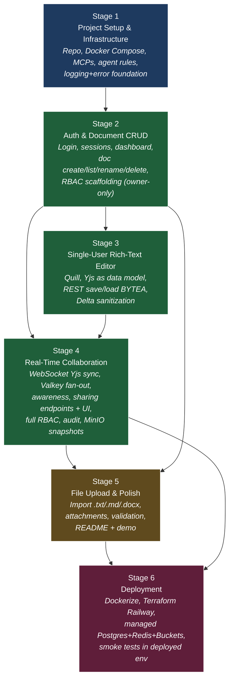

# Dependency Map — Cross-Stage View

**Project**: Collaborative Document Editor
**Audience**: Coding agents and human reviewers planning sequencing across the 6 stage gates.
**Cross-references**: `tech-stack-analysis.md`, `stage-N-development-plan.md` (each stage has its own intra-stage dependency graph at sub-task level)

---

## How to Read This Document

This is the **global** view: feature- and stage-level dependencies. Each stage plan additionally contains a **fine-grained intra-stage Mermaid graph** at the sub-task level so agents can dispatch parallel work within a stage.

If you are an agent deciding what to work on **within** a stage, consult that stage's plan. If you are deciding **whether the next stage can start**, consult this document's "Stage Entry Criteria" section.

---

## Feature → Stage Mapping

| Feature (from brief) | Primary Stage | Touches Stages |
|---|---|---|
| Project foundations (auth, infra, agent rules) | S1 | S1, S2 |
| Authentication | S2 | S2, S4 (WS auth), S5 (upload auth), S6 (prod env) |
| Document CRUD | S2 | S2, S3 (yjs_state column), S4 (permissions added) |
| Rich-text editing (Quill) | S3 | S3, S4 (collab layer) |
| Real-time collaboration (Yjs) | S4 | S3 (Yjs as data model), S4 (live), S5 (import seeds Yjs) |
| Sharing | S4 | S4 (RBAC + UI), S5 (uploads respect role) |
| File import | S5 | S5 |
| Attachments | S5 | S5, S4 (snapshot pattern reused) |
| Persistence | S2 / S3 | All — every stage adds to data model |
| Deployment | S6 | S6 |
| Cross-cutting hardening (validation, RBAC, sanitization, rate limit, audit) | All | Every stage adds its own hardening sub-tasks |

---

## Stage-Level Dependency Graph

**Critical Path**: S1 → S2 → S3 → S4 → S5 → S6 (linear; each stage's deliverables are required by the next). The few shortcuts (S2 → S4 directly, S2 → S5 directly) reflect that some Stage-4 / Stage-5 tasks need things from Stage 2 but not from Stage 3 (e.g., the sharing data model and the import-creates-doc flow).

---

## Foundation Layer

These items have no inbound dependencies and unblock everything else. Build them first in S1:

- Repo skeleton (`backend/`, `frontend/`, `alembic/`, `valkey/`, `minio/`, `infra/`, `docs/`)
- Docker Compose for Postgres + Valkey + MinIO
- Backend boilerplate import (FastAPI + uv + Alembic)
- Frontend Vite scaffold
- Agent rules files (`Claude.md`, `AGENTS.md`, `.cursorrules`)
- MCP setup (Figma, Graphify) for all four agents
- Superpowers skills installation in each agent's repo-level skill directory
- Exception hierarchy + global handler + structured logging + error envelope contract

---

## Stage Entry Criteria

A stage cannot start until ALL of its entry criteria are met. These are checkpoints for the user (or for an orchestrating agent).

### Stage 1
- Boilerplate repo URL is accessible
- Figma WYSIWYG kit URL is accessible
- Docker Desktop is installed and running on the dev laptop
- (No code prerequisites — this is the foundation stage)

### Stage 2 — entry from S1
- ✅ `docker compose up` brings up Postgres, Valkey, MinIO healthy
- ✅ FastAPI app boots with `uv run uvicorn ...`, hits `/health` returns 200
- ✅ Vite dev server boots, shows placeholder home page
- ✅ Alembic generates an empty migration successfully
- ✅ Agent rules files (`Claude.md`, `AGENTS.md`, `.cursorrules`) exist and contain tech stack + folder layout
- ✅ Graphify and Figma MCPs are reachable from at least Claude Code AND OpenCode (validated)
- ✅ `obra/superpowers` skills are installed and discoverable in each agent
- ✅ Custom exception classes (`AppException`, `NotFoundException`, `PermissionDeniedException`, `ValidationException`) and global FastAPI exception handler are in place; `/health` and a deliberately-failing test endpoint demonstrate the error envelope

### Stage 3 — entry from S2
- ✅ User can sign in with a seeded account (real session cookie issued from Valkey-backed store)
- ✅ User can create, list (owned only), rename, and soft-delete documents via REST
- ✅ Frontend dashboard renders the document list with create/rename/delete UI
- ✅ Pydantic validation rejects malformed payloads with 422 + standard error envelope
- ✅ Owner-only RBAC dependency exists and is exercised
- ✅ Auth endpoints have rate limiting (Valkey)
- ✅ Backend pytest suite passes; coverage on `auth` and `documents` features ≥ 70 %

### Stage 4 — entry from S2 + S3
- ✅ Quill editor renders with the Figma toolbar (bold/italic/underline, headings, lists)
- ✅ Yjs is the data model: editing produces Yjs updates client-side, full state is fetched from `/documents/{id}/state` (returns BYTEA), and saved on debounced change via `/documents/{id}/state` PUT
- ✅ Server-side Delta/HTML sanitization is wired to the import / state-write paths
- ✅ Frontend Vitest test suite for editor component is green

### Stage 5 — entry from S2 + S4
- ✅ Two browser windows on different seeded accounts can co-edit the same document over WebSocket; cursors visible
- ✅ Sharing UI works: owner enters another user's email, picks role (viewer/editor), grant appears in their "Shared with me" tab
- ✅ Permission denied responses use the standard error envelope
- ✅ Audit log records every share grant/revoke/role-change
- ✅ MinIO snapshot job writes a snapshot on last-collaborator-disconnect and on the 5-min timer

### Stage 6 — entry from S4 + S5
- ✅ Stages 1–5 fully working in local dev (covered by all prior entry criteria)
- ✅ README documents local-dev setup end-to-end
- ✅ Demo script (`docs/DEMO.md`) walks through every feature

---

## Stage Exit Criteria

These are the deliverables a stage must produce. They are aliased into each stage's plan but listed globally here for visibility.

### Stage 1 exit
1. Repo at desired layout, committed to a `main` branch
2. `docker compose up` health-passes for Postgres, Valkey, MinIO
3. FastAPI boots and `GET /health` returns `{"status":"ok"}`
4. Vite boots and serves a placeholder page that calls `GET /health` to prove CORS works
5. Agent rules files committed
6. MCPs configured in each of: Claude Code, OpenCode, Cursor, Codex
7. Superpowers skills installed and discoverable in each agent
8. README documents the local-dev start sequence
9. Backend has working `structlog` JSON logs with correlation IDs
10. Backend has the standard error envelope demonstrated by an `/api/v1/_demo/error` endpoint

### Stage 2 exit
1. Login / logout works via real session cookie
2. 5 demo users seeded automatically on `alembic upgrade head` + a seed script
3. Sessions stored in Valkey (with TTL) — verifiable by inspecting Valkey keys
4. Documents table migrated; CRUD endpoints implemented and validated
5. Owner-only RBAC enforced on rename, delete, get
6. Frontend dashboard usable (login → list → create → rename → delete)
7. Auth endpoints rate-limited (5 attempts / 5 min on `/auth/login`)
8. Pytest backend coverage ≥ 70 % on auth + documents features
9. Vitest frontend tests for `LoginForm` and `DocumentListItem` green

### Stage 3 exit
1. `documents.yjs_state` BYTEA column added via Alembic
2. `GET /documents/{id}/state` returns Yjs binary (or empty initial state)
3. `PUT /documents/{id}/state` accepts Yjs binary, sanitizes embedded HTML if extracted, persists
4. Frontend editor uses Yjs as data model (no live sync yet — single-user save/load)
5. Toolbar + formatting menu match the Figma design
6. Quill content survives reload with full formatting fidelity
7. Vitest covers Editor component, toolbar, save flow

### Stage 4 exit
1. WebSocket endpoint `/ws/docs/{doc_id}` validates session + role and speaks Yjs sync protocol
2. Two clients on different sessions co-edit same doc with character-level merging
3. Awareness/cursors visible across clients
4. `document_permissions` and `audit_log` tables migrated
5. Share endpoints (`POST /documents/{id}/share`, `DELETE /documents/{id}/share/{user_id}`, `PATCH ... role`) implemented
6. Full role matrix (owner/editor/viewer) enforced on REST + WebSocket per-message
7. Sharing UI: dialog + autocomplete user lookup + role dropdown
8. Dashboard separates "Owned by me" / "Shared with me"
9. Snapshot job writes to MinIO on last-disconnect + 5-min timer
10. Sharing endpoints rate-limited

### Stage 5 exit
1. `/documents/import` endpoint accepts `.txt`, `.md`, `.docx`; returns new doc ID
2. `.docx` import preserves: paragraphs, headings 1–3, bold/italic/underline, bulleted/numbered lists. Images dropped (documented).
3. `/documents/{id}/attachments` POST flow uses presigned upload URL
4. Attachments listed in editor sidebar; downloadable via presigned GET
5. File magic-byte validation enforced; mismatched MIME returns 415
6. Upload rate-limited
7. README is comprehensive (setup, demo accounts, supported file types, known limitations)
8. `docs/DEMO.md` walks through every feature in 5–10 minutes

### Stage 6 exit
1. Backend Dockerfile builds and runs in <2 GB image
2. Frontend Dockerfile (multi-stage, nginx-served) builds the Vite production bundle
3. Terraform plan applies cleanly to a fresh Railway project; outputs URLs
4. Railway services live: backend, frontend, managed Postgres, managed Redis, Bucket
5. Backend env-aware: detects `RAILWAY_ENVIRONMENT` and switches S3 endpoint + addressing style
6. Smoke test script hits the deployed app and validates auth, doc creation, share, WebSocket, upload, attachment download
7. README updated with deployment guide

---

## Parallelization Opportunities (Cross-Stage)

The stages are mostly serial, but **within** a stage there is significant parallelism. Each stage plan contains its own intra-stage Mermaid graph for this. Here are the **cross-stage** parallel opportunities — work that can begin in stage N–1 but pays off in stage N:

| Begin in | For payoff in | Item | Why |
|---|---|---|---|
| S1 | S3 | Frontend design tokens extracted from Figma into Tailwind config | Independent of any backend work; can run in parallel with backend infra setup |
| S2 | S3 | `documents.yjs_state` column scaffolded as nullable BYTEA | Lets S3 start without a migration step; column unused until S3 |
| S2 | S4 | `document_permissions` table migration prepared (kept unused until S4) | Unblocks S4 sharing work earlier |
| S3 | S4 | `y-py` integration smoke test in backend (load a Yjs blob into Python, decode, encode) | De-risks the WebSocket relay implementation |
| S4 | S5 | `bleach` and `filetype` integrated as utilities in `core/` | Available for both attachments and import |
| S5 | S6 | Backend `Settings` class env-aware from day one (uses `RAILWAY_ENVIRONMENT` if set) | Stage 6 doesn't need code changes, only env vars |

These shortcuts are **opt-in**: if you have parallel agent capacity (Claude Code orchestrating, OpenCode + Codex executing in parallel), use them. If you're solo, follow the linear path.

---

## Shared Infrastructure (Build Once, Use Many)

| Component | First introduced | Reused in |
|---|---|---|
| `core/errors.py` exception hierarchy + global handler | S1 | All endpoints in S2–S6 |
| `core/logging.py` structlog config + `request_id` middleware | S1 | All stages |
| `core/db.py` async SQLAlchemy session dependency | S1 | All endpoints |
| `core/valkey.py` connection + pub/sub helpers | S1 (connection), S2 (sessions), S4 (pub/sub) | Used in S2, S4 |
| `core/storage.py` S3 client (boto3 / aiobotocore) factory | S4 (snapshots) | S5 (attachments), S6 (Railway Buckets) |
| `core/security.py` `require_session`, `require_doc_role(min)` dependencies | S2 (require_session, owner-only) | S4 (full role matrix), S5 (uploads) |
| `core/rate_limit.py` Valkey token bucket | S2 (auth) | S4 (sharing), S5 (uploads) |
| `core/sanitize.py` Delta + HTML sanitization | S3 (state writes) | S5 (import) |
| `core/audit.py` audit log writer | S4 | All sensitive actions |
| Frontend `<ErrorBanner />` + `useApi()` hook with envelope parsing | S2 | All API calls in S3–S5 |
| Frontend `<Toolbar />` design-token primitives | S3 (Quill) | Reusable in any future toolbar |

---

## Risk Register (Cross-Cutting)

| ID | Risk | Likelihood | Impact | Mitigation | Surfaces in Stage |
|---|---|---|---|---|---|
| R1 | y-py / Yjs version drift breaks server-client compatibility | Medium | High | Pin both, document the pair, integration tests with real `y-websocket` clients | S3, S4 |
| R2 | FastAPI WebSocket implementation of Yjs sync protocol has edge cases (missed updates, reconnect storms) | Medium | High | Reference the canonical `y-websocket` Node implementation; write reconnect tests | S4 |
| R3 | `.docx` parsing fidelity disappoints in demo | Medium | Medium | Document supported subset prominently; pick demo files that fit | S5 |
| R4 | Railway Terraform provider can't manage Buckets primitive directly | Medium | Medium | Manage Buckets via Railway CLI in a one-time script + `terraform import`; provider handles services + env vars | S6 |
| R5 | Windows file watcher quirks in Vite cause stale reloads | Low | Low | Use Vite's `server.watch.usePolling: true` if encountered | S1 |
| R6 | Session cookie not attached to WebSocket due to wrong `SameSite` setting in cross-origin dev | Medium | Medium | Pin `SameSite=Lax`, run frontend and backend on `localhost` to share origin context | S2, S4 |
| R7 | Snapshot job on disconnect races with new connections | Low | Medium | Use a debounced "last user disconnected" timer (10 s) before snapshotting | S4 |
| R8 | Bleach default allowlist drops Quill format markers | Medium | Medium | Define explicit allowlist matching Quill Delta op attributes; integration test before merging | S3 |
| R9 | Rate limiter clobbers legit users behind shared NAT (e.g., demo on a single IP) | Low | Low | Use user-id + IP composite key; generous dev-mode limits | S2 |
| R10 | OpenCode/Claude Code MCP configs diverge across agents → inconsistent behavior | Medium | Medium | Treat agent rules files as content-equivalent; lint with a shared pre-commit hook that reads YAML front-matter | S1 |

---

## Cross-Stage Test Strategy

Tests accumulate; nothing is removed.

| Stage | Backend Pytest Suites | Frontend Vitest Suites |
|---|---|---|
| S1 | `core/test_errors.py`, `core/test_logging.py` | (none) |
| S2 | + `auth/`, `documents/` | + `LoginForm.test.tsx`, `DocumentListItem.test.tsx` |
| S3 | + `documents/test_yjs_state.py`, `core/test_sanitize.py` | + `Editor.test.tsx`, `Toolbar.test.tsx` |
| S4 | + `collaboration/test_websocket.py`, `sharing/`, `core/test_rate_limit.py` | + `ShareDialog.test.tsx`, `RemoteCursor.test.tsx` |
| S5 | + `files/test_import.py`, `files/test_attachments.py` | + `ImportDialog.test.tsx`, `AttachmentList.test.tsx` |
| S6 | + smoke test against deployed env (uses `pytest --base-url=...`) | (none) |

---

*End of dependency-map.md*
